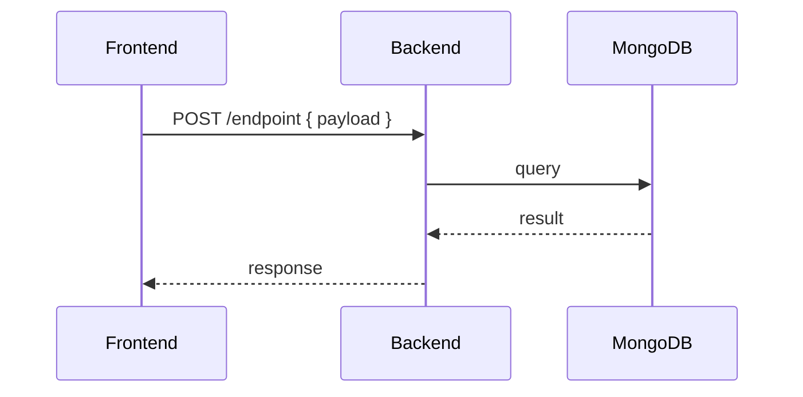
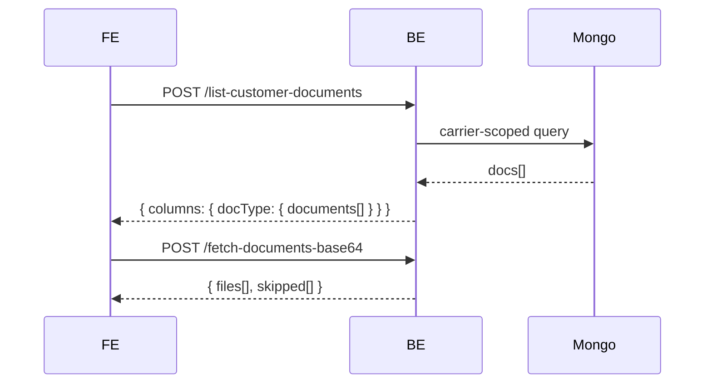

# raw-notes-format

House style for notes under `raw/`. Notes are terse. Depth lives in pointer pages.

## Scope guard

Apply ONLY when the target file path is under `raw/` (any depth). If user asks to format `wiki/`, `index.md`, `log.md`, or anything outside `raw/`, decline this skill and route to `/wiki-ingest` or normal editing.

## Format contract

Every note in `raw/` follows this skeleton:

```
# Step Topic

<2-5 line intro. State what the note covers + the major points as a bullet list.
Every broader concept named here is a [[term]] pointer, never an inline explanation.>

<If FE + BE code logic both present: mermaid flowchart here, in the intro.>

## <Section name>

- terse point
- [[pointer-term]] — one-line orientation, deep dive lives in `[[pointer-term]]`
- example: <only when example is load-bearing>

## <Next section>
...
```

### Rules

1. **Heading** — `# Step Topic`. Title Case. Match Obsidian filename.
2. **Intro** — 2–5 lines. Major points as a bullet list right under the heading. No prose paragraphs explaining concepts.
3. **No inline broader-concept explanation.** If a concept needs more than one line of context, replace it with `[[term]]` and create/extend the pointer page. The parent note states *what* and links *where* — never *how* or *why* for broad concepts.
4. **FE + BE flowchart rule.** If the note describes code logic spanning both frontend AND backend, the intro MUST include a mermaid diagram showing the cross-boundary flow. Block-wise code explanation does NOT live in the parent note — it lives in pointer pages (one per logical block / file / module).
5. **Examples** — include only when the example clarifies a non-obvious point. Skip default "here's how it looks" filler examples.
6. **Pointer pages live in `raw/` alongside the parent.** Same subfolder as the note that links to them. Filename = wikilink target in Title Case.

## Mermaid flowchart template (FE + BE)



Use `flowchart LR` instead when the flow is not strictly sequential (branches, retries, conditional paths).

## Pointer page format

A pointer page is itself a `raw/` note and follows the same format recursively. If a pointer page introduces yet more broader concepts, those become deeper `[[term]]` pointers — flat link graph, not nested explanation.

Minimum pointer-page content:
- `# <Term>`
- One-line definition.
- Bullet list: where this term is referenced (back-links to parent notes).
- The actual deep dive (code blocks, schema, block-wise breakdown).

## Workflow

When user asks to write / clean up a raw/ note:

1. **Confirm path.** Verify target file is under `raw/`. If not, stop and surface scope mismatch.
2. **Identify broader concepts.** Any term explained inline in >1 sentence is a pointer candidate. List them back to user before extracting (so they can veto an extraction).
3. **Detect FE+BE.** If note references both frontend and backend code, draft mermaid flowchart for the intro. Ask user to confirm flow direction if ambiguous.
4. **Write parent note.** Skeleton above. Intro + sections. No inline explanations of broader concepts.
5. **Create / extend pointer pages.** One file per `[[term]]` in `raw/<same-subfolder>/`. Pointer page format above. If the pointer file already exists, append the new back-reference under "Referenced from" and merge content — never overwrite.
6. **Report touched files.** List parent + every pointer page created / modified.

## Anti-patterns

Reject these in user drafts and in your own writing:

- Paragraphs of prose explaining a concept inline (extract to `[[term]]`).
- Repeating the same explanation across multiple notes (centralize in one pointer page, link from all).
- FE+BE note with no flowchart in the intro.
- Pointer page that just re-states the one-line summary from the parent — pointer must add depth.
- Mixing `raw/` and `wiki/` in the same edit pass — they have different schemas.
- Code blocks longer than ~15 lines inside the parent note when the same logic deserves its own pointer page.

## Example — minimum viable raw note

```markdown
# Flow E — Existing Docs Picker

Add second affordance to Doc Validation Step 5: dispatcher picks docs from past COMPLETED loads instead of fresh upload. Same Flow E pipeline downstream.

Major points:
- BE proxies storage → base64, FE packs into existing `files[]` payload
- Carrier scoping enforced server-side via [[Carrier Scoping]]
- Reuses [[Flow E Pipeline]] — agent / validator / skill unchanged



## Endpoints
- `list-customer-documents` — see [[List Customer Documents Endpoint]]
- `fetch-documents-base64` — see [[Fetch Documents Base64 Endpoint]]

## Carrier scoping check
See [[Carrier Scoping]] — controller `resolveCarrierId(userData)` prefers JWT `carrierId`.
```

Everything deeper — Joi schemas, MIME validation, base64 packing — lives in the linked pointer pages, not in this parent note.
