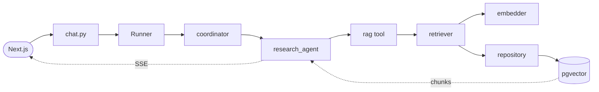

---
cssclasses:
  - wide-page
  - wide
---

# ADK Implementation Example

Code in **request-flow order**. Top→bottom = follow one request from client to DB and back.

Scenario: support assistant. Coordinator routes to `research`, `billing`, or `support` sub-agents. RAG retrieves from pgvector. Streams over SSE to Next.js.

Layout in [[Google ADKs]].

---

## 0. Flow Anchor



Each section below = one stop on this path.

---

## 1. App Entry — `src/main.py`

FastAPI factory. Mounts versioned API. CORS for Next.js.

```python
from contextlib import asynccontextmanager
from fastapi import FastAPI
from fastapi.middleware.cors import CORSMiddleware
from src.core.config import settings
from src.api.v1 import api_router


@asynccontextmanager
async def lifespan(app: FastAPI):
    yield


def create_app() -> FastAPI:
    app = FastAPI(title="Agent Platform", lifespan=lifespan)
    app.add_middleware(
        CORSMiddleware,
        allow_origins=[str(o) for o in settings.cors_origins],
        allow_credentials=True,
        allow_methods=["*"],
        allow_headers=["*"],
    )
    app.include_router(api_router, prefix="/api/v1")
    return app


app = create_app()
```

---

## 2. Router Aggregator — `src/api/v1/__init__.py`

```python
from fastapi import APIRouter
from src.api.v1 import chat, documents, auth

api_router = APIRouter()
api_router.include_router(auth.router)
api_router.include_router(documents.router)
api_router.include_router(chat.router)
```

---

## 3. Chat Route — `src/api/v1/chat.py`

**Request lands here.** Resolves agent, builds Runner, creates/loads session, streams `run_async` events as SSE.

```python
from uuid import uuid4
from fastapi import APIRouter, Depends, HTTPException
from fastapi.responses import StreamingResponse
from pydantic import BaseModel
from google.genai import types
from src.core.deps import current_user
from src.runtime.runner import build_runner
from src.runtime.streaming import stream_events

router = APIRouter(prefix="/chat", tags=["chat"])


class ChatRequest(BaseModel):
    message: str
    session_id: str | None = None


@router.post("/{agent_name}/stream")
async def stream_chat(
    agent_name: str,
    body: ChatRequest,
    user=Depends(current_user),
):
    try:
        runner = build_runner(agent_name)
    except KeyError:
        raise HTTPException(404, f"agent {agent_name} not found")

    session_id = body.session_id or str(uuid4())
    if not body.session_id:
        await runner.session_service.create_session(
            app_name=runner.app_name, user_id=user.id, session_id=session_id
        )

    content = types.Content(role="user", parts=[types.Part(text=body.message)])
    events = runner.run_async(
        user_id=user.id, session_id=session_id, new_message=content
    )

    return StreamingResponse(
        stream_events(events),
        media_type="text/event-stream",
        headers={"X-Session-Id": session_id},
    )
```

---

## 4. Auth Dep — `src/core/deps.py`

`Depends(current_user)` decodes JWT, fetches user. Injected into every protected route.

```python
from fastapi import Depends, HTTPException, status
from fastapi.security import OAuth2PasswordBearer
from sqlalchemy.ext.asyncio import AsyncSession
from src.core.db import get_session
from src.core.security import decode_token
from src.domains.users.models import User
from src.domains.users.repository import UserRepository

oauth2_scheme = OAuth2PasswordBearer(tokenUrl="/api/v1/auth/login")


async def current_user(
    token: str = Depends(oauth2_scheme),
    db: AsyncSession = Depends(get_session),
) -> User:
    try:
        payload = decode_token(token)
    except Exception:
        raise HTTPException(status.HTTP_401_UNAUTHORIZED, "invalid token")
    user = await UserRepository(db).get(payload["sub"])
    if not user:
        raise HTTPException(status.HTTP_401_UNAUTHORIZED, "user not found")
    return user
```

---

## 5. Runtime Registry — `src/runtime/registry.py`

Name → agent module. Add new agent = one line.

```python
from google.adk.agents import BaseAgent
from src.agents.coordinator import root_agent as coordinator
from src.agents.research_agent import root_agent as research
from src.agents.billing_agent import root_agent as billing
from src.agents.support_agent import root_agent as support


AGENTS: dict[str, BaseAgent] = {
    "coordinator": coordinator,
    "research": research,
    "billing": billing,
    "support": support,
}


def get_agent(name: str) -> BaseAgent:
    if name not in AGENTS:
        raise KeyError(f"unknown agent: {name}")
    return AGENTS[name]
```

---

## 6. Session Service — `src/runtime/services.py`

Persists ADK conversation state in Postgres. Singleton.

```python
from google.adk.sessions import DatabaseSessionService
from src.core.config import settings

_session_service: DatabaseSessionService | None = None


def get_session_service() -> DatabaseSessionService:
    global _session_service
    if _session_service is None:
        _session_service = DatabaseSessionService(db_url=str(settings.database_url))
    return _session_service
```

---

## 7. Runner Builder — `src/runtime/runner.py`

Builds ADK `Runner` per request. Wires agent + session service.

```python
from google.adk.runners import Runner
from src.runtime.registry import get_agent
from src.runtime.services import get_session_service


def build_runner(agent_name: str, app_name: str = "agent-platform") -> Runner:
    return Runner(
        app_name=app_name,
        agent=get_agent(agent_name),
        session_service=get_session_service(),
    )
```

---

## 8. Coordinator Agent — `src/agents/coordinator/`

Orchestrator. LLM reads user message, picks sub-agent via auto-injected `transfer_to_agent`.

### `agent.py`

```python
from google.adk.agents import Agent
from src.core.config import settings
from src.agents.research_agent import root_agent as research
from src.agents.billing_agent import root_agent as billing
from src.agents.support_agent import root_agent as support
from src.agents.coordinator.prompt import COORDINATOR_PROMPT

root_agent = Agent(
    name="coordinator",
    model=settings.llm_model,
    description="Routes user requests to the right specialist agent.",
    instruction=COORDINATOR_PROMPT,
    sub_agents=[research, billing, support],
)
```

### `prompt.py`

```python
COORDINATOR_PROMPT = """You are a router. Read the user's message and transfer to:
- research_agent: factual questions, knowledge lookups
- billing_agent: invoices, payments, refunds
- support_agent: product issues, how-to questions

Use transfer_to_agent. Do not answer directly unless none fit."""
```

### `__init__.py`

```python
from src.agents.coordinator.agent import root_agent
__all__ = ["root_agent"]
```

---

## 9. Sub-Agent (Research) — `src/agents/research_agent/`

Coordinator transfers here. Calls RAG tool, composes answer from chunks.

### `agent.py`

```python
from google.adk.agents import Agent
from src.core.config import settings
from src.rag.tools import rag_search_tool
from src.agents.research_agent.prompt import RESEARCH_PROMPT

root_agent = Agent(
    name="research_agent",
    model=settings.llm_model,
    description="Answers factual questions using internal docs.",
    instruction=RESEARCH_PROMPT,
    tools=[rag_search_tool],
)
```

### `prompt.py`

```python
RESEARCH_PROMPT = """You are a research specialist.
Use rag_search to find relevant information before answering.
Cite document_id for every claim. If no relevant docs found, say so."""
```

### `__init__.py`

```python
from src.agents.research_agent.agent import root_agent
__all__ = ["root_agent"]
```

---

## 10. ADK Tool Wrapper — `src/rag/tools.py`

Exposes retrieval to agent as `FunctionTool`. **Owns DB session lifecycle** — opens session inside, never receives one from agent.

```python
from google.adk.tools import FunctionTool
from src.core.db import async_session
from src.rag.retrievers import retrieve


async def rag_search(query: str, k: int = 5) -> list[dict]:
    """Search internal knowledge base for relevant document chunks.

    Args:
        query: User question or search phrase.
        k: Max number of chunks to return.

    Returns:
        List of {content, document_id} dicts.
    """
    async with async_session() as db:
        return await retrieve(query, db, k=k)


rag_search_tool = FunctionTool(func=rag_search)
```

---

## 11. Retriever — `src/rag/retrievers.py`

Embeds query + delegates to repository for vector search.

```python
from sqlalchemy.ext.asyncio import AsyncSession
from src.domains.documents.repository import ChunkRepository
from src.rag.embeddings import get_embedder


async def retrieve(query: str, db: AsyncSession, k: int = 5) -> list[dict]:
    embedder = get_embedder()
    [embedding] = await embedder.embed([query])
    repo = ChunkRepository(db)
    chunks = await repo.search(embedding, limit=k)
    return [
        {"content": c.content, "document_id": str(c.document_id)}
        for c in chunks
    ]
```

---

## 12. Embedder — `src/rag/embeddings.py`

Provider abstraction. Swap Vertex / OpenAI / local.

```python
from abc import ABC, abstractmethod
from google import genai
from src.core.config import settings


class EmbeddingProvider(ABC):
    @abstractmethod
    async def embed(self, texts: list[str]) -> list[list[float]]: ...


class VertexEmbeddings(EmbeddingProvider):
    def __init__(self):
        self.client = genai.Client(
            vertexai=True,
            project=settings.google_cloud_project,
            location=settings.google_cloud_location,
        )

    async def embed(self, texts: list[str]) -> list[list[float]]:
        result = await self.client.aio.models.embed_content(
            model=settings.embedding_model, contents=texts
        )
        return [e.values for e in result.embeddings]


def get_embedder() -> EmbeddingProvider:
    return VertexEmbeddings()
```

---

## 13. Repository — `src/domains/documents/repository.py`

Async SQLAlchemy. Cosine-distance vector search.

```python
from uuid import UUID
from sqlalchemy import select
from sqlalchemy.ext.asyncio import AsyncSession
from src.domains.documents.models import Chunk


class ChunkRepository:
    def __init__(self, db: AsyncSession):
        self.db = db

    async def search(
        self, query_embedding: list[float], limit: int = 5
    ) -> list[Chunk]:
        stmt = (
            select(Chunk)
            .order_by(Chunk.embedding.cosine_distance(query_embedding))
            .limit(limit)
        )
        result = await self.db.execute(stmt)
        return list(result.scalars().all())

    async def bulk_insert(self, chunks: list[Chunk]) -> None:
        self.db.add_all(chunks)
        await self.db.commit()
```

---

## 14. Domain Model — `src/domains/documents/models.py`

Vector column lives alongside relational fields. Same Postgres.

```python
from datetime import datetime
from uuid import UUID, uuid4
from sqlalchemy import String, Text, ForeignKey, DateTime, func
from sqlalchemy.orm import Mapped, mapped_column, relationship
from sqlalchemy.dialects.postgresql import UUID as PgUUID
from pgvector.sqlalchemy import Vector
from src.core.db import Base


class Document(Base):
    __tablename__ = "documents"

    id: Mapped[UUID] = mapped_column(PgUUID, primary_key=True, default=uuid4)
    title: Mapped[str] = mapped_column(String(500))
    source: Mapped[str] = mapped_column(String(200))
    created_at: Mapped[datetime] = mapped_column(
        DateTime(timezone=True), server_default=func.now()
    )

    chunks: Mapped[list["Chunk"]] = relationship(
        back_populates="document", cascade="all, delete-orphan"
    )


class Chunk(Base):
    __tablename__ = "chunks"

    id: Mapped[UUID] = mapped_column(PgUUID, primary_key=True, default=uuid4)
    document_id: Mapped[UUID] = mapped_column(
        ForeignKey("documents.id", ondelete="CASCADE")
    )
    content: Mapped[str] = mapped_column(Text)
    embedding: Mapped[list[float]] = mapped_column(Vector(768))
    chunk_index: Mapped[int]

    document: Mapped[Document] = relationship(back_populates="chunks")
```

DB returns chunks → repository → retriever → tool → back to research_agent. LLM composes answer.

---

## 15. Streaming Out — `src/runtime/streaming.py`

Agent yields `Event` per token/turn. Format as SSE frames.

```python
import json
from typing import AsyncIterator
from google.adk.events import Event


def format_sse(event: Event) -> str:
    payload = {
        "author": event.author,
        "content": event.content.parts[0].text if event.content and event.content.parts else None,
        "is_final": event.is_final_response(),
    }
    return f"data: {json.dumps(payload)}\n\n"


async def stream_events(events: AsyncIterator[Event]) -> AsyncIterator[str]:
    async for event in events:
        yield format_sse(event)
```

`StreamingResponse` in chat.py pumps these to client.

---

## 16. Frontend SSE Consumer — `app/chat/stream.ts`

```typescript
export async function* streamChat(
  agentName: string,
  message: string,
  sessionId?: string,
) {
  const res = await fetch(`/api/v1/chat/${agentName}/stream`, {
    method: "POST",
    headers: { "Content-Type": "application/json" },
    body: JSON.stringify({ message, session_id: sessionId }),
  });

  const reader = res.body!.getReader();
  const decoder = new TextDecoder();
  let buffer = "";

  while (true) {
    const { value, done } = await reader.read();
    if (done) break;
    buffer += decoder.decode(value, { stream: true });
    const frames = buffer.split("\n\n");
    buffer = frames.pop() ?? "";
    for (const line of frames) {
      if (!line.startsWith("data: ")) continue;
      yield JSON.parse(line.slice(6));
    }
  }
}
```

Round-trip complete.

---

# Supporting Pieces

Setup + alternates. Off the hot path but needed for working system.

---

## A. Dependencies — `pyproject.toml`

```toml
[project]
name = "agent-platform"
version = "0.1.0"
requires-python = ">=3.12"
dependencies = [
    "google-adk>=1.0.0",
    "fastapi>=0.115",
    "uvicorn[standard]>=0.32",
    "sqlalchemy[asyncio]>=2.0.36",
    "asyncpg>=0.30",
    "alembic>=1.14",
    "pgvector>=0.3.6",
    "pydantic>=2.10",
    "pydantic-settings>=2.6",
    "arq>=0.26",
    "structlog>=24.4",
    "httpx>=0.27",
]
```

---

## B. Config — `src/core/config.py`

```python
from pydantic import PostgresDsn, RedisDsn, SecretStr, AnyHttpUrl
from pydantic_settings import BaseSettings, SettingsConfigDict
from typing import Literal


class Settings(BaseSettings):
    environment: Literal["local", "staging", "prod"] = "local"
    database_url: PostgresDsn
    redis_url: RedisDsn
    google_api_key: SecretStr
    google_cloud_project: str
    google_cloud_location: str = "us-central1"
    cors_origins: list[AnyHttpUrl] = []
    embedding_model: str = "text-embedding-004"
    llm_model: str = "gemini-2.0-flash"

    model_config = SettingsConfigDict(env_file=".env", env_nested_delimiter="__")


settings = Settings()
```

---

## C. DB Setup — `src/core/db.py`

```python
from sqlalchemy.ext.asyncio import async_sessionmaker, create_async_engine, AsyncSession
from sqlalchemy.orm import DeclarativeBase
from src.core.config import settings


class Base(DeclarativeBase):
    pass


engine = create_async_engine(str(settings.database_url), pool_pre_ping=True)
async_session = async_sessionmaker(engine, expire_on_commit=False, class_=AsyncSession)


async def get_session() -> AsyncSession:
    async with async_session() as session:
        yield session
```

---

## D. Alembic Migration — `alembic/versions/0001_init.py`

```python
def upgrade():
    op.execute("CREATE EXTENSION IF NOT EXISTS vector")
    op.create_table("documents", ...)
    op.create_table(
        "chunks",
        sa.Column("embedding", Vector(768)),
        ...,
    )
    op.execute(
        "CREATE INDEX chunks_embedding_idx ON chunks "
        "USING hnsw (embedding vector_cosine_ops)"
    )
```

---

## E. Other Sub-Agents

### Billing — `src/agents/billing_agent/agent.py`

```python
from google.adk.agents import Agent
from google.adk.tools import FunctionTool
from src.core.config import settings


async def get_invoice(invoice_id: str) -> dict:
    """Fetch invoice details by ID."""
    return {"id": invoice_id, "amount": 0, "status": "paid"}


root_agent = Agent(
    name="billing_agent",
    model=settings.llm_model,
    description="Handles invoices, refunds, payment methods.",
    instruction="Help users with billing. Use get_invoice to look up invoices.",
    tools=[FunctionTool(func=get_invoice)],
)
```

### Support — `src/agents/support_agent/agent.py`

```python
from google.adk.agents import Agent
from src.core.config import settings
from src.rag.tools import rag_search_tool

root_agent = Agent(
    name="support_agent",
    model=settings.llm_model,
    description="General product help and troubleshooting.",
    instruction="Help users with product issues. Use rag_search for docs.",
    tools=[rag_search_tool],
)
```

---

## F. Deterministic Workflow (Alternative to Coordinator)

`SequentialAgent` — planner → searcher → writer. No LLM routing.

```python
# src/agents/research_pipeline/agent.py
from google.adk.agents import SequentialAgent, Agent
from src.core.config import settings
from src.rag.tools import rag_search_tool

planner = Agent(name="planner", model=settings.llm_model,
                instruction="Break query into subquestions.")
searcher = Agent(name="searcher", model=settings.llm_model,
                 tools=[rag_search_tool],
                 instruction="Retrieve evidence.")
writer = Agent(name="writer", model=settings.llm_model,
               instruction="Compose answer from evidence.")

root_agent = SequentialAgent(
    name="research_pipeline",
    sub_agents=[planner, searcher, writer],
)
```

---

## G. MCP Integration

### Consume external MCP server — `src/mcp/clients/github_mcp.py`

```python
from google.adk.tools.mcp_tool import MCPToolset, StdioServerParameters


def github_toolset() -> MCPToolset:
    return MCPToolset(
        connection_params=StdioServerParameters(
            command="npx",
            args=["-y", "@modelcontextprotocol/server-github"],
            env={"GITHUB_PERSONAL_ACCESS_TOKEN": "..."},
        ),
    )
```

Use in an agent:

```python
# src/agents/devops_agent/agent.py
from google.adk.agents import Agent
from src.core.config import settings
from src.mcp.clients.github_mcp import github_toolset

root_agent = Agent(
    name="devops_agent",
    model=settings.llm_model,
    instruction="Help with GitHub workflows.",
    tools=[github_toolset()],
)
```

### Expose your own MCP server — `src/mcp/servers/documents_mcp.py`

```python
from mcp.server.fastmcp import FastMCP
from src.core.db import async_session
from src.rag.retrievers import retrieve

mcp = FastMCP("documents")


@mcp.tool()
async def search_docs(query: str, k: int = 5) -> list[dict]:
    async with async_session() as db:
        return await retrieve(query, db, k=k)


if __name__ == "__main__":
    mcp.run()
```

Run separately: `python -m src.mcp.servers.documents_mcp`. External agents connect.

---

## H. Worker — Document Ingestion

Off the request path. Chunks doc, embeds, writes to pgvector.

### Task — `src/workers/tasks/ingest.py`

```python
from uuid import UUID
from src.core.db import async_session
from src.domains.documents.models import Chunk
from src.domains.documents.repository import ChunkRepository
from src.rag.embeddings import get_embedder
from src.rag.chunking import chunk_text


async def ingest_document(ctx, document_id: str, raw_text: str):
    chunks_text = chunk_text(raw_text, size=500, overlap=50)
    embedder = get_embedder()
    embeddings = await embedder.embed(chunks_text)

    async with async_session() as db:
        repo = ChunkRepository(db)
        chunks = [
            Chunk(
                document_id=UUID(document_id),
                content=text,
                embedding=emb,
                chunk_index=i,
            )
            for i, (text, emb) in enumerate(zip(chunks_text, embeddings))
        ]
        await repo.bulk_insert(chunks)
```

### Worker Entrypoint — `src/workers/worker.py`

```python
from arq.connections import RedisSettings
from src.core.config import settings
from src.workers.tasks.ingest import ingest_document


class WorkerSettings:
    functions = [ingest_document]
    redis_settings = RedisSettings.from_dsn(str(settings.redis_url))
    max_jobs = 10
```

Run: `arq src.workers.worker.WorkerSettings`

### Enqueue from API — `src/api/v1/documents.py`

```python
from fastapi import APIRouter, UploadFile, Depends
from arq import ArqRedis
from src.core.deps import get_queue, get_session
from src.domains.documents.service import DocumentService

router = APIRouter(prefix="/documents", tags=["documents"])


@router.post("/")
async def upload(
    file: UploadFile,
    db=Depends(get_session),
    queue: ArqRedis = Depends(get_queue),
):
    text = (await file.read()).decode()
    doc = await DocumentService(db).create(title=file.filename, source="upload")
    await queue.enqueue_job("ingest_document", str(doc.id), text)
    return {"id": str(doc.id), "status": "processing"}
```

---

## I. Local Run

```bash
# 1. start infra
docker compose up -d postgres redis

# 2. migrate
alembic upgrade head

# 3. api
uvicorn src.main:app --reload

# 4. worker (separate terminal)
arq src.workers.worker.WorkerSettings

# 5. test agent in ADK web UI (bypasses FastAPI)
adk web src/agents
```

---

## References

- [[Google ADKs]] — folder layout, rules, conventions
- google.github.io/adk-docs/agents/multi-agents/
- google.github.io/adk-docs/tools/mcp-tools/
- google.github.io/adk-docs/sessions/
