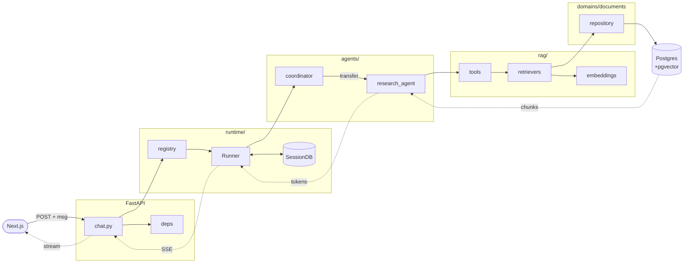

---
cssclasses:
  - wide-page
  - wide
---

# Google ADK + FastAPI + Postgres/pgvector

Single source of truth. Large-scale, company-wide layout. Frontend (Next.js) consumes FastAPI directly.

> 📎 Code samples live in **[[ADK Implementation Example]]**. This doc = structure, rules, conventions only.
> 📐 Wide layout: toggle Obsidian **Settings → Editor → Readable line length OFF** for full-width view.

## Code Flow — Client Hits Agent API

`POST /api/v1/chat/{agent_name}/stream` — compact view.



### Layer Mapping

| Step | Code Location |
|------|---------------|
| HTTP entry | `src/api/v1/chat.py` |
| Auth + DB session | `src/core/deps.py` |
| Agent resolution | `src/runtime/registry.py` |
| Runner build | `src/runtime/runner.py` |
| Session persistence | `src/runtime/services.py` → Postgres |
| Orchestration | `src/agents/coordinator/` |
| Specialist agent | `src/agents/<name>/` |
| Tool wrapper | `src/rag/tools.py` |
| Retrieval logic | `src/rag/retrievers.py` |
| Embedding | `src/rag/embeddings.py` |
| Vector query | `src/domains/documents/repository.py` |
| Storage | Postgres + pgvector |
| Stream out | `src/runtime/streaming.py` → SSE |

### Boundary Highlights

- **API never touches agents directly** — always through `runtime/`
- **Agents never touch domains directly** — only through `rag/tools.py`
- **Tools own DB session lifecycle** — open inside tool, close after query
- **Streaming end-to-end** — agent tokens flow LLM → Runner → API → FE without buffering

Code: see [[ADK Implementation Example#14. Request Flow Diagram]].

## Stack

- **Google ADK** — agents, sub-agents, tools, sessions, eval
- **FastAPI** — public HTTP API (hand-rolled, not `get_fast_api_app()`)
- **Postgres + pgvector** — relational + vectors, same DB
- **Async SQLAlchemy 2.0 + Alembic** — ORM + migrations
- **Pydantic v2 + pydantic-settings** — schemas + config
- **Workers** — Arq/Celery for ingestion + eval jobs

## Full Tree

```
.
├── pyproject.toml
├── uv.lock                        # or poetry.lock
├── .env.example
├── .python-version
├── docker-compose.yml             # local Postgres+pgvector, redis, worker
├── Dockerfile                     # multi-stage, prod image
├── alembic.ini
├── alembic/
│   ├── env.py
│   └── versions/
├── src/
│   ├── __init__.py
│   ├── main.py                    # FastAPI app factory; mounts /api/v1
│   │
│   ├── core/                      # framework-level infra, no domain logic
│   │   ├── config.py              # pydantic-settings BaseSettings, env-layered
│   │   ├── db.py                  # async engine, session factory, Base
│   │   ├── logging.py             # structlog config
│   │   ├── security.py            # password hash, JWT, OAuth helpers
│   │   ├── deps.py                # shared FastAPI deps (get_session, current_user)
│   │   ├── pagination.py
│   │   ├── exceptions.py          # base AppException + handlers
│   │   └── middleware.py          # request id, timing, error envelope
│   │
│   ├── api/                       # HTTP layer, thin routers only
│   │   └── v1/
│   │       ├── __init__.py        # api_router = APIRouter(); include all
│   │       ├── auth.py
│   │       ├── users.py
│   │       ├── documents.py
│   │       ├── conversations.py
│   │       ├── chat.py            # ADK Runner streaming endpoints
│   │       └── search.py          # vector + hybrid search
│   │
│   ├── domains/                   # Dispatch-style vertical slices
│   │   ├── auth/
│   │   │   ├── __init__.py
│   │   │   ├── models.py          # SQLAlchemy models
│   │   │   ├── schemas.py         # Pydantic request/response
│   │   │   ├── repository.py      # AsyncSession queries only
│   │   │   ├── service.py         # business logic, orchestrates repos
│   │   │   ├── exceptions.py
│   │   │   ├── constants.py
│   │   │   └── tests/
│   │   ├── users/
│   │   │   └── ... (same shape)
│   │   ├── documents/             # owns relational + pgvector chunks
│   │   │   ├── models.py          # Document, Chunk(embedding: Vector(1536))
│   │   │   ├── schemas.py
│   │   │   ├── repository.py      # incl. vector similarity queries
│   │   │   ├── service.py
│   │   │   ├── ingest.py          # chunking + embedding pipeline
│   │   │   └── tests/
│   │   └── conversations/         # ADK session/message persistence mirror
│   │       └── ...
│   │
│   ├── agents/                    # pure ADK packages, one per agent
│   │   ├── __init__.py
│   │   ├── _shared/               # cross-agent helpers (callbacks, guards)
│   │   │   ├── callbacks.py
│   │   │   ├── guardrails.py
│   │   │   └── prompts.py         # shared prompt fragments
│   │   ├── research_agent/
│   │   │   ├── __init__.py        # exports root_agent
│   │   │   ├── agent.py           # root_agent = Agent(...)
│   │   │   ├── prompt.py
│   │   │   ├── tools/
│   │   │   │   ├── __init__.py
│   │   │   │   ├── web_search.py
│   │   │   │   └── rag_lookup.py  # wraps rag/retrievers
│   │   │   ├── sub_agents/
│   │   │   │   └── summarizer/
│   │   │   │       ├── __init__.py
│   │   │   │       ├── agent.py
│   │   │   │       ├── prompt.py
│   │   │   │       └── tools/
│   │   │   ├── callbacks.py
│   │   │   └── eval/              # ADK eval sets
│   │   │       ├── conversation.test.json
│   │   │       └── test_config.json
│   │   └── support_agent/
│   │       └── ... (same shape)
│   │
│   ├── runtime/                   # ADK Runner + session/artifact wiring
│   │   ├── runner.py              # build_runner(agent, session_service, ...)
│   │   ├── services.py            # get_session_service, get_artifact_service
│   │   ├── registry.py            # name -> agent module map
│   │   └── streaming.py           # SSE/StreamingResponse helpers
│   │
│   ├── rag/                       # cross-agent retrieval, pgvector-backed
│   │   ├── embeddings.py          # provider abstraction (Vertex/OpenAI)
│   │   ├── chunking.py
│   │   ├── retrievers.py          # vector, hybrid, rerank
│   │   └── tools.py               # ADK FunctionTool wrappers
│   │
│   ├── integrations/              # external services (replaces "plugins/")
│   │   ├── vertex/
│   │   ├── slack/
│   │   ├── email/
│   │   └── storage/               # GCS/S3
│   │
│   └── workers/                   # background jobs, separate process
│       ├── __init__.py
│       ├── worker.py              # Arq/Celery entrypoint
│       ├── tasks/
│       │   ├── ingest.py          # document chunk+embed
│       │   ├── eval.py            # nightly ADK eval runs
│       │   └── cleanup.py
│       └── schedules.py
│
├── tests/
│   ├── conftest.py                # async fixtures, db rollback per test
│   ├── factories.py               # polyfactory / factory-boy
│   ├── api/                       # httpx AsyncClient integration tests
│   ├── domains/                   # unit tests mirror src/domains
│   ├── agents/                    # ADK eval harness per agent
│   └── workers/
│
├── deployment/
│   ├── cloud-run/
│   │   ├── api.yaml
│   │   └── worker.yaml
│   ├── agent-engine/              # ADK Agent Engine manifests per agent
│   └── k8s/                       # optional GKE
│
├── scripts/
│   ├── seed.py
│   ├── export_openapi.py          # dump openapi.json for FE codegen
│   └── reindex_vectors.py
│
└── docs/
    ├── architecture.md
    ├── adr/                       # architecture decision records
    └── runbooks/
```

## Layer Responsibilities

| Layer | Owns | Imports |
|-------|------|---------|
| `core/` | infra primitives (db, config, logging, security) | nothing internal |
| `api/v1/` | HTTP routing, request/response shaping | `core`, `domains`, `runtime` |
| `domains/<x>/` | one bounded context (models + repo + service) | `core`, own domain only |
| `agents/<x>/` | one ADK agent package | `rag.tools`, `agents._shared` |
| `runtime/` | ADK Runner construction, session services | `core`, `agents` (registry) |
| `rag/` | embeddings, retrievers, ADK tool wrappers | `core`, `domains.documents` |
| `integrations/` | external service clients | `core` |
| `workers/` | background tasks | `core`, `domains`, `rag` |

## Import Boundaries (enforce via import-linter)

```
api        → domains, runtime, rag, core
runtime    → agents, core
agents     → rag, agents._shared        # NEVER → api, domains, runtime
domains/X  → core                       # NEVER → other domain
rag        → domains.documents, core
workers    → domains, rag, core
core       → (nothing internal)
```

Hard rules:
- Domains never import other domains. Cross-domain → service call via `api/`.
- Agents never import `domains/` or `api/`. Access data only via `rag/tools.py`.
- `core/` is leaf.

## Naming

- Files: `snake_case.py`
- Classes: `PascalCase`
- SQLAlchemy models: singular (`User`, `Document`, `Chunk`)
- Pydantic schemas: `<Entity>Create`, `<Entity>Update`, `<Entity>Read`, `<Entity>InDB`
- Repos: `<Entity>Repository`; methods `get`, `list`, `create`, `update`, `delete`, `search_*`
- Services: `<Entity>Service`
- Routers: `router = APIRouter(prefix="/users", tags=["users"])`
- ADK agents: package name = agent name (`research_agent`), exports `root_agent`

## ADK + FastAPI Wiring (Mode B)

Hand-rolled FastAPI. ADK `Runner` built per request, injected via `Depends`. Public API contract independent of ADK URL shape.

- Endpoint receives request → resolves agent by name → constructs `Runner` → streams `run_async` events as SSE
- `runtime/registry.py` maps `agent_name` → ADK agent module. New agent = drop folder in `agents/`, register one line
- Session id passed by client (resume) or generated (new). Session state persisted via `DatabaseSessionService` against same Postgres

Code: see [[ADK Implementation Example#10. FastAPI Layer]] and [[ADK Implementation Example#9. Runtime Wiring]].

## pgvector Conventions

- Vector columns live on domain models (`documents.models.Chunk.embedding: Vector(1536)`)
- Migrations: first migration runs `CREATE EXTENSION IF NOT EXISTS vector`
- Index: `ivfflat` for <10M rows, `hnsw` past that
- Async queries via `select().order_by(Chunk.embedding.cosine_distance(q))`
- Embedding provider abstracted in `rag/embeddings.py` — swap Vertex/OpenAI/local
- Ingestion always async via `workers/tasks/ingest.py`, never inline in request

## Config (12-factor)

- Single `Settings(BaseSettings)` in `core/config.py`
- All env vars typed + validated at boot (fail fast on missing)
- `.env` for local, real env vars in staging/prod
- Secrets as `SecretStr`, never logged
- Nested config via `env_nested_delimiter="__"`
- No `os.getenv` anywhere outside `core/config.py`
- Inject `settings` via `Depends` where reasonable

Code: see [[ADK Implementation Example#2. Config]].

## Frontend Contract

- `scripts/export_openapi.py` dumps `openapi.json` on CI
- Next.js consumes via `openapi-typescript` or `orval` → typed client
- Versioned under `/api/v1`; breaking changes = `/api/v2`
- SSE for streaming chat; JSON for everything else

## Testing

- Unit: `tests/domains/<x>/` — pytest-asyncio, transactional rollback fixture
- API: `tests/api/` — `httpx.AsyncClient(app=app, base_url="http://test")`
- Agents: `tests/agents/<name>/eval/` — ADK eval sets (`conversation.test.json`, `test_config.json`)
- Factories: polyfactory for Pydantic, factory-boy for SQLAlchemy
- CI: lint (ruff) → type (mypy/pyright) → unit → integration → eval (nightly)

## Deployment

| Service | Target |
|---------|--------|
| FastAPI | Cloud Run (autoscale, min=1) |
| Workers | Cloud Run Jobs or GKE deployment |
| Agents (managed) | Vertex AI Agent Engine (optional, per-agent) |
| Postgres+pgvector | Cloud SQL or self-hosted |
| Redis | Memorystore |

`deployment/agent-engine/<agent>/` holds per-agent manifest for managed deploy. Same agent code runs locally via `adk web`, in API via `runtime.runner`, in managed via Agent Engine.

## Decision Rules

| Question | Answer |
|----------|--------|
| New HTTP endpoint? | Add route in `api/v1/`, call into `domains/<x>/service` |
| New domain entity? | New folder in `domains/`, full slice |
| New agent? | New folder in `agents/`, register in `runtime/registry.py` |
| Agent needs DB data? | Expose via `rag/tools.py` wrapper, never import `domains/` from agent |
| Cross-domain logic? | Orchestrate in `api/` layer (service composition), not in domains |
| External API call? | Add client in `integrations/`, inject via `Depends` |
| Long-running task? | Enqueue in `workers/tasks/`, return job id from API |
| New config value? | `core/config.py` Settings field, document in `.env.example` |

## References

- [[ADK Implementation Example]] — concrete code for this layout
- github.com/Netflix/dispatch
- github.com/zhanymkanov/fastapi-best-practices
- github.com/google/adk-samples
- adk.dev/deploy/
- github.com/danny-avila/rag_api
