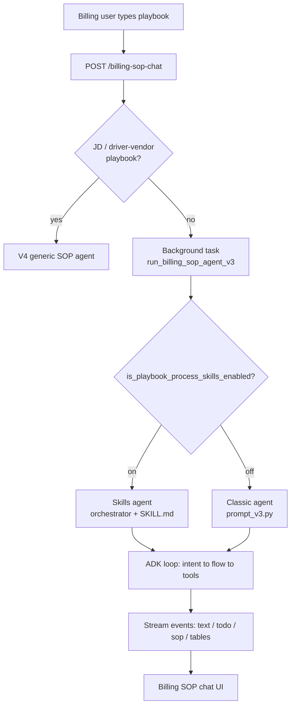

# Billing SOP Agent V3

## Introduction
The Billing SOP Agent V3 is the conversational agent behind the **Billing SOP
chat**. A billing user types a playbook in plain English ("All ACME loads need a
signed POD before invoicing; escalate mismatches to #billing-ops") and the agent
turns it into executable TMS rules for that customer. It is an ADK-pattern agent
(Claude Opus) that runs as a background task, streams its work back over SSE, and
persists everything so a conversation can be resumed after any gap.

This is the entry note. It maps the pieces and points at the deeper notes. The
single most useful read for "what happens when I send a message" is
[[Customer SOP Message Flow]].

## What it does
- **Builds customer playbooks** from natural language — merge, verify, preview,
  save, then compile into rules. See [[Full Pipeline (Flow A)]].
- **Edits / removes / views** existing playbook rules without wiping unrelated
  ones. See [[Intent Routing and Flows]].
- **Trains document validation** from real sample documents (upload or pick from
  past loads). See [[Document Validation and Existing-Docs Picker]].
- **Compiles scenarios into rules** via the Rails rule-creation pipeline. See
  [[Scenario Processing and Rule Creation]].
- **Automates customer portals** (login, scrape, upload) through a portal
  sub-agent. See [[Tools and Sub-Agents]].

## Two scoping modes
| Mode | Trigger | Meaning |
|------|---------|---------|
| **Customer SOP** | `customerIds` present | Playbook applies to one customer (or a customer group). The focus of this vault. |
| **Generic playbook** | `customerIds` empty / null | Carrier-wide default that applies to all customers. Smaller prompt. |

A separate **V4 generic SOP agent** handles driver-pay / vendor-pay / CSR job
descriptions and is routed *before* V3 — see [[Customer SOP Message Flow]].

## Component map
| File                                                         | Role                                                                                              |
| ------------------------------------------------------------ | ------------------------------------------------------------------------------------------------- |
| `app/routes/exception_recommendation_agent.py`               | HTTP route `billing_sop_chat` — auth, decrypt, conversation, dispatch. → [[codes/Route Dispatch]] |
| `sop/runner.py`                                              | `run_billing_sop_agent` — thin wrapper that delegates to V3.                                      |
| `sop/runner_v3.py`                                           | The engine — background task, ADK session, tools, SSE, resume.                                    |
| `sop/agent_v3.py` + `sop/prompt_v3.py`                       | Classic agent factory + full system prompt.                                                       |
| `sop/sop_v3_skills/`                                         | Skills-based agent — slim orchestrator + one SKILL.md per flow. Flag-gated.                       |
| `sop/agent_v3_static_cache.py` + `runner_v3_static_cache.py` | Prompt-cache variant. See [[Prompt Caching (Static-Cache)]].                                      |
| `billing_agent_v2/playbook_tools.py`                         | Playbook CRUD + the existing-docs picker tool.                                                    |

## Two prompt builds (both live, flag-gated)
The agent factory is chosen at runtime (`runner_v3.py:4902`):

- **Classic** — `get_billing_sop_agent_v3` with the ~2,800-line `prompt_v3.py`
  system prompt that holds all flows inline.
- **Skills** — `get_billing_sop_agent_v3_skills` with a slim ~280-line
  orchestrator plus 11 on-demand `SKILL.md` files (one per flow). Selected when
  the carrier flag `is_playbook_process_skills_enabled` is on (and not generic).

Both express the **same Flow A–F behavior**; the skills build just loads each
flow's recipe on demand instead of carrying all of them every turn.

## Diagram

## How it works
1. **Request arrives** at the route, is decrypted, scoped to a conversation, and
   the user turn is saved. → [[Customer SOP Message Flow]] · [[codes/Route Dispatch]]
2. **Dispatch** either routes to the V4 generic agent (job descriptions) or runs
   V3 as a background task and streams events back over SSE. → `exception_recommendation_agent.py:257`
3. **The agent classifies intent** (add / remove / edit / view / document / recompile)
   and runs the matching flow. → [[Intent Routing and Flows]]
4. **The flow drives tools** — merge, verify, review, preview, save, then compile
   scenarios into rules. → [[Full Pipeline (Flow A)]] · [[Scenario Processing and Rule Creation]]
5. **State persists** across ADK session, Postgres chat tables, a Redis event
   journal, and scratch context — so the run survives disconnects and resumes.
   → [[Lifecycle and Persistence]]

## Related
[[Customer SOP Message Flow]] · [[Intent Routing and Flows]] · [[Full Pipeline (Flow A)]] · [[Document Validation and Existing-Docs Picker]] · [[Scenario Processing and Rule Creation]] · [[Tools and Sub-Agents]] · [[Lifecycle and Persistence]] · [[Prompt Caching (Static-Cache)]] · [[Prompt]]
