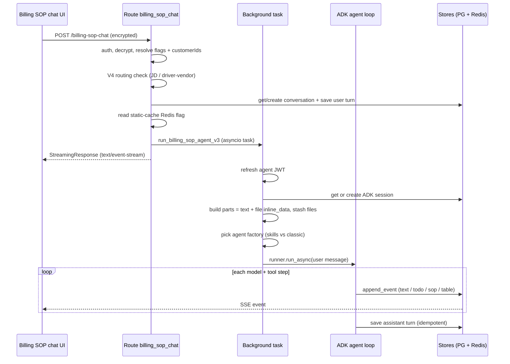

# Customer SOP Message Flow

## Introduction
This is the end-to-end lifecycle of a single message in a **customer** SOP chat —
from the moment the user hits send to the moment the reply finishes streaming.
It answers "how does it actually flow." The defining trait of V3 is that the
agent runs as a **detached background task** and the HTTP response only *streams*
its events: the work survives a browser disconnect or a server restart.

"Customer SOP" means the request carries `customerIds` (one customer, or a list
for a customer group). That is what selects the billing playbook path rather than
the generic carrier-wide path or the V4 job-description path.

## Example
User on the ACME playbook tab types *"Add: every load needs a signed POD before
invoicing"* and attaches nothing. The browser sends one encrypted POST. The route
saves the turn, starts a background task, and returns a stream. The agent
classifies this as **Flow A (add content)**, merges the text into ACME's
playbook, previews it, asks to save, and — because the text mentions a document
rule — offers to collect POD samples. Every step is a separate SSE event the UI
renders live.

## Diagram

## How it works
1. **POST arrives** at `billing_sop_chat`. The user is read from
   `request.state.user`; `user_id` doubles as `carrier_id`. Carrier-level
   capability flags (`is_browser_agent_enabled`, `is_generic_playbook_enabled`,
   `is_playbook_process_skills_enabled`, `adminId`) are read off the user.
   → `exception_recommendation_agent.py:257`
2. **Payload is decrypted.** The body's `data` field is an encrypted blob;
   `decrypt_sop_payload` turns it back into `{ message, customerIds, files,
   context, session_id, run_id, ... }`. → `exception_recommendation_agent.py:327`
3. **V4 routing gate.** If `sop_type` is a job description or a driver/vendor
   playbook, the request is handed to the **V4 generic SOP agent** and V3 is never
   touched. A customer billing playbook has no such `sop_type`, so it falls
   through to V3. → `exception_recommendation_agent.py:335` · [[Intent Routing and Flows]]
4. **Conversation resolved + user turn saved.** A conversation id is fetched or
   created per `customerIds` (group vs single vs generic), and the user message is
   written to `chat_messages`. → `exception_recommendation_agent.py:633` · `:704`
5. **Static-cache flag read.** A single Redis flag decides whether to use the
   prompt-cache pipeline; it flips all SOP-chat traffic at once.
   → `exception_recommendation_agent.py:601` · [[Prompt Caching (Static-Cache)]]
6. **Dispatch to the runner.** Either `run_billing_sop_agent_v3_static_cache`
   (`:823`) or `run_billing_sop_agent` (`:842`). Both ultimately call
   `run_billing_sop_agent_v3`, which spawns `_run_agent_background` as an
   `asyncio` task and returns immediately. The route wraps the Redis event stream
   in a `StreamingResponse`. → `runner.py:87` → `runner_v3.py:6018` · [[codes/Route Dispatch]]
7. **Background task sets up.** It refreshes the agent JWT
   (`get_carrier_agent_token`, `:4197`), then gets or creates the ADK session
   keyed by `(app_name, user_id, conversation_id)` (`:4208` / `:4251`).
   → [[Lifecycle and Persistence]]
8. **The user message is built as multimodal parts.** Text first; each uploaded
   file becomes an `inline_data` blob so the model can actually see PDFs/images.
   Files are also stashed in `V3ContextStore.uploaded_files` (capped at the last
   few) for tools to read later. → `runner_v3.py:5270` · `:5297`
9. **Agent factory is chosen.** `is_playbook_process_skills_enabled and not
   is_generic` → skills agent; otherwise the classic `prompt_v3` agent. Both get
   the same tools, customer scoping, and token tracker. → `runner_v3.py:4902`
10. **ADK loop runs.** `runner.run_async` drives model ↔ tool turns. Each
    meaningful step is pushed to the Redis journal via `append_event` and
    surfaces as an SSE event — `text`, `todo`, `sop` (right-panel content),
    `document_validation_suggestion`, `doc_picker_table`. → `runner_v3.py:5264` · `:4168`
11. **The flow does the real work.** Intent → flow → tools: merge, verify,
    review, preview, save, compile. → [[Full Pipeline (Flow A)]]
12. **Assistant turn is persisted exactly once.** Two writers (the stream-end
    callback and the background accumulator) race; a Redis flag
    (`try_mark_message_persisted`) guarantees a single row. → [[Lifecycle and Persistence]]

## Why it's a background task, not a request handler
The model can run for minutes (multi-tool pipelines, portal automation). If the
work lived inside the HTTP handler, a closed tab would kill it mid-save. Instead
the task is detached and the HTTP layer only relays events from Redis — so the
client can disconnect and **resume** later by polling the run. → [[Lifecycle and Persistence]]

## Related
[[Billing SOP Agent V3]] · [[Intent Routing and Flows]] · [[Lifecycle and Persistence]] · [[codes/Route Dispatch]] · [[Prompt Caching (Static-Cache)]]
