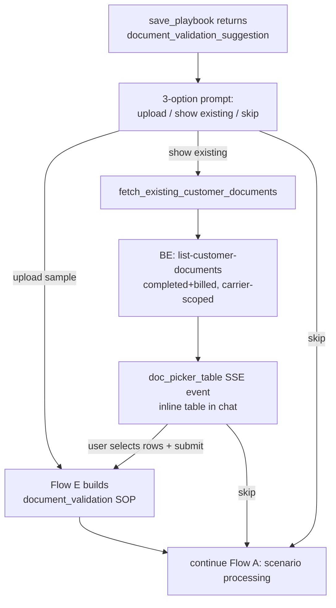

# Document Validation and Existing-Docs Picker

## Introduction
When a playbook says things like "POD must be signed" or "TIR must be stamped,"
the AI document validator needs **real sample documents** to learn what a valid
one looks like for that customer. Flow E collects those samples — either fresh
uploads or, via the **existing-docs picker**, documents pulled from the
customer's past completed loads and shown in an inline table to select from.
Flow E then builds a customer-specific `document_validation` SOP.

This is the "Flow E" of [[Intent Routing and Flows]] and the home of the picker
feature (`fetch_existing_customer_documents`).

## How it is triggered
Flow E begins from one of two places:
- **Step 4.5 of [[Full Pipeline (Flow A)]]** — `save_playbook` /
  `update_playbook` returns a `document_validation_suggestion` (the prose
  mentioned document-acceptance rules). The agent emits a 3-option prompt.
- **A direct document upload** — the user attaches a PDF/image and calls it a
  valid sample.

The 3-option prompt offers: **(1) upload** samples, **(2) "show existing"** to
fetch a table of past documents, or **(3) "skip"**.

## The existing-docs picker
Choosing option 2 fires `fetch_existing_customer_documents`, which is the
reusable fetch-and-show-in-a-table capability:

- It calls the backend `POST /tms/ai-doc-picker/list-customer-documents` with the
  customer id(s) and canonical doc types.
- The backend returns documents grouped by type (each `{ totalCount, documents }`
  with signed URLs), scoped to the **carrier from the JWT**, drawn from
  **completed + billed loads only**, and refuses customer-portal users (403).
- The tool stashes the result under `pending_doc_picker_table`; the runner drains
  it into a `doc_picker_table` SSE event the chat UI renders inline. The table is
  also persisted to the chat message so a page reload rehydrates it.

Today the picker is **gated to this flow** — it fires reliably only when the
post-save `document_validation_suggestion` left an `awaiting_doc_picker_choice`
stash. There is no first-class "fetch documents any time" entry point yet.
→ [[codes/Existing-Docs Picker Tool]]

## Diagram

## How it works
1. **Suggestion detected.** Document-acceptance language in the saved playbook
   makes the save return a `document_validation_suggestion` carrying `doc_types`,
   `parent_customer_ids`, and evidence snippets. → `flow-a-full-pipeline/SKILL.md:87`
2. **3-option prompt + await.** The agent shows the prompt text and calls
   `await_user_response()` in the same turn so the user sees the options before
   replying. → `SKILL.md:91`
3. **Upload / submit path.** Files arrive as the same upload payload and the agent
   pivots into Flow E to create or extend the `document_validation` SOP. If
   `action == "extend"` and an `existing_doc_sop_id` is present, it updates that
   SOP instead of creating a new one. → `SKILL.md:104`
4. **"show existing" path.** A deterministic runner intercept (or the LLM) calls
   `fetch_existing_customer_documents(customer_ids, doc_types)`; the table renders
   inline; selecting rows is treated as an upload and pivots to Flow E.
   → `playbook_tools.py:3029` · `runner_v3.py:4941` · [[codes/Existing-Docs Picker Tool]]
5. **"skip" path.** Clears the picker stash and resumes Flow A scenario
   processing. → `runner_v3.py:5015`

## Constraints worth knowing
- **Completed + billed loads only** — the picker shows finalized documents, not
  in-progress loads. → `ai-doc-picker-controller.js` (`buildCompletedBilledLoadFilter`)
- **Doc types must be canonical labels** (`Proof of Delivery`, `Scale Ticket`) —
  codes like `POD` are normalized through the `DocumentType` enum; empty types
  return nothing. → `playbook_tools.py:2990` (`_canonicalize_doc_types`)
- **Carrier-scoped from JWT**, never from the request body; customer-portal logins
  are blocked outright.

## Related
[[Intent Routing and Flows]] · [[Full Pipeline (Flow A)]] · [[codes/Existing-Docs Picker Tool]] · [[Lifecycle and Persistence]] · [[Billing SOP Agent V3]]
