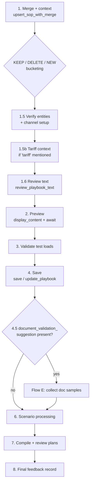

# Full Pipeline (Flow A)

## Introduction
Flow A is the complete, canonical user flow for **adding playbook content** to a
customer SOP — and the path B and C converge into after they synthesize their
text. It walks the playbook from raw prose all the way to live rules: merge →
verify → review → preview → test loads → save → (optional document samples) →
scenario processing → plan compilation. Every step that changes something asks
the user before committing.

This is "the user flow" most people mean when they ask how the agent works.

## Example
User: *"Here's our playbook for ACME: all loads need POD before invoicing,
reference number must match the BOL, escalate to #billing-ops if mismatch."*

The agent merges it into ACME's existing playbook, finds 0 prior rules and 3 new
scenarios, verifies #billing-ops exists, reviews the text (PASS), previews it,
asks to save, validates the test loads the user gives, saves, then compiles the 3
scenarios into rules — pausing for confirmation at preview, test loads, and the
final business summary.

## Diagram

## How it works
1. **Merge + context.** `upsert_sop_with_merge(new_instructions, sop_type=
   "playbook")` returns `merged_content` + `existing_sop_id`. Then
   `get_playbook_context_for_decision` buckets every existing rule into
   **KEEP / DELETE / NEW**. A scenario is "already covered" only if a KEEP rule
   *fully* covers it — a partial match marks the rule stale (delete + reprocess).
   → `flow-a-full-pipeline/SKILL.md:21`
   - 🚨 **Auto-approve exception**: auto-approve-on-completion scenarios are
     always KEEP — the backend re-evaluates them on every load event regardless
     of trigger. → `SKILL.md:35`
2. **Verify entities + channels.** `verify_playbook_entities` checks customers,
   locations, charge codes, branches, channels. Special replies: `⚠️ CHANNEL
   REQUIRED` (playbook implies notifications but names no channel) and
   `⚠️ COMMANDER NOT A MEMBER` (Captain must join the channel). Both pause for the
   user. → `SKILL.md:37`
3. **Tariff context (conditional).** If the text mentions "tariff", always call
   `get-tariff-summary-by-customer` and warn about charge codes not in the
   customer's tariff. Enrichment only — never blocks. → `SKILL.md:50`
4. **Review text.** `review_playbook_text` returns PASS / NEEDS_REVIEW / FAIL.
   FAIL shows the offending excerpts and loops after user correction; NEEDS_REVIEW
   offers to proceed or fix. → `SKILL.md:57`
5. **Preview.** `display_content(merged_content, sop_type="playbook")` renders the
   playbook in the right panel (an SSE `sop` event), the agent says what will
   change, then `await_user_response()`. → `SKILL.md:67`
6. **Validate test loads (mandatory).** Show any `existing_test_loads`; once the
   user confirms/provides refs, `validate_test_loads` must return `valid: true`
   before save. → `SKILL.md:73`
7. **Save.** New playbook → `save_playbook`; existing → `update_playbook`. Capture
   the returned `sop_embedding_id` for the audit feedback record. → `SKILL.md:81`
8. **Document-validation sample prompt (conditional).** If the save return holds a
   `document_validation_suggestion`, the agent offers three options — upload
   samples, "show existing", or skip — and branches into Flow E if the user
   provides documents. → `SKILL.md:87` · [[Document Validation and Existing-Docs Picker]]
9. **Scenario processing.** New scenarios trigger the `scenario-processing` skill
   (split → assess → process → batch rule creation). If everything was KEEP, skip
   it. → [[Scenario Processing and Rule Creation]]
10. **Plan compilation + review (mandatory).** `plan-compilation-review` compiles
    scenarios into executable plans, reviews them, shows a business summary, and
    saves. Never skipped. → `SKILL.md:131` · [[Scenario Processing and Rule Creation]]
11. **Final feedback record.** `create_feedback_wrapper(..., rules_to_delete=[...])`
    closes the audit trail — always pass `rules_to_delete` explicitly (use `[]`)
    so stale deletion markers from prior sessions don't carry forward.
    → `SKILL.md:135`

## Gotchas
- The first content-step todo must read as **Create / Add** — never "Merge"
  (internal jargon must not reach the user). → `SKILL.md:17`
- Portal mentions are resolved to the canonical provider name *before* the merge,
  so the saved playbook always names the real portal. → [[Tools and Sub-Agents]]

## Related
[[Intent Routing and Flows]] · [[Scenario Processing and Rule Creation]] · [[Document Validation and Existing-Docs Picker]] · [[Tools and Sub-Agents]] · [[Billing SOP Agent V3]]
