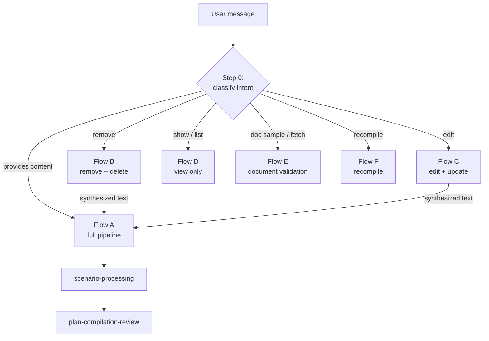

# Intent Routing and Flows

## Introduction
Before the agent touches a single tool it classifies what the user wants and
routes to one of six flows (A–F). This "Step 0" is what keeps an *edit* from
being treated as an *add* (which would wipe rules) and a *document upload* from
being treated as plain text. In the skills build, each flow is a separate
`SKILL.md` recipe loaded on demand; in the classic build the same flows live
inline in `prompt_v3.py`.

There are actually **two routing layers**: a coarse one in the HTTP route (V3 vs
V4 generic agent) and the fine one inside the agent (Flow A–F).

## Layer 1 — route-level (V3 vs V4)
Decided in `exception_recommendation_agent.py:335` before the agent runs:

| Condition | Goes to |
|-----------|---------|
| `sop_type` ends in `_job_description` (billing / CSR / driver-pay / vendor-pay) | V4 generic SOP agent |
| `sop_type` ends in `_playbook` with an `entity_type` (driver / vendor) | V4 generic SOP agent |
| Everything else (customer billing playbook, generic playbook) | **V3 — this vault** |

## Layer 2 — agent-level intent table (Flow A–F)
| Intent | Signals | Flow |
|--------|---------|------|
| Add new content | "here's our playbook", "add these rules", a paste of rules, even "also add one rule" | **A** — [[Full Pipeline (Flow A)]] |
| Remove content | "remove", "delete", "drop the X rule" | **B** — Remove & delete rule |
| Edit existing | "change X to Y", "update the threshold", "rename" | **C** — Edit & update rule |
| View / list | "show me", "what's in the playbook", "list playbooks" | **D** — View only (read-only) |
| Document sample | user attaches a PDF/image + "valid POD/BOL/TIR sample", or asks to fetch existing docs | **E** — [[Document Validation and Existing-Docs Picker]] |
| Recompile | "recompile", "regenerate", "reprocess" | **F** — Recompile (re-run pipeline, same text) |

Source recipes: `sop/sop_v3_skills/skills/flow-*/SKILL.md`; orchestrator routing
in `sop/sop_v3_skills/orchestrator_prompt.py` (skills build) and
`prompt_v3.py` Step 0 (classic build).

## The dangerous flows — B and C
Remove (B) and Edit (C) share a **hard gate** and a **synthesis-completeness**
rule, because the save path compares the *whole* new playbook text against
existing rules and deletes anything not covered:

- 🛑 **Hard gate** — never merge until `get_playbook_context_for_decision`
  confirms the synthesized instructions are non-empty. Empty text + existing
  rules + save = every rule bucketed DELETE = all rules wiped.
- 🚨 **Synthesis completeness** — the rewritten text must capture the intent of
  *every remaining rule* (minus the one being changed). Anything omitted is read
  as "deleted" and silently removed.

After confirmation, B and C both hand off to Flow A with the synthesized text as
`new_instructions`.

## Diagram

## How it works
1. **Step 0 runs first.** The orchestrator reads the message (and any files) and
   picks the flow. It then writes a user-visible todo list whose labels describe
   the *operation* ("Add playbook content", never "Merge"). → `flow-a-full-pipeline/SKILL.md:12`
2. **Add → Flow A.** The canonical pipeline: merge → verify → review → preview →
   test loads → save → scenario processing → compile. → [[Full Pipeline (Flow A)]]
3. **Remove / Edit → B / C.** Apply the hard gate + synthesis completeness, then
   converge into Flow A with the synthesized text. → `flow-b-remove-content/SKILL.md` · `flow-c-edit-existing/SKILL.md`
4. **View → Flow D.** Read-only: list entities, show current content. No save.
   → `flow-d-view-only/SKILL.md`
5. **Document → Flow E.** Triggered by an uploaded sample *or* a "show existing"
   request; builds a `document_validation` SOP from real documents.
   → [[Document Validation and Existing-Docs Picker]]
6. **Recompile → Flow F.** Re-runs scenario processing on the saved text without
   re-prompting for content. → `flow-f-recompile/SKILL.md`
7. **Portal sub-flow.** Inside Flow A, any portal mention resolves the canonical
   portal name first, then routes portal operations through the portal sub-agent.
   → [[Tools and Sub-Agents]]

## Related
[[Billing SOP Agent V3]] · [[Full Pipeline (Flow A)]] · [[Document Validation and Existing-Docs Picker]] · [[Scenario Processing and Rule Creation]] · [[Customer SOP Message Flow]]
