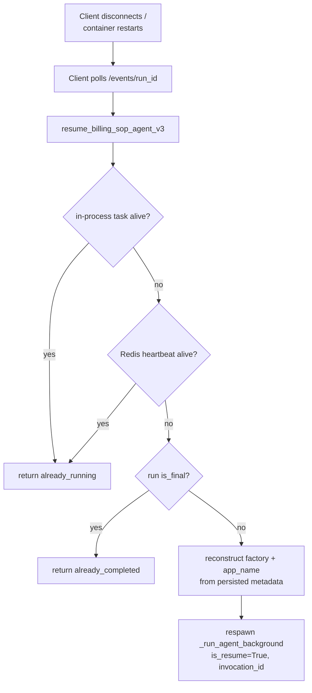

# Lifecycle and Persistence

## Introduction
V3 runs the agent as a detached background task and streams its work over SSE, so
the run has to survive a closed tab or a redeployed server. That resilience comes
from spreading state across several stores and being able to **resume** a run by
its id. This note covers the background-task model, the storage layers, the resume
path, and the SSE event format.

## Background task model
`run_billing_sop_agent_v3` spawns `_run_agent_background` as an `asyncio` task and
returns a `run_id` immediately; the HTTP layer only relays Redis events. The task
is shielded so it survives HTTP disconnect, tracked in a per-container registry,
and writes a heartbeat to Redis so another container can tell it is still alive.
→ `runner_v3.py:4107` · `:6018`

## Persistence layers
| Layer | Where | What it stores |
|-------|-------|----------------|
| `chat_messages` (Postgres) | route | User + assistant text turns and metadata |
| `chat_conversations` (Postgres) | route | Conversation metadata — carrier-scoped, `customerIds`, agent type |
| ADK `sessions` (Postgres) | ADK | Full LLM history (parts, tool calls/results), keyed by `(app_name, user_id, session_id)` |
| `AgentRunEventStoreRedis` | runner | Per-run event journal: seq → payload, status, `app_name`, heartbeat, `customer_ids`, auth token |
| `V3ContextStore` (Redis) | tools | Session scratch — uploaded files, intents, pending payloads. → [[Tools and Sub-Agents]] |
| `agent_trace_usage` (Postgres) | token tracker | Per-run input/output token usage |

## ADK session scoping
- Service: `DatabaseSessionService(db_url=AGENT_SESSION_POSTGRES_URL)`.
- Key: `(app_name, user_id, session_id)` where `session_id` = conversation id.
- `app_name` is `PORTPRO_BILLING_SOP_AGENT`, or
  `PORTPRO_BILLING_SOP_AGENT_static_cache` on the cache path. The schema is shared
  and scoped by column, so adding a new `app_name` needs no migration.
  → `runner_v3.py:4208` · `:4251` · [[Prompt Caching (Static-Cache)]]

## Diagram


## Resume flow
1. **Fast path** — if the task is alive in-process, return `already_running`.
2. **Cross-container** — if the Redis heartbeat is fresh, return `already_running`.
3. **Completed** — if the run is `is_final`, return `already_completed`.
4. **Rebuild context** — reconstruct `agent_factory` + `app_name_override` from the
   persisted `app_name`. ⚠️ This matters: if a static-cache run resumed under the
   default `app_name`, the ADK session lookup would miss, a new session would be
   created, and the message would re-run (double work / double billing).
5. **Respawn** `_run_agent_background` with `is_resume=True` + `invocation_id`; ADK
   skips already-completed tool calls for idempotent resume.
   → `runner_v3.py:5842`

## Idempotent assistant-message save
Two writers race to persist the assistant turn — the route's stream-end callback
and the background accumulator. An atomic Redis flag
(`try_mark_message_persisted(run_id)`) lets exactly one of them write the row.
→ `exception_recommendation_agent.py` (save path)

## SSE event format
Each Redis event is unwrapped by the route and re-emitted as an SSE line the UI
parses:

```
data: {"type":"text","data":"..."}                       # streamed model text
data: {"type":"todo","data":{...}}                        # todo list update
data: {"type":"sop","data":"...","replace":bool}          # right-panel content
data: {"type":"document_validation_suggestion","data":{}} # offer to collect doc samples
data: {"type":"doc_picker_table","data":{...}}            # inline existing-docs table
data: {"type":"keepalive"} | {"type":"heartbeat"} | {"type":"error",...}
```
Emit points: `runner_v3.py:5392` (todo), `:5413` / `:5439` (sop), `:5475`
(doc_picker_table); helper `append_event` at `:4168`.

## Related
[[Customer SOP Message Flow]] · [[Tools and Sub-Agents]] · [[Prompt Caching (Static-Cache)]] · [[Document Validation and Existing-Docs Picker]] · [[Billing SOP Agent V3]]
