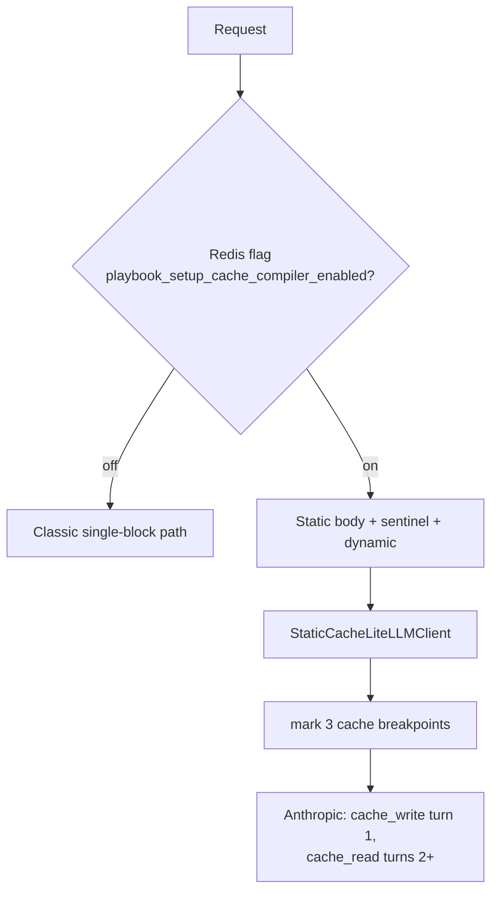

# Prompt Caching (Static-Cache)

## Introduction
The V3 system prompt is large (~50–80k tokens). Anthropic's prompt cache only
hits on an exact byte-prefix match, but V3 interpolates per-customer values
(customer id, carrier id, flags, skill catalog) *inside* that prompt — so a naïve
cache misses on every call. The static-cache pipeline fixes that by splitting the
prompt into a stable static block (cached) and a tiny dynamic block (not),
cutting per-turn input cost by ~85–90%. It is an opt-in variant selected by a
single Redis flag.

## The split
The system prompt is built with **neutral defaults** so its bytes are identical
for every caller, then a small dynamic block of override lines is appended after a
sentinel:

```
[ static block ~50k tokens — same bytes for all customers ]  ← cache_control, 1h TTL
<<<STATIC_DYNAMIC_BOUNDARY sentinel>>>
[ dynamic block — "overrides Customer ID: ABC", skill catalog ]  ← no cache_control
```

The model reads both blocks in order and reconciles the overrides ("override says
ABC; static said not provided → use ABC").

## Three cache breakpoints
Anthropic allows up to 4 `cache_control` blocks; this uses 3:

| # | Marked block | TTL | Why |
|---|--------------|-----|-----|
| 1 | Static system block | 1h | Biggest payload, hot across all customers |
| 2 | Last assistant message in history | 5m | Rolling marker — re-marked each turn so multi-turn history caches |
| 3 | Last tool definition | 5m | Tools array (~25k tokens) is stable within a session |

## Diagram


## How it works
1. **Flag check.** `_is_static_cache_pipeline_enabled` reads the Redis key once per
   request; truthy → use the cache pipeline for all SOP-chat traffic.
   → `exception_recommendation_agent.py:2070`
2. **Isolated wrapper.** `run_billing_sop_agent_v3_static_cache` is a thin override
   passing `agent_factory=get_billing_sop_agent_v3_static_cache` +
   `app_name_override=PORTPRO_BILLING_SOP_AGENT_static_cache`. Everything else
   delegates to `run_billing_sop_agent_v3`. → [[Lifecycle and Persistence]]
3. **The client preserves the block structure.** `StaticCacheLiteLLMClient` splits
   the system message on the sentinel, marks the 3 breakpoints, and calls the
   grandparent LiteLLM client directly so the parent's single-block caching does
   not clobber the list-of-blocks. → `agents/gemini_agent/utils/model_utils_static_cache.py`
4. **Resume keeps the namespace.** Because sessions live under a distinct
   `app_name`, resume must reconstruct the static-cache factory or the session
   lookup misses. → [[Lifecycle and Persistence]]

## Fallbacks
- No sentinel in content → degrade to a single cached block (warns).
- Caching disabled by env → strip the sentinel, send plain string.
- Generic-playbook mode → smaller prompt, bypass the split entirely.

## Why a flag, not always-on
A new LLM-client subclass is risky (orphan tool messages, multi-block edges,
rate-limit interaction). The flag gives instant rollback without redeploy and let
the team A/B the real cache hit rate before full rollout. One key flips all
`/billing-sop-chat` requests.

## Related
[[Lifecycle and Persistence]] · [[Customer SOP Message Flow]] · [[Billing SOP Agent V3]]
