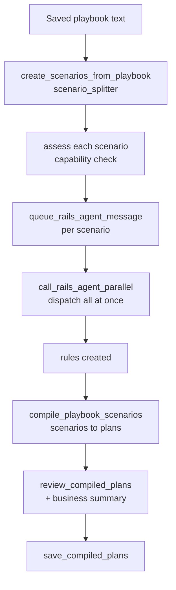

# Scenario Processing and Rule Creation

## Introduction
A saved playbook is still just prose. This is the back half of [[Full Pipeline (Flow A)]]
that turns it into executable rules: the text is split into discrete scenarios,
each scenario is assessed and handed to the **Rails** rule-creation agent, and the
resulting rules are compiled into plans, reviewed, and saved. Two skills own this:
`scenario-processing` (split → assess → process → batch) and
`plan-compilation-review` (compile → review → save).

## What a scenario is
One playbook may say several independent things ("POD required before invoice",
"reference must match BOL", "escalate mismatches to #billing-ops"). Each becomes a
**scenario** — a single trigger + condition + action — so it can become one rule
and be reasoned about independently.

## Diagram

## How it works
1. **Split.** `create_scenarios_from_playbook` runs the scenario splitter to break
   the playbook into individual scenarios. → `runner_v3.py` (`create_scenarios_from_playbook`)
2. **Assess.** Each scenario is checked for whether the available tools/agents can
   actually execute it; portal scenarios are flagged for sequential handling.
   → `scenario-processing/SKILL.md`
3. **Queue + dispatch to Rails.** Scenarios are queued
   (`queue_rails_agent_message`) and then dispatched concurrently
   (`call_rails_agent_parallel`). The Rails agent is the rule-creation step — one
   scenario in, one rule out. → `runner_v3.py:1427` · `:1709`
4. **Compile.** `compile_playbook_scenarios` turns the scenarios into executable
   plans — trigger events, trigger scripts, watched fields — and caches them in
   Redis for approval. → `runner_v3.py:2860`
5. **Review + business summary.** `review_compiled_plans` lints the plans and
   produces a business-friendly summary; the user confirms.
   → `runner_v3.py:3497` · `plan-compilation-review/SKILL.md`
6. **Save plans.** `save_compiled_plans` persists the final plans — the last step
   that makes the rules live. → `runner_v3.py:3664`
7. **Recompile (Flow F).** `recompile_playbook` re-runs this whole back half on the
   existing saved text without re-prompting for content. → `runner_v3.py:3751`

## Portal scenarios
A scenario whose work happens on an external portal (login, scrape, upload, sync)
is deferred and routed through the portal sub-agent rather than created as a plain
Rails rule. Each distinct portal *operation* is its own scenario; the sub-steps of
one operation stay together. → [[Tools and Sub-Agents]]

## Related
[[Full Pipeline (Flow A)]] · [[Tools and Sub-Agents]] · [[Intent Routing and Flows]] · [[Billing SOP Agent V3]]
