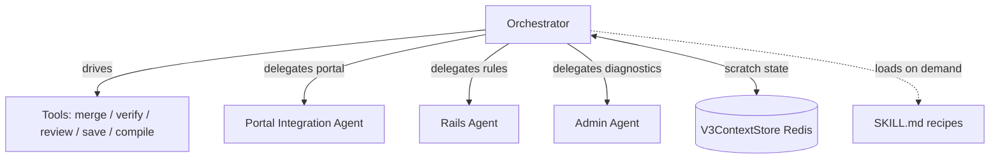

# Tools and Sub-Agents

## Introduction
The orchestrator does almost nothing by itself — it drives a toolbox and delegates
heavy work to sub-agents. This note catalogs the tools the flows call, the
sub-agents they hand off to (portal, admin, Rails), the skills runtime that loads
flow recipes on demand, and the Redis scratch store that carries state between
tool calls within a turn.

## Tool catalog (defined in `runner_v3.py`)
| Tool | Purpose |
|------|---------|
| `await_user_response` | Halt the model loop and wait for the user. Triggers the before-model stop callback. |
| `display_content` | Stream a `sop` event to the right panel (rendered as markdown). |
| `upsert_sop_with_merge` | Merge new instructions into the existing playbook. |
| `get_playbook_context_for_decision` | Return existing scenarios, test loads, and KEEP/DELETE/NEW inputs. |
| `verify_playbook_entities` | Verify customers, locations, charge codes, branches, channels; resolve typos; channel readiness. |
| `review_playbook_text` | Lint for ambiguity / contradiction / missing triggers. Verdict PASS / NEEDS_REVIEW / FAIL. |
| `validate_test_loads` / `suggest_test_loads_for_customer` | Validate or suggest test-load references. |
| `save_playbook` / `update_playbook` | Persist the playbook; may return `document_validation_suggestion`. |
| `create_scenarios_from_playbook` | Split the playbook into scenarios. |
| `queue_rails_agent_message` / `call_rails_agent_parallel` | Queue + dispatch scenarios to the Rails rule creator. |
| `compile_playbook_scenarios` / `review_compiled_plans` / `save_compiled_plans` | Compile → review → persist plans. |
| `recompile_playbook` | Flow F entry — re-run the pipeline on saved text. |
| `fetch_existing_customer_documents` | The existing-docs picker. → [[Document Validation and Existing-Docs Picker]] |
| `create_feedback_wrapper` | Write the audit feedback record (with `rules_to_delete`). |
| `search_entities` / `list_entities` / `delete_entity` / `get_entity_versions` | Entity CRUD (`tools_v3.py`). |

Entity types: `playbook`, `contract`, `document_validation`, and JD variants.

## Sub-agents
- **Portal Integration Agent** (`portal_integration_agent/`) — a separate ADK
  agent for portal automation (login, scrape, upload). The orchestrator resolves
  the canonical portal name first (`get-supported-portals`), loads delegation
  rules once (`get_portal_instructions`), then routes portal work through
  `call_portal_integration_agent`. → [[Scenario Processing and Rule Creation]]
- **Rails Agent** — the rule-creation step. Not a standalone ADK agent; invoked
  via `call_rails_agent` / `call_rails_agent_parallel`. One scenario → one rule.
- **Admin Agent** — inline diagnostic sub-agent (`call_admin_agent`), gated by the
  carrier `admin_agent_enabled` flag. Describes system state and suggests fixes;
  read-only.

## Skills runtime
In the skills build, each flow is a `SKILL.md` under `sop_v3_skills/skills/`. ADK
exposes only the frontmatter (name + one-line description) until the agent
triggers a skill, then loads the body on demand. This keeps a routine turn at
~6k tokens instead of carrying the whole ~50k prompt. Session state tracks
assigned / active skills and any references they load. → [[Billing SOP Agent V3]]

## V3ContextStore — cross-tool scratch
Redis key-value scoped by `session_id` (`app/services/v3_context_store.py`).
Holds short-lived state that must survive between tool calls and turns:

| Key | Holds |
|-----|-------|
| `uploaded_files` | Recent file payloads (filename, mimetype, base64), capped at the last few |
| `sop_type_intent` | Active tab (playbook / contract / document_validation) — tools refuse cross-type writes |
| `awaiting_doc_picker_choice` / `last_doc_picker_args` | Existing-docs picker intent + args |
| `pending_doc_picker_table` / `pending_doc_validation_suggestion` | Payloads waiting to be drained into SSE events |
| `is_captain_enabled`, `auth_failed` | Carrier Captain flag, auth-refresh flag |

## Diagram

## How it works
1. **Orchestrator picks tools per flow.** Each SKILL.md lists its allowed tools in
   `metadata.adk_additional_tools`. → `flow-a-full-pipeline/SKILL.md:5`
2. **Tools read/write scratch state** through `V3ContextStore.get_value` /
   `set_value`, scoped to the session. → `app/services/v3_context_store.py`
3. **Heavy work is delegated** to the portal, Rails, or admin sub-agent rather than
   done inline. → `runner_v3.py:1427` · `:1918`
4. **Skills load incrementally** so the model only carries the recipe for the flow
   it is currently running.

## Related
[[Full Pipeline (Flow A)]] · [[Scenario Processing and Rule Creation]] · [[Lifecycle and Persistence]] · [[Billing SOP Agent V3]]
