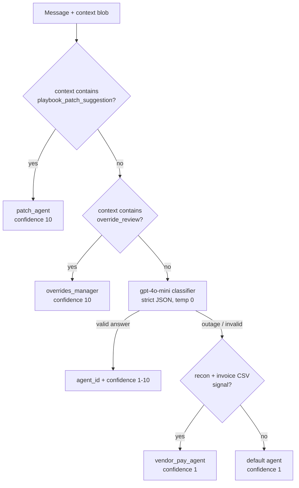

# Captain Routing and Classifier

## Introduction

"Captain" is the orchestrator identity of the Commander agent. When a chat enters with `agent_id="captain"`, a small, cheap classifier model (`gpt-4o-mini`, temperature 0, strict JSON schema) reads the message plus the full conversation context and picks which domain sub-agent should own the turn. Two thread types skip the LLM entirely and are routed by plain code — that is what makes the override-review and patch-card threads reliable.

## Routing table

| agent_id | Domain | Typical triggers |
|----------|--------|------------------|
| `helen` | Customer billing | charges, pricing, invoices, chargesets, payments |
| `csr_agent` | Load lifecycle | load status, routing, drivers, appointments, documents |
| `vendor_pay_agent` | Vendor AP | vendor bills, chassis invoices, reconciliation |
| `collection_agent` | AR collections | overdue invoices, dunning, aging |
| `sales_agent` | New-business pricing | quotes, RFQs, market rates |
| `driver_pay_agent` | Driver payroll | pay items, settlements, deductions |
| `sop_agent` | Playbooks / rules | create/edit/debug playbooks — bridges to SOP V3 |
| `patch_agent` | Patch-card explanations | **never LLM-chosen** — deterministic marker only |
| `overrides_manager` | Override review | **never LLM-chosen** — deterministic marker only |

## Why the short-circuits are code, not LLM

Cards are posted *as captain* with a system-emitted marker in their context (`exception_type` / category). A thread reply like "ok" or "apply 300" carries that marker in its context blob. Intent here is not fuzzy — the system itself tagged the thread — so a string check is the right tool. A misroute would land a bare "ok" on `helen`, a **live mutating billing agent**. The code comments call this out explicitly.

## Degraded fallback

If the classifier LLM is down (timeout, 429, malformed JSON), routing does **not** silently fall to `helen`. A heuristic checks for the known high-risk case (invoice/chassis CSV reconciliation → `vendor_pay_agent`); everything else takes the default with confidence pinned to 1 so the degraded route is visible in logs. → `classifier.py:255-286`

## Diagram

## How it works

1. **Patch short-circuit** — `"playbook_patch_suggestion"` found anywhere in the context blob → return `("patch_agent", 10)`. → [[codes/Captain Classifier]] · `app/agents/comms/classifier.py:315-320`
2. **Override short-circuit** — `"override_review"` in the context blob → return `("overrides_manager", 10)`. This is the hook that wires the override feature into Commander. → [[Override Review Integration]] · `classifier.py:327-333`
3. **LLM classification** — system prompt with the routing rules + user turn containing `<context>` and `<message>` delimited blocks (keeps untrusted input separate from instructions); response forced into `{"agent_id", "confidence"}` via strict JSON schema. → `classifier.py:335-380`
4. **Validation** — returned id must be in the valid set; anything else goes through `_degraded_fallback`. → `classifier.py:255-286`
5. **Runner applies the result** — `run_drayage_comms_agent` swaps `agent_id` before building tools, prompt, and MCP endpoint, so the rest of the turn runs fully as the chosen sub-agent. → [[codes/Comms Runner]] · `runner.py:523-531`

## Related

[[Commander Agent Overview]] · [[Delegation to Sub-Agents]] · [[Override Review Integration]] · [[codes/Captain Classifier]]
