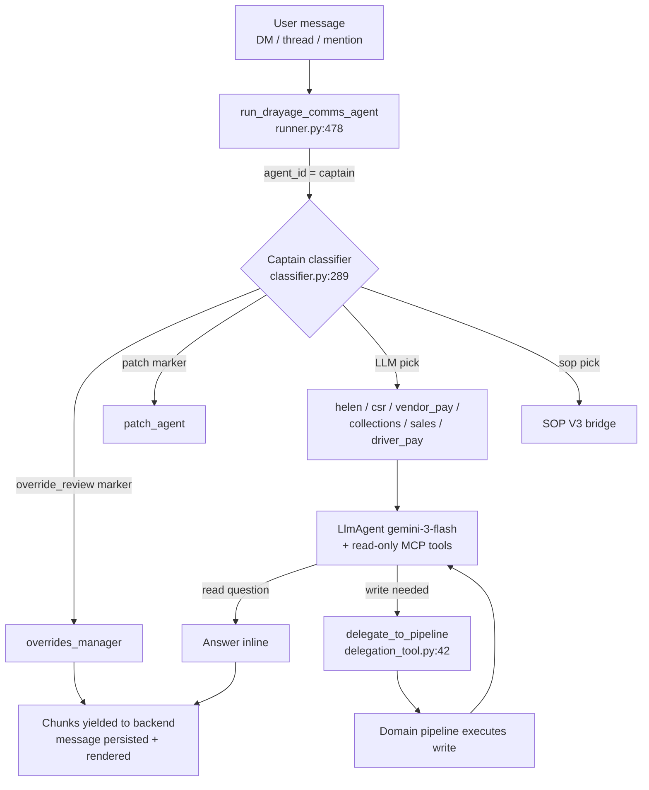

# Commander Agent Overview

## Introduction

The Commander agent (code name **DrayageCommsAgent**, "Commander" in the UI, `communication_chat` in Opik traces) is the conversational hub of PortPro's AI chat. Every message a user types in the AI Hub — a direct message, a channel thread reply, or an @mention — lands on this one agent. It answers read-only questions itself using MCP tools, and hands every write operation (create / update / approve / delete) to a specialist sub-agent pipeline. It is deliberately **not** a do-everything LLM: it has a scope gate, a frozen list of blocked write tools, and deterministic routing rules.

## Features

- **One front door** — DMs, threads, and @mentions all enter through a single runner, `run_drayage_comms_agent()`.
- **Captain routing** — when the entry agent is `captain`, a small classifier model picks the right domain sub-agent (billing, CSR, vendor pay, collections, sales, driver pay, playbooks…). See [[Captain Routing and Classifier]].
- **Read inline, write by delegation** — read-only MCP tools are mounted directly; writes must go through the `delegate_to_pipeline` tool. See [[Delegation to Sub-Agents]].
- **Deterministic thread short-circuits** — replies inside an override-review card thread always go to the overrides manager, and replies on a patch-suggestion card always go to the patch agent, no LLM vote involved. See [[Override Review Integration]].
- **Attachment reading** — `read_dm_attachment` extracts data from files dropped into the chat (PDF, Excel, CSV, images).
- **Skills** — per-user assigned runtime skills get seeded into session state and activated via an `activate_skill` tool.

## Key facts

| Fact | Value |
|------|-------|
| Framework | Google ADK (`google.adk.agents.LlmAgent`) |
| Model | `gemini-3-flash-preview`, temperature pinned to 1.0 (lower values make Gemini 3 loop) — `app/agents/comms/runner.py:861-866` |
| Session | `InMemorySessionService` — per-request, no cross-turn memory; conversation state lives in the DM "sidecar" (`DMContextService`) |
| Repo | `portpro-ai-agents`, `app/agents/comms/` |
| Observability | Opik project `communication_chat`; the whole Commander → delegation chain shows as one trace |
| Audit trail | `aiRequestlogs` collection in MongoDB (`portpro-backend/server/modules/ai-request-logs/ai-request-logs-model.js`) |

## Diagram

## How it works

1. **Message arrives** — frontend chat posts the message; the auto-response/DM-context service builds a context blob (sidecar state, rolling summary, up to 250 recent messages, attachment extractions) and calls `run_drayage_comms_agent()`. → [[codes/Comms Runner]] · `app/agents/comms/runner.py:478-511`
2. **Captain resolves the domain** — if `agent_id == "captain"`, the classifier returns the concrete sub-agent id and a confidence score. → [[Captain Routing and Classifier]] · `runner.py:523-531`
3. **Special routes bypass the full runner** — `sop_agent` bridges into SOP V3's own persistent session (`runner.py:541-567`); override-review and patch threads short-circuit deterministically. → [[Override Review Integration]]
4. **Agent is built per request** — instruction template from `instruction.py`, read-only MCP toolset (write tools excluded per agent id), `LlmAgent` with the Gemini model, fresh in-memory session seeded with `carrier_id`, `auth_token`, `customer_id` from the sidecar, and the raw `context_data`. → `runner.py:868-926`
5. **LLM answers or delegates** — reads run inline against MCP; any mutation must go through `delegate_to_pipeline(task_description=…)`, which runs the matching domain pipeline and returns its result as a tool response. → [[Delegation to Sub-Agents]]
6. **Response streams back** — the runner yields `(text_chunk, is_final)` tuples; the messaging service persists the message (PostgreSQL messages table + `aiRequestlogs` audit) and the frontend renders text or an exception card. → [[End-to-End User Flows]]

## Related

[[Captain Routing and Classifier]] · [[Delegation to Sub-Agents]] · [[Override Review Integration]] · [[End-to-End User Flows]] · [[codes/Comms Runner]] · [[../Override Flow|Override Flow domain]]
