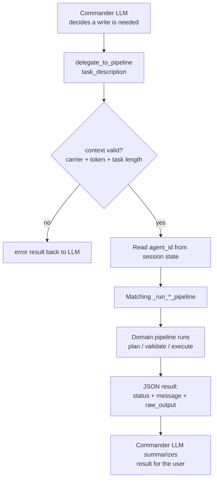

# Delegation to Sub-Agents

## Introduction

Commander never writes data itself. Its MCP toolset is filtered down to read-only tools, and every mutation must go through one ADK tool: `delegate_to_pipeline(task_description)`. The tool reads the session state (carrier, user, token, the agent id the classifier picked) and runs the matching domain pipeline end to end, returning the pipeline's result back to Commander's LLM as a tool response. This keeps one safety model: the chat LLM can only *describe* a write; a dedicated, validated pipeline *performs* it.

## Why this design

- **Blast-radius control** — write MCP tools are excluded per agent id by frozen lists in the runner (billing ~45 tools, CSR ~13, vendor-pay all of them). A jailbroken or confused chat turn physically cannot call an update tool.
- **Validation lives in pipelines** — billing actions pass through plan → action-validator (playbook gates) → executor; the chat layer never re-implements those checks.
- **Self-contained task text** — the tool docstring forces explicit task descriptions ("Update chassis charge on load DRAY-12345 to 18 days at $40/day"), rejecting vague ones ("ok do it") under 10 characters.

## Pipeline map

| agent_id in state | Pipeline function | What executes |
|-------------------|-------------------|---------------|
| `helen` | `_run_billing_pipeline` | Billing agent (plan → validate → execute) |
| `csr_agent` | `_run_csr_pipeline` | CSR/load-lifecycle pipeline |
| `collection_agent` | `_run_collection_pipeline` | Collections runner |
| `sales_agent` | `_run_sales_pipeline` | Sales/pricing runner |
| `vendor_pay_agent` | `_run_vendor_pay_pipeline` | Vendor AP runner (thin-router mode: *all* its work is delegated) |
| `patch_agent` | `_run_patch_pipeline` | Patch explanation runner |
| `overrides_manager` | `_run_overrides_manager_pipeline` | Overrides Manager — see [[Override Review Integration]] |
| `admin_agent` | `_run_admin_pipeline` | Diagnostics/audit agent |
| `sop_agent` | `_run_sop_v3_pipeline` | Playbook CRUD (SOP V3) |

All in `app/agents/comms/delegation_tool.py`.

## Diagram



## How it works

1. **LLM calls the tool** — with a self-contained `task_description`. → [[codes/Delegation Tool]] · `app/agents/comms/delegation_tool.py:42-73`
2. **Context pulled from session state** — `agent_id`, `carrier_id`, `user_id`, `auth_token`, `session_id`, shared Opik tracer, and `customer_id` (seeded from the DM sidecar so per-customer playbook gates evaluate correctly on the first turn). → `delegation_tool.py:77-97`
3. **Guard rails** — missing carrier/token → error; task description under 10 chars → error with guidance. → `delegation_tool.py:91-103`
4. **Dispatch by agent id** — the right `_run_*_pipeline` helper is invoked; each wraps its domain runner, collects streamed chunks, and normalizes into `{status, message, raw_output, runner}`. → `delegation_tool.py:138-220`
5. **Special case: overrides manager** — gets the *original* `context_data` from state (not Commander's paraphrase) because it acts on exact ids, and its raw output (with the ```json decision block) is stashed in a session-keyed dict for the backend pick→apply bridge to pop afterwards. → `delegation_tool.py:494-549` · [[Override Review Integration]]
6. **Result returns to the LLM** — which writes the human-facing confirmation; the pipeline's own side effects (DB updates, audits) are already done.

## Related

[[Commander Agent Overview]] · [[Captain Routing and Classifier]] · [[Override Review Integration]] · [[codes/Delegation Tool]]
