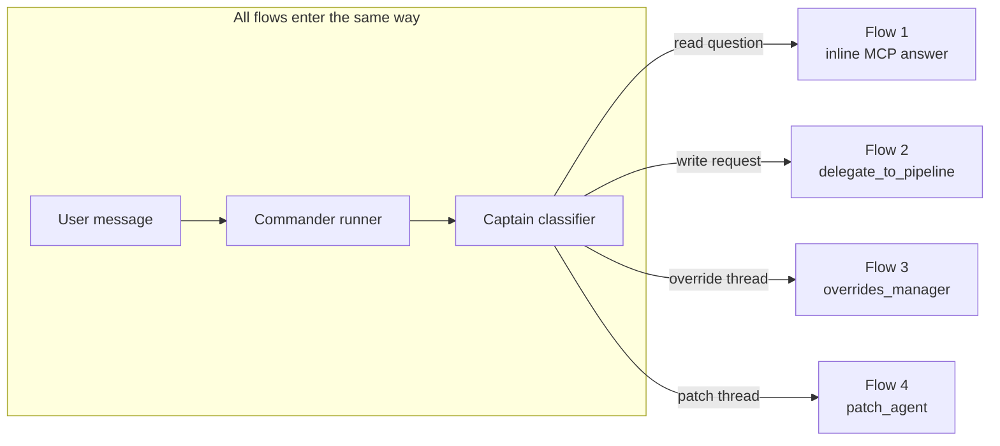

# End-to-End User Flows

## Introduction

The four flows that cover almost every Commander interaction: a read-only question, a write request, an override review, and a patch-suggestion question. Each one shows what the user sees and which component does the work underneath.

## Flow 1 — Read-only question

> User: *"What's the status of load 5VHLS_SMT_M100019?"*

1. Message enters `run_drayage_comms_agent()`; captain classifier picks the domain (load status → `csr_agent` or billing → `helen`). → [[Captain Routing and Classifier]]
2. The sub-agent's LLM calls read-only MCP tools (`search-loads`, `get-charge-list`, …) directly.
3. Answer is composed and streamed back; message persisted; user sees a plain text reply.

No delegation, no writes, one trace in Opik project `communication_chat`.

## Flow 2 — Write request (delegation)

> User: *"Approve the $500 LINE_HAUL charge on DRAY-12345"*

1. Classifier routes to `helen` (charge operation).
2. Helen's LLM reads the load and charge with MCP tools, recognizes "approve" as a write, and calls `delegate_to_pipeline("Approve $500 LINE_HAUL charge on DRAY-12345")`. → [[Delegation to Sub-Agents]]
3. The billing pipeline validates against playbook gates and executes the approval.
4. Result returns as a tool response; Commander confirms in chat. Charge is approved in the DB with an audit row.

## Flow 3 — Override review (our feature)

> Biller edits a protected tariff charge → blocked → card → reviewer replies *"apply 300"* → applied.

Full sequence in [[Override Review Integration]]. The Commander-specific part: the card thread carries the `override_review` marker, so every reply short-circuits to `overrides_manager` — reviewers can write anything ("ok", "why?", "apply 300") and it never lands on a mutating billing agent by accident.

## Flow 4 — Patch-suggestion question

> Playbook learning posts a patch card; user asks *"why this patch?"*

1. The learning system POSTs to `/api/add-task` with the patch payload; `AddTaskService` creates the `aiRequestlog` and posts a card *as captain* to the Playbook Learnings channel, tagged `playbook_patch_suggestion`. → `app/routes/add_task.py` · `app/services/add_task_service.py`
2. A thread reply carries the marker → classifier short-circuits to `patch_agent` (read-only thin router). → `app/agents/comms/classifier.py:315-320`
3. Patch agent explains the suggested change from the card + thread context.

## Diagram

## Where responses live

| Store | What |
|-------|------|
| PostgreSQL `messages` / `channels` / `conversations` | Chat history, threading, channel membership (`app/models/messaging/`) |
| MongoDB `aiRequestlogs` | Audit trail + exception-card payloads (`portpro-backend/server/modules/ai-request-logs/ai-request-logs-model.js`) |
| Opik `communication_chat` | Full trace of every turn including delegated pipelines |

Frontend renders plain messages or, when `content_type="exception_card"`, a structured widget (override card, patch card) — `portpro-frontend` AIHub chat components.

## Related

[[Commander Agent Overview]] · [[Override Review Integration]] · [[Delegation to Sub-Agents]] · [[codes/Comms Runner]]
