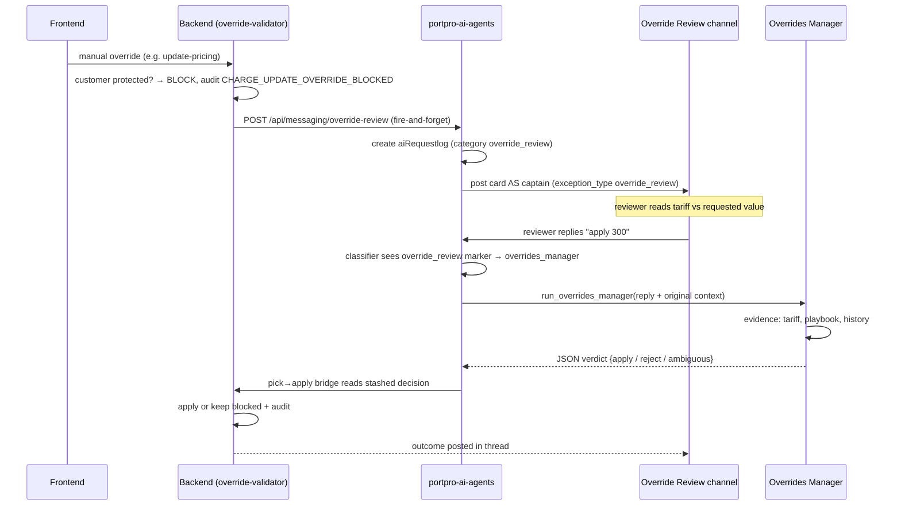

# Override Review Integration

## Introduction

This is where our override feature plugs into Commander. When a user manually overrides a system value (e.g. edits a tariff-derived charge) on a customer protected by the override setting, the backend **blocks** the write, records it, and posts a review card into the "Override Review" / needs-review channel — posted *as captain*. Any reply in that card's thread is deterministically routed to the **Overrides Manager** agent, which gathers evidence, recommends approve/reject, and on the reviewer's explicit pick applies the chosen value. Commander is the chat surface and router; the Overrides Manager is the brain; the backend remains the executor.

## Example

A biller edits the Base Price on load `5VHLS_SMT_M100019` from the tariff's $100 to $300. The customer (GCT NY) is override-protected, so the PATCH does not apply. Instead a card appears in Override Review: tariff said $100, user wanted $300, reason "customer confirmed new rate". A manager replies "apply 300" in the thread → Overrides Manager checks the tariff, playbook rules, and override history → returns verdict `apply` with high confidence → the backend bridge applies $300 and the timeline records the override.

## Diagram



## How it works

1. **Block at the source** — the backend `override-validator` module intercepts protected manual actions, records the reason, and writes a blocked-audit row (`CHARGE_UPDATE_OVERRIDE_BLOCKED` and siblings in `tms/payload.js` auditType). It does **not** apply the change. → `portpro-backend/server/modules/override-validator/index.js:64-156`
2. **Notify the agents service** — `postOverrideReviewToNeedsReview()` POSTs the override payload (kind, action, reason, actor, load/customer ids, entity snapshot, tariff snapshot) to `{AGENT_API_URL}/api/messaging/override-review`, fire-and-forget so billing UX never blocks on it. → `portpro-backend/server/modules/ai-control-tower/override-review-client.js:120-180`
3. **Card posted as captain** — the agents service creates an `aiRequestlog` (category `override_review`) and posts an exception card to the Override Review channel; the card context carries the `override_review` marker. → `app/services/add_task_service.py`
4. **Thread reply → deterministic route** — a reply in the card thread reaches Commander with that marker in its context blob; the captain classifier short-circuits to `overrides_manager` with confidence 10, no LLM vote. → [[Captain Routing and Classifier]] · `app/agents/comms/classifier.py:327-333`
5. **Manager runs with the original context** — `_run_overrides_manager_pipeline` passes the reviewer's reply *plus* the untouched `context_data` (exact charge/pricing ids — never Commander's paraphrase) into `run_overrides_manager()`. → [[codes/Delegation Tool]] · `app/agents/comms/delegation_tool.py:494-529` · `app/agents/overrides_manager/runner.py`
6. **Decision comes back as JSON** — verdict (`apply` / `reject` / `ambiguous`), recommendation, confidence, and a chat message. The raw output (with its ```json block) is stashed per session because Commander's final message paraphrases and would drop the block. → `delegation_tool.py:25-39, 541-544`
7. **Pick→apply bridge executes** — the auto-response service pops the stashed decision (`pop_overrides_raw_output`) and the backend applies the override (replay-mode apply of the original action) or leaves it blocked, updating the load timeline either way.

## Gotchas

- **Commander-only threads** — override cards live in Commander surfaces; routing relies on the system marker, so anything that strips `context_data` breaks the short-circuit.
- **Exact ids, not paraphrase** — the manager must act on the precise `chargeId`/pricing `_id` from the original log; that is why `context_data` rides along in session state (`runner.py:896-899`).
- **Flag-gated** — the whole capture path sits behind a customer-targeted override setting; flag off means manual edits apply directly and nothing posts.

## Related

[[Commander Agent Overview]] · [[Captain Routing and Classifier]] · [[Delegation to Sub-Agents]] · [[End-to-End User Flows]] · [[../Override Flow|Override Flow domain]]
