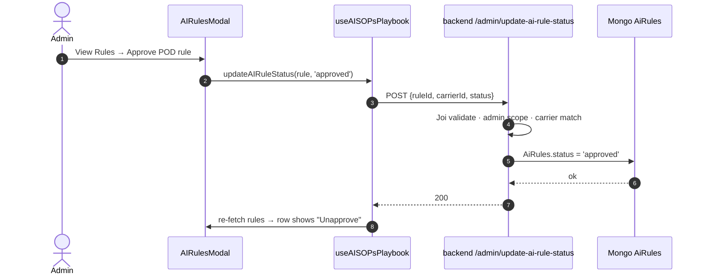

# Admin Rule Approval

## Introduction

The single approval gate for an AI rule. On `/admin/ai-sops-playbook` an admin opens a playbook's **View Rules** modal and approves each `AiRule`, flipping its `status` from `pending` → `approved`. This is the only approval action that matters for rule-firing — there is no separate business/engineering step (those buttons still render but are vestigial; see the note below). After this, the rule still won't fire until the SOP is activated in [[Customer SOP Activation]].

## Example

For the Ross Logistics POD playbook, the modal shows one row:
```
☐  POD required on DELIVERLOAD arrived — Ross Logistics
   Status: pending      Approve | Reject
```
Admin clicks **Approve** → `AiRules.status: pending → approved` → toast "Rule approved successfully".

## Vestigial UI — Engineering / Business Approved buttons
The DataGrid still renders **Engineering Approved** and **Business Approved** columns + buttons (`constants.js:198-205` / `216-221`). Their flags (`sop_embeddings.engineering_approved` / `business_approved`) are **not consumed by the live rule-firing gate** — only by an unused draft-trial branch. Treat them as legacy. The operative path is **View Rules → Approve**. See [[Runtime Validation Layers and Load Match]].

## Diagram



## How it works

1. **Open the page** — `/admin/ai-sops-playbook` (admin role; server-side scope on every API). → `routesConfig.jsx:2146`, `pages/admin/AISOPsPlaybook/index.js`
2. **View Rules** — `onShowAIRules(row)` opens `AIRulesModal.jsx`, populated by `getAIRulesBySopId(sopId, 1000, 0)` (all rules for the playbook's `sop_id`).
3. **Approve a rule** — builds a 3-field payload `{ruleId, carrierId, status}` and POSTs it, then re-fetches to refresh the modal. → [[codes/Admin Rule Approval Code]]
4. **Backend updates Mongo** — Joi-validated, admin-scoped, carrier-matched; sets `AiRules.status='approved'`. → [[codes/Admin Rule Approval Code]] · `portpro-backend/server/modules/admin/index.js:3104-3155`
5. **Bulk path** — `handleToggleAllAIRules` fires one POST per rule concurrently via `Promise.all`. → [[codes/Admin Rule Approval Code]]

## Post-step state (single-approval)

| Field | State |
|-------|-------|
| AiRules.status | `approved` ✅ |
| AiRules.isActive | `true` ✅ |
| sop_embeddings.status | `pending` ❌ (activated at [[Customer SOP Activation]]) |
| playbook_scenarios.is_active | `false` ❌ |

`status='approved'` is necessary but not sufficient — the runtime gate also needs `isActive=true` and an active `playbook_scenarios` row, flipped at activation. See [[Runtime Validation Layers and Load Match]].

## Failure cases

| Case | Behavior |
|------|----------|
| Double-click mid-request | `setLoadingRuleId` guards; second click no-op |
| Joi rejects payload | Toast "Failed to update rule status" |
| `carrierId` missing | Joi rejects (required) |
| Non-admin via direct API | 403 — scope check fails |
| Unapprove | Same endpoint, `status='pending'` — flips back (doesn't delete) |

## Related
[[Document Validation Overview]] · [[Flow E Document Validation]] (prev) · [[Customer SOP Activation]] (next) · [[codes/Admin Rule Approval Code]] · [[Runtime Validation Layers and Load Match]]
