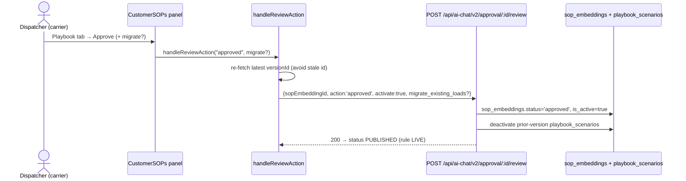

# Customer SOP Activation

## Introduction

The carrier-side sign-off that makes an approved rule **live**. After admin approves the rules ([[Admin Rule Approval]]), a dispatcher / ops manager opens the customer's SOP panel and clicks **Approve** — this marks the SOP `status='approved'` + `is_active=true`, deactivates older scenario versions, and (optionally) back-applies the rule to in-flight loads. This is the moment the rule starts firing.

## Why a separate carrier-side gate?

Admin approval ([[Admin Rule Approval]]) certifies the rule's quality (Portpro side). This step is the carrier turning it **on** for their own loads. Keeping them distinct separates "Portpro approved the rule" from "the carrier wants it enforced."

The carrier can:
- **Approve** — SOP activates carrier-wide for matching loads.
- **Reject** — stays dormant; admin republishes after fixes.
- **Approve + migrate** — also apply to existing in-flight loads (the `MigrateModal`).

## Diagram

## How it works

1. **Open the panel** — `/tms/ai-agent-hub?section=customer-sops` → customer → Playbook tab. Right panel shows `Rules: Approved` / `Status: Pending review` / `[Reject] [Approve]`. → `CustomerSOPs.jsx:788-803`
2. **Approve → (Playbook only) migrate modal** — confirming Approve on the Playbook tab opens a second modal: "apply to existing in-flight loads too?" → [[codes/Customer SOP Activation Code]]
3. **`handleReviewAction`** — re-fetches the latest `versionId` (avoids stale IDs), builds the review payload (`activate:true`, optional `migrate_existing_loads`), POSTs it. → [[codes/Customer SOP Activation Code]]
4. **Endpoint** — `POST {aiAgentUrl}/api/ai-chat/v2/approval/:sopEmbeddingId/review` (distinct from the admin rule-approval endpoint in [[Admin Rule Approval]]). → [[codes/Customer SOP Activation Code]]
5. **Backend side effects** — mark SOP `status='approved'`+`is_active=true`; **deactivate old scenario versions** (deferred to here so live scenarios aren't killed during draft testing); if `migrate_existing_loads`, background task re-applies to in-flight loads. → [[codes/Customer SOP Activation Code]] · `ai_chat_v2.py` `/review` · `sop_vector.py:1441-1451`

## Post-step state — rule LIVE

| Field | State |
|-------|-------|
| AiRules.status | `approved` ✅ |
| AiRules.isActive | `true` ✅ |
| sop_embeddings.status | `approved` ✅ |
| sop_embeddings.is_active | `true` ✅ |
| playbook_scenarios.is_active | `true` ✅ |

(No `business_approved`/`engineering_approved` in the gate — see [[Runtime Validation Layers and Load Match]].) Runtime firing: [[Runtime Rule Firing]].

## Failure cases

| Case | Behavior |
|------|----------|
| Reject | `action='rejected'`, no `activate`. Dormant; admin republishes. |
| Approve without migrate | Fires on new events only; in-flight loads unaffected. |
| Migration partial failure | Background task logs per-load failures (Control Tower); successes keep the exception. |
| Group customer | Approval + migration apply to ALL customers in the group. |
| document_validation tab | `migrate_existing_loads` irrelevant — doc-validation SOPs auto-approve at save ([[Flow E Document Validation]]); they skip this gate. |

## Related
[[Document Validation Overview]] · [[Admin Rule Approval]] (prev) · [[Runtime Rule Firing]] (next) · [[codes/Customer SOP Activation Code]] · [[Runtime Validation Layers and Load Match]]
