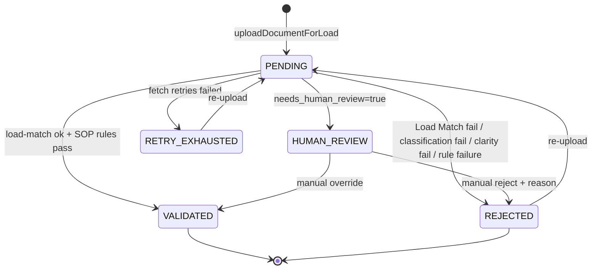

# Document Validation — Overview

## Introduction

The end-to-end flow that turns a dispatcher's plain sentence — `"require POD on driver arrived in deliver event"` — into a live rule that fires on the next matching load, and validates the uploaded document at runtime. This is the index for the domain: each step links to its own note, and code lives under [[codes/|/codes]]. Start here, then follow the deep-dive links.

> **Scope note (2026-06-02):** Approval in the live code is a **single gate** — an AI rule is either `pending` or `approved`, and the SOP is activated once on the customer-SOP review screen. Earlier drafts of this manual described separate "Business Approved" + "Engineering Approved" buttons; those flags (`sop_embeddings.business_approved` / `engineering_approved`) still exist as columns but are **not consumed by the live rule-firing path** (only by an unused draft-trial branch). They are omitted here on purpose. See [[Runtime Validation Layers and Load Match]] for the runtime gate detail.

## At a glance

```mermaid
flowchart LR
    A[1 · Open Customer SOPs]:::user --> B[2 · Create SOP for customer]:::user
    B --> C[3 · Chat: send rule]:::user
    C --> D[4 · Pick test loads]:::user
    D --> E[5 · Provide sample docs<br/>upload OR pick existing OR skip]:::user
    E --> F[6 · Admin approves rules<br/>status: pending → approved]:::admin
    F --> G[7 · Customer-SOP review<br/>activates the SOP → LIVE]:::user
    G --> H[8 · Runtime fires<br/>on driver arrived + doc validated]:::runtime

    classDef user fill:#e3f2fd,stroke:#1976d2
    classDef admin fill:#fff3e0,stroke:#f57c00
    classDef runtime fill:#e8f5e9,stroke:#388e3c
```



| Step | Persona | Where | Outcome | Deep dive |
|------|---------|-------|---------|-----------|
| 1 | Dispatcher | `/tms/ai-agent-hub?section=customer-sops` | Customer list visible | — |
| 2 | Dispatcher | + New SOP modal | Empty playbook + contract rows | — |
| 3 | Dispatcher | Chat panel | Playbook draft + 1 `pending` AiRule + doc-requirement profile | — |
| 4 | Dispatcher | Chat panel | Test loads pinned to playbook | — |
| 5 | Dispatcher | Chat panel (Flow E) | `document_validation` SOP with ground-truth samples | [[Flow E Document Validation]] · [[Flow E Multi-Document Save]] · [[Flow E Existing Docs Picker E2E]] |
| 6 | Admin | `/admin/ai-sops-playbook` → View Rules | AiRule `status='approved'` | [[Admin Rule Approval]] |
| 7 | Dispatcher | Customer SOPs review | SOP `status='approved'`, scenarios live | [[Customer SOP Activation]] |
| 8 | Runtime | Load detail | Required-doc chip; upload → validated | [[Runtime Rule Firing]] · [[Runtime Validation Layers and Load Match]] |

---

## Step 1 — Open Customer SOPs

**You click:** Sidebar → AI Agent Hub → Customer SOPs (or paste `/tms/ai-agent-hub?section=customer-sops`).

**You see:** the carrier's customers, each card showing playbook + contract status (`Pending` / `Approved`).

**Key code:**
- Route: `portpro-frontend/src/routes/routesConfig.jsx:2374` → `AIAgentHubV3`.
- Shell reads `?section=` from URL: `pages/tms/AIHub/AIAgentHubV3/index.jsx:89-95`; mounts `<CustomerSOPs />` at `:725`.

URL-driven by design — deep links and back/forward work, no hidden per-component state.

---

## Step 2 — Create the SOP for a customer

**You click:** `+ Create SOP` → pick a customer → `Save`.

**You see:** the customer card gains `Playbook: Pending` + `Contract: Pending`, and a chat panel opens for that customer.

**Backend:**
```
POST {aiAgentUrl}/api/ai-chat/v2/sop
Body: { customerIds: ["<customerId>"], customerGroupName?: string }
```
Creates two `sop_embeddings` rows (PLAYBOOK + CONTRACT), both `instructions=""`, scoped to the customer. At most one playbook + one contract per customer (enforced server-side).

**Key code:** modal `CustomerSOPModal.jsx`; action `AIChatV2/actionCreators.js:49` (`createSOPsForCustomers`); handler `portpro-ai-agents/app/routes/ai_chat_v2.py:1796`.

---

## Step 3 — Send the rule in chat

**You type:** `Make POD required on driver arrived on deliver events` → Send.

**Frontend POST** (SSE response):
```
POST {aiAgentUrl}/api/exception-recommendation-agent/billing-sop-chat
payload: { message, customer_ids: ["<customerId>"], sop_type_intent: "playbook", run_id }
```

SSE event types the UI consumes:

| `event.type` | Source | UI effect |
|--------------|--------|-----------|
| `text` | LLM chunks | append to assistant message |
| `todo` | `write_todos` | render planner card |
| `sop` | `display_content` | repaint right-panel preview |

**Agent pipeline** (skill `flow-a-full-pipeline`): `upsert_sop_with_merge` (merge raw text → structured playbook, blocks on JD conflict / contradiction) → `get_playbook_context_for_decision` (bucket scenarios DELETE/KEEP/NEW) → `verify_playbook_entities` → `review_playbook_text` (PASS/NEEDS_REVIEW/FAIL) → `display_content` → `await_user_response` (pauses the loop).

**Last message this turn:** *"Here's the playbook. I'll process 1 new scenario and delete 0 stale rules. Should I save?"*

**Key code:** route `exception_recommendation_agent.py:256`; runner `sop/runner_v3.py` (`run_billing_sop_agent_v3`); skill `sop/sop_v3_skills/skills/flow-a-full-pipeline/SKILL.md`.

---

## Step 4 — Pick test loads

**Agent asks** for 2–3 load reference numbers to trial the rule against (you can ask it to suggest some — `suggest_test_loads_for_customer`).

**You reply** with refs → agent calls `validate_test_loads(test_loads=[...])`.

Backend joins `loads × customers` and applies three filters: **exists** in carrier scope, **owned** by the customer (or group), **not COMPLETED** (finished loads can't be fixtures). Rejection reasons surfaced: `COMPLETED`, `NOT_FOUND_OR_WRONG_CUSTOMER`, `NOT_FOUND_OR_OUTSIDE_GROUP` (group SOPs). The agent will not save until every ref is valid.

**Key code:** `playbook_tools.py` `validate_test_loads`. Group SOPs: a ref is valid if it belongs to **any** member customer.

---

## Step 5 — Provide sample documents (Flow E)

**Trigger:** `save_playbook` detects the playbook references document types (e.g. `Proof of Delivery`, `Scale Ticket`) and returns a `document_validation_suggestion` + a STOP_INSTRUCTION that detours into the `flow-e-document-validation` skill before Flow A continues.

**Agent asks** (three options):

> Your playbook mentions rules for **Proof of Delivery, Scale Ticket**. To make the AI validator enforce them accurately, please (1) **upload** one or two valid examples per type, OR (2) reply **"show existing"** to pick from past completed-load documents, OR (3) reply **"skip"**.

### 5A — Upload fresh files
Drag valid sample PDFs/images into chat. They flow to the agent on the next send; Flow E analyzes them.

### 5B — Pick from past completed-load documents (the picker)
Reply `show existing` / `choose existing` / `pick from past`. Agent calls:
```python
fetch_existing_customer_documents(customer_ids=[...], doc_types=["Proof of Delivery","Scale Ticket"])
```
Backend `/tms/ai-doc-picker/list-customer-documents` returns one bucket per `doc_type` of past **COMPLETED + billed** loads with signed preview URLs. FE renders an inline `DocumentPickerTable` in the chat — one table per doc_type, a customer dropdown above the tables for group SOPs, a per-row preview, and a per-table select-all.

- **Suggestion fetch cap:** at most **10 documents per type per customer** (`MAX_DOCS_PER_CUSTOMER_PER_TYPE`). This bounds the universe.
- **No selection cap:** the user may select as many listed documents as they want.
- Submit calls `/tms/ai-doc-picker/fetch-documents-base64` (10 MiB/doc limit, SSRF-guarded to the own-S3 allowlist). The base64 payload enters the **same** upload pipeline as fresh files — the agent sees an identical shape regardless of source.

Full cross-repo detail: [[Flow E Existing Docs Picker E2E]].

### 5C — Skip
Reply `skip`. The flow proceeds to scenario processing without samples; the `document_validation` SOP can be created later via the runtime drop-zone (with lower accuracy — generic-shape checks).

### Multi-document / multi-type save
A single submit may contain several documents of **different** types and/or several samples of the **same** type. Flow E:
- analyzes **every** uploaded document,
- writes **one tag per distinct type** (`<proof_of_delivery>`, `<scale_ticket>`, …),
- synthesizes multiple samples of one type into a **single** tag,
- on update, **preserves** existing tags for types not uploaded this turn.

Detail + the 2026-06-02 fix: [[Flow E Multi-Document Save]].

**Flow E persists** via `save_sop_to_vector_db(sop_type="document_validation")` (auto-approved, active immediately — document_validation SOPs do **not** go through the rule approval lifecycle). Then Flow A resumes: `create_document_rule` writes a `load_doc_requirements` profile (Mongo, read by the FE chip) + an `AiRule` (Mongo, `status='pending'`, read at runtime). Compilation: `compile_playbook_scenarios` → `review_compiled_plans` → `save_compiled_plans` (PG `playbook_scenarios`, `is_active=false`) → `create_feedback_wrapper`.

**Last message:** *"Playbook saved. 1 scenario processed: POD on delivery arrival. It's pending approval — once approved, the rule goes live."*

**Deep dive:** [[Flow E Document Validation]] · [[Step 5 Flow E Document Validation|wiki summary]]

---

## Step 6 — Admin approves the rules

**You navigate to:** `/admin/ai-sops-playbook` (admin role). Filter by carrier → open the playbook row → **View Rules**.

The modal lists each `AiRule` for the playbook as `status: pending` with an **Approve** action. Click Approve.

```
POST /admin/update-ai-rule-status   { ruleId, status: "approved", carrierId }
```
→ Mongo `AiRules.status: pending → approved` (`admin-controller.js` `updateAiRuleStatus`).

This is the **single approval gate** — there is no separate business/engineering step in the live path.

**Deep dive:** [[Admin Rule Approval]] · [[Step 6a Admin Approve Rules|wiki summary]]

---

## Step 7 — Activate on the customer-SOP review screen

**You return to:** Customer SOPs → the customer → Playbook → **Review & Approve**. For the playbook a modal asks whether to apply to existing in-flight loads (`migrate_existing_loads`).

```
POST {aiAgentUrl}/api/ai-chat/v2/approval/:sopEmbeddingId/review
Body: { action: "approved", comment, activate: true, migrate_existing_loads?: true }
```

Backend marks the SOP `status='approved'`, activates its `playbook_scenarios` (deactivating prior active versions — deferred to here so live scenarios aren't killed during draft testing), and optionally back-applies to in-flight loads.

**This is the moment the rule becomes live.**

**Deep dive:** [[Customer SOP Activation]] · [[Step 7 Customer Portal Approval|wiki summary]]

---

## Step 8 — Runtime: rule fires + document is validated

### A) Rule fires on driver-arrived
A driver taps "Arrived" on a delivery stop → mobile `PATCH tms/editTMSLoad`:
```
load-service.js:3977 → processPreAIRules
load-service.js:4759 → processPostAIRules
   └─ fetch AiRules: module='load' · customer match · status='approved' · isActive · not deleted
   └─ rule-executor: validation_script → true
   └─ execution_script → publishException('DOC_REQUIREMENT')
   └─ TOPICS.EXCEPTION.UPDATE → billingexceptions insert → Control Tower red badge
```
The live firing path gates on `status='approved'` + `isActive` only — see [[Runtime Validation Layers and Load Match]] for why the legacy `engineering_approved`/`business_approved` columns are NOT part of this gate.

### B) Drop-zone + document validation
When a dispatcher opens the load, `NewDocumentsTab` calls `getRequireDocumentsList(loadId)` → renders a red "Required: Proof of Delivery" drop-zone on the DELIVERLOAD stop. The dispatcher drops the document → `validateDocumentWithAI` runs the **doc-validator agent**, which applies **two layers**:

1. **Built-in load-match** — extracts physical identifiers (container, BOL, seal, booking) and checks they match the load (`is_load_match`). `reference_number` is explicitly NOT matched.
2. **Customer SOP rules** — the `<doc_type>` rules authored in Step 5 (`v2RulesCompliance`).

Verdict `VALIDATED` → no further DOC_REQUIREMENT exception. Rejections carry an `issueType` (Load Match Issue / clarity / rule failure). Full layer breakdown + a worked example: [[Runtime Validation Layers and Load Match]].

**Deep dive:** [[Runtime Rule Firing]] · [[Step 8 Runtime Rule Fire|wiki summary]]

---

## Approval-state cheat sheet (live path)

| Stage | AiRule.status | playbook_scenarios.is_active | sop_embeddings.status | Rule fires? |
|-------|---------------|------------------------------|------------------------|-------------|
| After Step 5 (save) | `pending` | `false` | `pending` | No |
| After Step 6 (admin approves rules) | `approved` | `false` | `pending` | No |
| After Step 7 (customer-SOP review) | `approved` | `true` | `approved` | **Yes** |

`processPostAIRules` fires a rule only when `status='approved'` AND `isActive=true` AND `isDeleted=false` AND customer matches AND its `playbook_scenarios.is_active=true`. (`document_validation` SOPs skip this lifecycle entirely — auto-active on save.)

---

## DocumentValidationState — runtime state machine (post-upload)



State determination: `portpro-backend/server/modules/document/document-controller.js:1456-1471`.

---

## File index

| File | Covers |
|------|--------|
| [[Document Validation Overview]] | This file — the 8-step flow (single-approval lifecycle) |
| [[Prompt]] | The original ask that seeded this domain |
| [[Flow E Document Validation]] | Flow E skill · tag-wrap · `save_sop_to_vector_db` · refinement loop · code: [[codes/Flow E Document Validation Code]] |
| [[Admin Rule Approval]] | AISOPsPlaybook page · View Rules · `updateAiRuleStatus` · code: [[codes/Admin Rule Approval Code]] |
| [[Customer SOP Activation]] | Customer-SOP Review & Approve · activation gate · code: [[codes/Customer SOP Activation Code]] |
| [[Runtime Rule Firing]] | NewDocumentsTab · `getRequireDocumentsList` · drop-zone UI · code: [[codes/Runtime Rule Firing Code]] |
| [[Existing Docs Picker — Build Log]] | Flow E existing-docs picker — design + fairness session log |

**Wiki summaries (linkable):** [[Step 5 Flow E Document Validation]] · [[Flow E Multi-Document Save]] · [[Flow E Existing Docs Picker E2E]] · [[Runtime Validation Layers and Load Match]] · [[Step 8 Runtime Rule Fire]] · [[User Manual Overview]]

> **Removed:** earlier drafts had separate `step-06b-business-approved` / `step-06c-engineering-approved` pages for a business/engineering approval workflow. That workflow is **not in the live code path** (the `business_approved`/`engineering_approved` flags are read only by an unused draft-trial branch and are never set by the app), so those pages were deleted. Approval is the single gate in Step 6 + activation in Step 7. See [[Runtime Validation Layers and Load Match]].

---

## Changelog

- **2026-06-02** — Rewrote to the single-approval lifecycle (dropped business/engineering steps from the live flow). Added multi-document/multi-type Flow E save, removed picker selection cap (suggestion fetch stays 10/type/customer), documented the two-layer runtime validation (built-in load-match + customer SOP rules). Cross-linked the wiki summaries.
- Earlier — original 8-step manual + Flow E existing-docs picker + group-SOP fairness fix (see session log).
