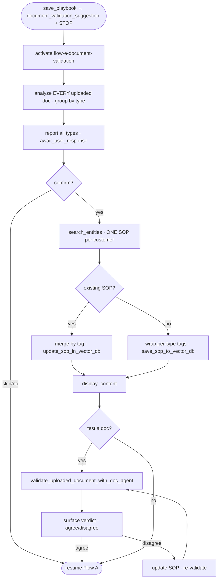

# Flow E Document Validation

## Introduction

When a playbook's prose names a document type (e.g. "require a valid POD"), `save_playbook` returns a `document_validation_suggestion` + STOP_INSTRUCTION and the orchestrator detours into the `flow-e-document-validation` skill **before** scenario processing. Flow E captures ground-truth sample documents and writes a `document_validation` SOP — one tag per doc type — that the runtime validator later judges uploads against. It is auto-approved and active on save (it does **not** go through the rule approval lifecycle). Trigger: `playbook_tools.py:777-810` inside `save_playbook`.

## Features
- **Narrow tool surface** — only `search_entities`, `save_sop_to_vector_db`, `update_sop_in_vector_db`, `display_content`, `await_user_response`, `validate_uploaded_document_with_doc_agent`. No merge / playbook / scenario tools.
- **One SOP per customer** — search-first; never create a duplicate.
- **Tag per doc type** — `<proof_of_delivery>`, `<scale_ticket>`, `<all_type>` … overwritten in place by tag (the only SOP type with no merge tool).
- **Multi-document aware** — handles several types / several samples in one submit (one synthesized tag per type) — see [[Flow E Multi-Document Save]].
- **Refinement loop** — upload a test doc and ask "would this pass?"; always routed through the validator, never self-answered.

## Diagram



## How it works

1. **Source the samples** — three replies to the prompt: **upload** fresh files, **"show existing"** (the picker — past completed+billed-load docs, see [[Flow E Existing Docs Picker E2E]]), or **skip**. All paths deliver the same files payload.
2. **Analyze every uploaded document** — the LLM does a multimodal pass per file and groups by distinct doc type. Multi-type/multi-sample handling: [[Flow E Multi-Document Save]].
3. **Report + confirm** — lists every detected type, then `await_user_response`.
4. **Search first** — `search_entities(sop_type="document_validation")`; only ONE SOP per customer is allowed.
5. **Tag-wrap + save/update** — wrap each type's rules in its `<doc_type>` tag; one save (new) or one merge-by-tag update (existing, preserving untouched tags). → [[codes/Flow E Document Validation Code]]
6. **Display** — `display_content(is_updated=True)` → `✅ Saved` in the right panel.
7. **Refinement loop (optional)** — `validate_uploaded_document_with_doc_agent` on a test doc; surface the verdict verbatim; on disagreement update the SOP and re-validate. Never self-answer "is this valid?". → [[codes/Flow E Document Validation Code]]

## What persists

```
sop_embeddings (PG):
  sop_type     : "document_validation"
  customer_ids : ["<customerId>"]
  instructions : "<proof_of_delivery>…</proof_of_delivery>"
  is_active    : true
  status       : "approved"     # auto-approved + active on save — skips the rule lifecycle
```

No `AiRules`, no `playbook_scenarios`, no `load_doc_requirements` (those come from the Flow A resumption that follows). This SOP is read by the runtime validator as **Layer 2** — see [[Runtime Validation Layers and Load Match]].

## Critical rules (SKILL.md)
- No `upsert_sop_with_merge` (only SOP type without merge).
- No self-review, no scenario processing, no test loads, no approval workflow (auto-approved).
- ONE `document_validation` SOP per customer — search first, update if exists.
- ALWAYS wrap in tags (`<all_type>` fallback).
- NEVER self-answer "is this valid?" — route through the validator.

## Next
After Flow E (or skip), Flow A resumes → `create_document_rule` (writes `load_doc_requirements` + a `pending` `AiRule`) → compile → save scenarios. Chat: *"Playbook saved. 1 scenario processed… pending approval — once approved, the rule goes live."* → [[Admin Rule Approval]].

## Related
[[Document Validation Overview]] · [[Flow E Multi-Document Save]] · [[Flow E Existing Docs Picker E2E]] · [[Runtime Validation Layers and Load Match]] · [[codes/Flow E Document Validation Code]] · [[Admin Rule Approval]] (next)
