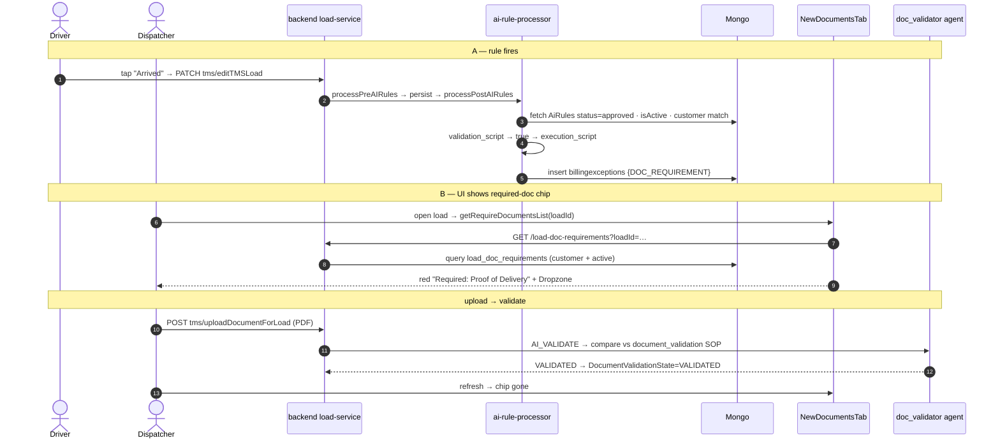

# Runtime Rule Firing

## Introduction

What happens once the rule is live ([[Customer SOP Activation]]) and a driver hits the matching event. Two halves: **(A)** the backend fires the rule on driver-arrived and raises a `DOC_REQUIREMENT` exception; **(B)** the frontend renders a red "Required: Proof of Delivery" drop-zone on the load, and the upload runs through document validation. Why two data records (`load_doc_requirements` + `AiRules`) both exist is explained below.

## Diagram

## How it works

### Half A — rule fires (backend)
1. Driver taps "Arrived" on the DELIVERLOAD stop → mobile `PATCH tms/editTMSLoad`. → `load-service.js:3977`
2. `processPreAIRules` (filter applicable rules) → persist load → `processPostAIRules`. → `load-service.js:4759` · [[codes/Runtime Rule Firing Code]]
3. Rule filter: `module=load · customer match · status='approved' · isActive`. **No** business/engineering gate — see [[Runtime Validation Layers and Load Match]]. → `ai-rule-processor/index.js`
4. `rule-executor` runs `validation_script` → true, then `execution_script` → `publishException('DOC_REQUIREMENT')` → `billingexceptions` insert → Control Tower red badge. → `rule-executor.js`

### Half B — required-doc drop-zone (frontend)
5. Opening the load mounts `NewDocumentsTab`; behind the `isDocRequiredAgentEnabled()` flag it calls `getRequireDocumentsList(loadId)` and builds a `docRulesMapper`. → [[codes/Runtime Rule Firing Code]] · `NewDocumentsTab/index.js:185-225`
6. Backend `GET /load-doc-requirements?loadId=…` reads the `load_doc_requirements` Mongo profiles (created during Flow E resumption). → [[codes/Runtime Rule Firing Code]]
7. `AllUploadedDocumentsSandbox` computes per-event `reqList` (event path filters by `appliedEvents`; charge path by `appliedChargeSets`), diffs against already-uploaded types, and renders a `Dropzone` per missing required doc. → [[codes/Runtime Rule Firing Code]]
8. Dropping a POD → `tms/uploadDocumentForLoad` → document validation (two layers: load-match + SOP rules). Verdict `VALIDATED` clears the requirement; chip disappears on refresh. → [[Runtime Validation Layers and Load Match]]

## Why both `load_doc_requirements` AND `AiRules`
- **`load_doc_requirements`** (Mongo) — read by the FE to show the missing-doc chip *proactively*, even before the rule fires. Without it the dispatcher wouldn't know POD is needed until after arrival.
- **`AiRules`** (Mongo) — read by `processPostAIRules` at runtime to *raise the exception* (Control Tower / notifications). Without it the chip would show but no event would fire.

Both are written during Flow E resumption (`create_document_rule`). They serve different audiences (proactive UI vs runtime exception).

## Related
[[Document Validation Overview]] · [[Customer SOP Activation]] (prev) · [[Runtime Validation Layers and Load Match]] (how the uploaded doc is judged) · [[codes/Runtime Rule Firing Code]]
