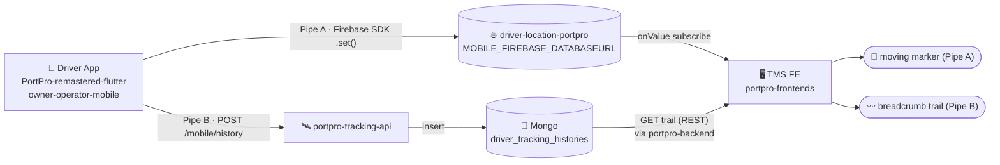
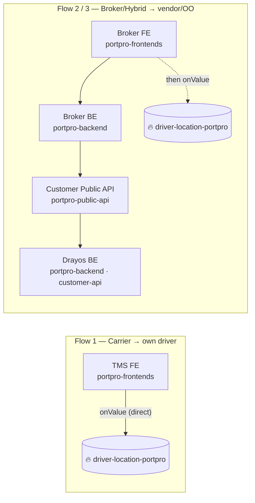
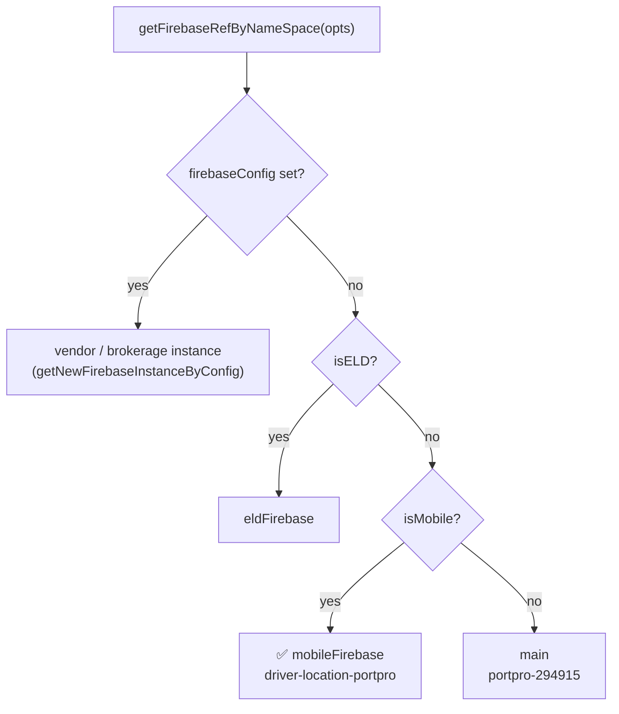
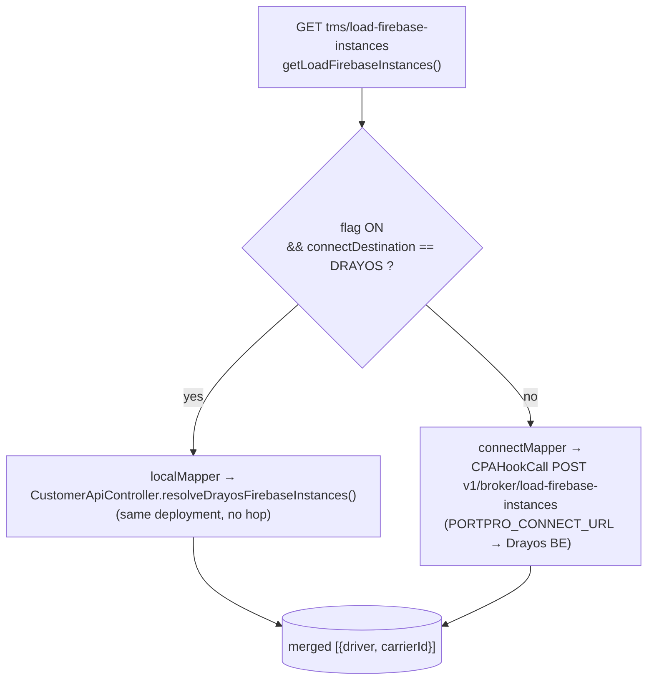
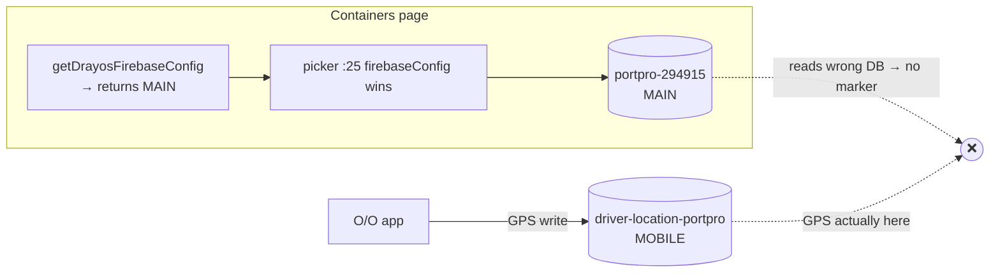

# Live Tracking — Firebase Architecture

> **Ticket:** DRAYOS-35867 (FD #39955) — Whisk O/O drivers show arrive/depart status but **no live GPS marker**.
> This note maps the whole realtime-tracking architecture. Flow deep-dives: [[01 - Flow 1 - Carrier to Own Driver|Flow 1]] · [[02 - Flow 2 - Broker to Connected Carrier|Flow 2]] · [[03 - Flow 3 - Hybrid to OO Carrier|Flow 3]]

---

## 1. The two pipes

Every tracking screen is fed by two **independent** pipes:



| Pipe | Feeds | Mechanism |
|------|-------|-----------|
| **A — realtime marker** | moving truck icon | app writes Firebase RTDB directly → FE `onValue` |
| **B — trail/history** | breadcrumb polyline | app → tracking-api → Mongo → FE REST |

> DRAYOS-35867 fix repaired **Pipe B** (verified live). Open item = **Pipe A** marker for O/O.

### Repo cast

| Repo / service | Role in tracking |
|----------------|------------------|
| `PortPro-remastered-flutter` | in-house driver app — writes GPS (Pipe A) + history (Pipe B) |
| `owner-operator-mobile` | O/O driver app — same, but **no `bearing`** |
| `portpro-frontends` | **Broker/TMS FE** — subscribes Firebase, renders marker + trail |
| `portpro-backend` | **Broker BE** — `getLoadFirebaseInstances`, `getDrayosFirebaseConfig`; also the **Drayos/Vendor BE** (customer-api module) on the other side |
| `portpro-public-api` | **Customer Public API** — the Connect gateway (`PORTPRO_CONNECT_URL`) |
| `portpro-tracking-api` | ingests `POST /mobile/history` → Mongo |

### Hop chain per flow



Flow 1 read = **direct to Firebase**. Flow 2/3 add **Broker BE → Customer Public API → Drayos BE** only to *resolve which carrier+driver+config*; the marker itself still comes from Firebase `onValue`.

---

## 2. The Firebase databases (env-verified)

Source: devops parameter-viewer.

| Env key | URL | Role |
|---------|-----|------|
| `FIREBASE_DATABASEURL` | `portpro-294915` | **main** (broker's own) |
| `MOBILE_FIREBASE_DATABASEURL` | `driver-location-portpro` | **mobile** — all driver GPS |
| `ELD_FIREBASE_DATABASEURL` | `portpro-eld` | ELD |
| `EU_FIREBASE_DATABASEURL` | `portpro-eu` | EU |

Dead / refuted: `axle-178513` (old default), `portpro-shipos-dev` (legacy).

### Node key — always the same shape

```
{carrierUSERid} / currentLocation / {driverUSERid}
```

- both are **USER `_id`s** (not driver RECORD id)
- `driver-location-portpro` is **ONE shared global DB** — not per-carrier. Only the node path is carrier-scoped.

### App fingerprint — `bearing`

| App | writes `bearing`? |
|-----|-------------------|
| in-house `PortPro-remastered-flutter` | ✅ yes |
| O/O `owner-operator-mobile` | ❌ no |

Used to tell which app authored a node.

---

## 3. FE instance picker (the decision that decides everything)

`portpro-frontends/src/hooks/firebase/useFirebaseRef.js:16-39`



```js
// useFirebaseRef.js
:25  if (firebaseConfig) return getNewFirebaseInstanceByConfig(firebaseConfig, "portpro-brokerage"); // WINS
:30  if (isELD)          return eldFirebase;
:34  if (isMobile)       return mobileFirebase;   // ← driver-location-portpro
:38  return main;                                 // portpro-294915
```

**The subscription always passes `isMobile:true`.** So:
- `firebaseConfig` **null** → falls through to `mobileFirebase` ✅ (correct DB for GPS)
- `firebaseConfig` **set** → overrides, uses that config's DB (may be wrong)

---

## 4. Where the two inputs come from

| Input | Source | File |
|-------|--------|------|
| `brokerCarrierDriverIdMapper` | `load-firebase-instances` API resp | `LoadList.js:131-132` |
| `firebaseConfig` | **only** containers side-panel → `getDrayosFirebaseConfig` (= **MAIN** config) | `useContainersTrackingSidePanel.js:159-164` |

> **Load-info tab never sets `firebaseConfig`** → stays `null` (`driverReducer.js:70`) → picker uses `mobileFirebase`. This is why the load-info tab is safe.

---

## 5. Backend tender split — `getLoadFirebaseInstances`

`portpro-backend/server/modules/tms/tms-controller.js:11824` (DRAYOS-35867)



```js
:11862  brokerSetting.isBrokerContainerTrackingEnabled          // broker's own flag
:11875  isDrayosDestination = drayosCarrier.connectDestination === DRAYOS
:11876  if (flag && isDrayosDestination) localMapper[key]       // NEW local path
:11878  else                             connectMapper[key]     // connected → Connect proxy
:11904  localMapper → CustomerApiController.resolveDrayosFirebaseInstances()   // customer-api-controller.js:483
:11887  connectMapper → CPAHookCall(isPortproConnect:true)
```

Config helpers:
- `getFirebaseConfig:824-835` → returns `FIREBASE_DATABASEURL` = **MAIN**
- `getDrayosFirebaseConfig:11915` → CPA to vendor `get-drayos-firebase-config` (vendor also returns MAIN — see [[02 - Flow 2 - Broker to Connected Carrier|Flow 2]])

---

## 6. The 3 flows at a glance

| Flow | Namespace source | `firebaseConfig` | Instance read | GPS write DB | ✔ |
|------|------------------|------------------|---------------|--------------|---|
| **1** Carrier → own driver | own carrier | null | mobileFirebase | driver-location-portpro | ✅ |
| **2** Broker → connected carrier | vendor (CPA) | vendor MAIN¹ | vendor Firebase | vendor mobile | ⚠️ |
| **3a** Hybrid → OO (load-info tab) | OO (local) | null | mobileFirebase | driver-location-portpro | ✅ |
| **3b** Hybrid → OO (containers page) | OO (local) | **MAIN** | portpro-294915 | driver-location-portpro | ❌ |

¹ only on containers page; load-info tab = null → mobileFirebase.

---

## 7. The root bug (3b, and same class in 2)



**Containers page** forces `firebaseConfig`=MAIN → picker `:25` overrides `isMobile` → reads MAIN, but GPS is in mobile → **no marker**.
**Load-info tab** never sets `firebaseConfig` → `mobileFirebase` → correct.

**Candidate fixes:**
1. `getDrayosFirebaseConfig` returns the **mobile** config, OR
2. picker merges mobile `databaseURL` when `firebaseConfig` lacks one.

---

## 8. Verified vs open

- ✅ FE reads `driver-location-portpro` as MOBILE (bundle grep + params)
- ✅ Pipe B fix live (currentDriverLocation `[85.302,27.673]`, trail 539→779; E2E 11/11)
- ❌ REFUTED: "shipos-dev mismatch", "FE reads wrong DB / MOBILE env unset"
- ⏳ OPEN: where O/O app writes Firebase — emulator produced no write because **pre-prod backend was down**. Needs a live O/O write with backend up.

---

## Related
- [[01 - Flow 1 - Carrier to Own Driver]]
- [[02 - Flow 2 - Broker to Connected Carrier]]
- [[03 - Flow 3 - Hybrid to OO Carrier]]
