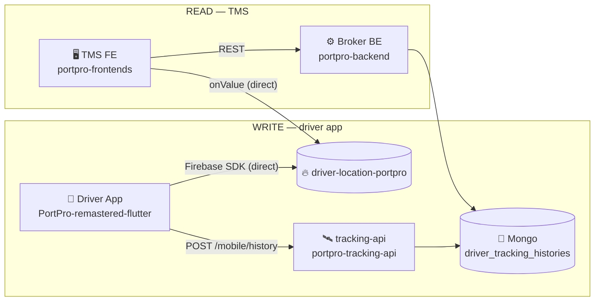
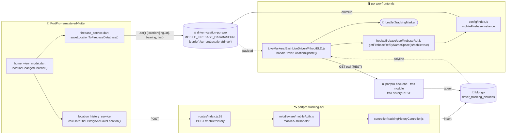

# Flow 1 — Carrier → Own Driver

The baseline that always works: no broker, no cross-instance, no config override.
Overview + building blocks: [[00 - Firebase Tracking Overview]].

**Setup:** carrier's own driver runs in-house app `PortPro-remastered-flutter`, load assigned, moving. Carrier watches **Live Tracking** (`/tracking`) or **Load → Tracking tab**.

---

## Repo hop chain

Single deployment — **no Connect hop, no Drayos BE**. Marker comes straight from Firebase.



> Contrast [[02 - Flow 2 - Broker to Connected Carrier|Flow 2]]: `Broker FE → Broker BE → Drayos BE (portpro-backend · customer-api)`. Flow 1 skips the Drayos-BE hop.

---

## Detailed flow — endpoints, routes, DBs



> **Flow 1 read is single-deployment** — no Connect hop. Broker BE only serves the trail; the marker comes straight from Firebase. Contrast [[02 - Flow 2 - Broker to Connected Carrier|Flow 2]]: **Broker FE → Broker BE → Drayos BE (portpro-backend · customer-api)**.

---

## WRITE half — in-house app

### 1. GPS tick
`lib/ui/views/home_view/home_view_model.dart:403`
```dart
void locationChangedListener(Location location) async {
  if (_previousLat != location.latitude || _previousLng != location.longitude) {
    bearing  = LocationUtils.bearingBetween(prevLat, prevLng, lat, lng); // in-house sets bearing
    driverID = await _secureStorageService.getUserID();                  // driver USER _id
    locationData = LiveLocationData(bearing: …, lat: …, lng: …, referenceNumber: …);
    await _locationHistoryService.calculateTheHistoryAndSaveLocation(locationData); // Pipe B
    await _firebaseService.saveLocationToFirebaseDatabase(locationData);            // Pipe A
  }
}
```

### 2. Pipe A — Firebase write
`lib/services/firebase_service.dart:86`
```dart
final _locationData = {
  "location": [locationData.lng, locationData.lat],   // [lng, lat] order
  "last": <ISO utc>, "status": …, "ref": …, "type": …,
  if (bearing != null) "bearing": bearing,            // present → in-house
};
DatabaseReference _ref = _database.ref().child('$carrierID/currentLocation/$userID');
await _ref.set(_updatedData);
```
Node = `{carrierUSERid}/currentLocation/{driverUSERid}`.

### 3. Which DB?
`lib/services/firebase_service.dart`
```dart
init():                    _database = _firebaseDatabase                // default app
updateFirebaseDatabase():  _database = _getOrCreateDatabase(SECONDARY)
_getOrCreateDatabase():    databaseURL = _appStateService.appServer?.databaseUrl  // ← mobile DB URL
```
`appServer.databaseUrl` = **`driver-location-portpro`**. In-house writes there **with bearing** (matches fresh 2026-07-13 node observed live).

### 4. Pipe B — trail
`home_view_model.dart` → `calculateTheHistoryAndSaveLocation` → tracking-api `POST /mobile/history` → Mongo `driver_tracking_histories`.

---

## READ half — TMS frontend

### 5. Mount
`src/pages/tms/Load/LoadTrackingHistory/index.js`
```js
:32  const firebaseConfig = stateDriver?.firebaseConfig ?? null;  // NULL on load-info tab
:60  <LiveTrucksMarkers firebaseConfig={firebaseConfig} />
```

### 6. Resolve namespace + instance
`src/pages/trucker/Tracking/Components/LiveMarkers/EachLiveDriverWithoutELD.js:207`
```js
namespace = `${currentCarrierId}/currentLocation/${driver._id}`;   // own carrier
const carrier = brokerCarrierDriverIdMapper[driver._id];           // undefined (no broker)
if (_isBrokerContainerTrackingEnabled && carrier) { /* skip */ }
const ref = getFirebaseRefByNameSpace({
  overrideNamespace: namespace,
  firebaseConfig: null,        // → picker falls to isMobile
  isMobile: true,              // → mobileFirebase (driver-location-portpro)
});
```
**Read node == write node.** ✅

### 7. Subscribe
```js
:222  driverLocationRef.on("value", handleDriverLocationUpdate);
```

### 8. Marker update
`EachLiveDriverWithoutELD.js:104`
```js
const handleDriverLocationUpdate = (snapshot) => {
  const driverLocation = snapshot.val();
  driverLocation.location = driverLocation.location.reverse();  // [lng,lat] → [lat,lng]
  setHistory(prev => [...prev, [lat, lng]]);
  // freshness guard: if last update > 10 min → drop
};
```

### 9. Render
`EachLiveDriverWithoutELD.js:261`
```js
history.length >= LIVE_TRACKING_LEAD_OFFSET && !initialMarker &&
  <LeafletTrackingMarker latlngs={history} rotate icon={truckIcon} />  // rotates by bearing
```
Trail polyline drawn separately from Mongo (Pipe B).

---

## Why it always works
Own driver → mapper empty → namespace stays own-carrier. `firebaseConfig` null → picker uses `mobileFirebase` = the exact DB the app writes. Same shared mobile DB, addressed by `{carrier}/currentLocation/{driver}`. No override, no cross-instance.

## Next
- [[02 - Flow 2 - Broker to Connected Carrier]]
- [[03 - Flow 3 - Hybrid to OO Carrier]]
