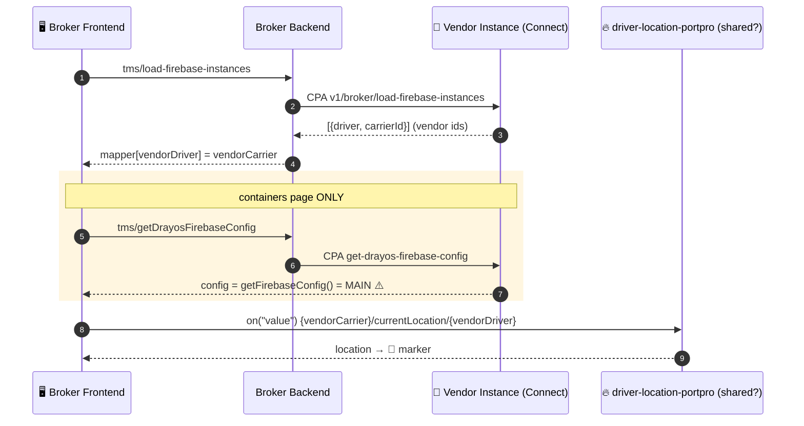
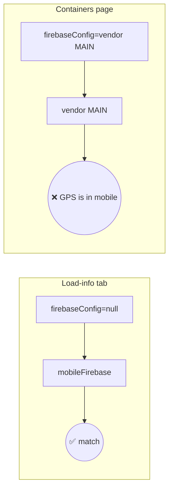

# Flow 2 — Broker → Connected Carrier

Broker has **no own drivers**. Load tendered to a **connected carrier** = separate PortPro instance (`connectDestination ≠ DRAYOS`). Broker reaches across via **Connect (CPA)** to resolve the vendor's carrier+driver and their Firebase.

Overview: [[00 - Firebase Tracking Overview]]. Contrast: [[01 - Flow 1 - Carrier to Own Driver]].

---

## Sequence diagram



---

## 1. Resolve vendor carrier+driver (via CPA)

`portpro-backend/server/modules/tms/tms-controller.js getLoadFirebaseInstances:11824`
```js
isDrayosDestination = drayosCarrier.connectDestination === DRAYOS;  // FALSE (connected)
// → connectMapper branch
CPAHookCall({
  url: "v1/broker/load-firebase-instances",
  body: { tenderRefToRefNumberMapper: connectMapper },
  isPortproConnect: true,                       // hop to vendor instance
});
// returns [{ driver, carrierId }] in VENDOR id-space
```
Vendor handler: `customer-api-controller.js getDrayosFirebaseInstances` (route `/broker/get-drayos-firebase-instances:1252`, auth `connect-x-api-key`).

FE stores:
```js
// LoadList.js:132
brokerCarrierDriverIdMapper[vendorDriver._id] = vendorCarrierId;
```

> ⚠️ **Route-name discrepancy (unconfirmed):** CPA calls `v1/broker/load-firebase-instances`, but registered vendor route is `/broker/get-drayos-firebase-instances`. Connect gateway may rewrite — not verified.

## 2. Resolve vendor Firebase config (containers page only)

`useContainersTrackingSidePanel.js:115` → `getDrayosFirebaseConfig` → BE `getDrayosFirebaseConfig:11915` → CPA → **vendor** handler:
```js
// customer-api-controller.js:590  (VENDOR side)
const config = controllers.TmsController.getFirebaseConfig();  // = FIREBASE_DATABASEURL
return config;                                                 // ← MAIN, never mobile ⚠️
```

## 3. Namespace + instance
`EachLiveDriverWithoutELD.js:207`
```js
const carrier = brokerCarrierDriverIdMapper[driver._id];   // vendorCarrierId
if (_isBrokerContainerTrackingEnabled && carrier)
  namespace = `${vendorCarrier}/currentLocation/${vendorDriver}`;
const ref = getFirebaseRefByNameSpace({ overrideNamespace: namespace, firebaseConfig, isMobile: true });
```

**Splits by surface:**

| Surface | `firebaseConfig` | picker result | reads |
|---------|------------------|---------------|-------|
| **Load-info tab** | `null` | `:34 isMobile` | `driver-location-portpro` ✅ |
| **Containers page** | vendor **MAIN** | `:25 firebaseConfig wins` | vendor MAIN ❌ |

## 4. Subscribe + render
Same as Flow 1 — `.on("value")` → `handleDriverLocationUpdate` → `<LeafletTrackingMarker>`.

---

## Where GPS actually lives

`portpro-backend/server/modules/firebaseConnection.js:15-17`
```js
const mobileDatabase = process.env.MOBILE_FIREBASE_DATABASEURL
  ? app.database(process.env.MOBILE_FIREBASE_DATABASEURL)   // driver-location-portpro
  : database;                                               // else MAIN
```
Driver apps write GPS to the **mobile** project, not main.



---

## Verified vs assumed
- ✅ vendor `getDrayosFirebaseConfig` → MAIN, not mobile (`customer-api-controller.js:590` + `getFirebaseConfig:828`)
- ✅ `firebaseConfig` set only by containers side-panel
- ✅ backend `mobileDatabase` = separate `MOBILE_FIREBASE_DATABASEURL` instance
- ⏳ **assumed:** `driver-location-portpro` is one org-wide project shared by connected-carrier deployments — this is what makes the load-info tab work cross-instance. Needs vendor env to confirm.

## Net
Namespace resolves correctly (vendor ids via CPA). **Load-info tab** → shared mobile DB → works. **Containers page** → vendor MAIN → marker breaks. `getDrayosFirebaseConfig` returning MAIN instead of mobile is the **same root bug** as [[03 - Flow 3 - Hybrid to OO Carrier|Flow 3b]].

## Next
- [[03 - Flow 3 - Hybrid to OO Carrier]] — DRAYOS-35867 core
