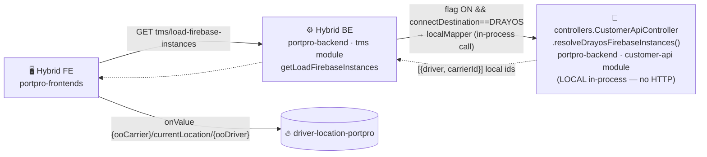
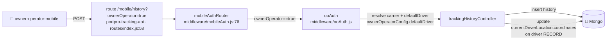
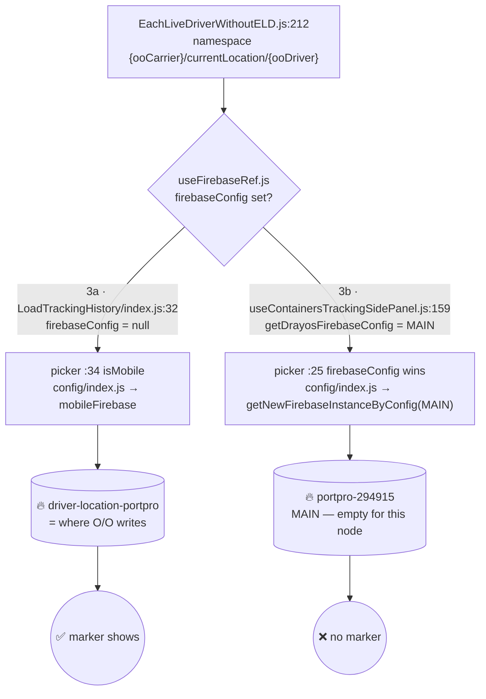

# Flow 3 — Hybrid → Owner-Operator Carrier

**This is the DRAYOS-35867 bug flow.** A **hybrid** account (broker + carrier) tenders to a **same-deployment O/O carrier** (`connectDestination === DRAYOS`). The O/O driver runs `owner-operator-mobile`.

Two surfaces diverge:
- **3a — Load-info Tracking tab** → works ✅
- **3b — Containers page** → no marker ❌

Overview: [[00 - Firebase Tracking Overview]]. Contrast [[02 - Flow 2 - Broker to Connected Carrier|Flow 2]] (cross-instance, HTTP hop to the Drayos BE `customer-api` module).

---

## Repo hop chain

Unlike Flow 2, driver resolution is an **in-process function call** — same deployment, **no HTTP hop** (`resolveDrayosFirebaseInstances` is called directly, not via `CPAHookCall`).



> ⚠️ **Config path is the exception (containers page only):** `getDrayosFirebaseConfig` uses `CPAHookCall(isPortproConnect)` → `connectUrl || PORTPRO_CONNECT_URL` → the **Drayos BE `customer-api` module** (`getDrayosFirebaseConfig:588`). For a same-deployment O/O, `connectUrl` points back to the same backend → returns **MAIN**. That HTTP round-trip (not the local resolve) is what breaks 3b.

---

## WRITE half — O/O app (`owner-operator-mobile`)

### Pipe A — Firebase (no bearing)
`lib/services/firebase_service.dart:95`
```dart
final _locationData = {
  "location": [locationData.lng, locationData.lat],
  "last": <ISO utc>, "status": …, "ref": …, "type": …, "prevType": …,
  // ❗ NO "bearing" key — O/O fingerprint
};
DatabaseReference _ref = _database.ref().child('$userID/currentLocation/$defaultDriverId');
await _ref.set(_updatedData);
```
- `userID` = O/O **carrier** USER id (O/O logs in as carrier)
- `defaultDriverId` = default driver USER id
- `_database` = `appServer.databaseUrl` = **`driver-location-portpro`** (after `updateFirebaseDatabase()`)

Node = `{ooCarrierUser}/currentLocation/{defaultDriverUser}` in the **mobile** DB. Same shape as Flow 1 — just no `bearing`.

### Pipe B — trail (the DRAYOS-35867 fix)


`ooAuth` (`middleware/ooAuth.js`) resolves:
- carrier user (`role:'carrier'`) → `req.body.carrier`
- `ownerOperatorConfig.defaultDriver` (USER id) → `req.body.driver`
- driver RECORD id → `req.ownerOperatorDriverRecordId`
- sets `req.isOwnerOperator = true`

---

## READ half — the surface split

`EachLiveDriverWithoutELD.js:207` — namespace resolves the same for both surfaces:
```js
const carrier = brokerCarrierDriverIdMapper[driver._id];   // ooCarrier (local resolve)
if (_isBrokerContainerTrackingEnabled && carrier)
  namespace = `${ooCarrier}/currentLocation/${ooDriver}`;
const ref = getFirebaseRefByNameSpace({ overrideNamespace: namespace, firebaseConfig, isMobile: true });
```

**Only `firebaseConfig` differs — and that decides everything:**



| | 3a — Load-info tab | 3b — Containers page |
|--|--------------------|----------------------|
| `firebaseConfig` | `null` (`LoadTrackingHistory:32`) | `getDrayosFirebaseConfig` = **MAIN** |
| picker | `:34 isMobile` → mobileFirebase | `:25 firebaseConfig` → MAIN |
| reads | `driver-location-portpro` ✅ | `portpro-294915` ❌ |
| result | marker shows | **no marker** |

---

## Root cause + fix

O/O GPS lives in **`driver-location-portpro`** (mobile). The containers page reads **MAIN** because `getDrayosFirebaseConfig` returns `getFirebaseConfig()` (= `FIREBASE_DATABASEURL`), and picker `:25` lets `firebaseConfig` override `isMobile`.

**Candidate fixes:**
1. `getDrayosFirebaseConfig` returns the **mobile** config (`MOBILE_FIREBASE_DATABASEURL`), OR
2. picker (`useFirebaseRef.js:25`) merges the mobile `databaseURL` when `firebaseConfig` lacks one and `isMobile` is set.

> Same root bug as [[02 - Flow 2 - Broker to Connected Carrier|Flow 2]] containers page — `getDrayosFirebaseConfig` = MAIN, not mobile.

---

## Verified vs open
- ✅ O/O app node = `{ooCarrier}/currentLocation/{ooDriver}`, **no bearing** (`firebase_service.dart:95-112`)
- ✅ local resolve path (no Connect hop) — `getLoadFirebaseInstances:11876` + `resolveDrayosFirebaseInstances:483`
- ✅ `ooAuth` + trail fix live-verified (currentDriverLocation `[85.302,27.673]`, trail 539→779; E2E 11/11)
- ✅ 3a load-info tab reads mobileFirebase (correct)
- ⏳ OPEN: live O/O Firebase write not observed — emulator produced none because **pre-prod backend was down**. Needs a live write with backend up to close 100%.

## Related
- [[00 - Firebase Tracking Overview]]
- [[01 - Flow 1 - Carrier to Own Driver]]
- [[02 - Flow 2 - Broker to Connected Carrier]]
