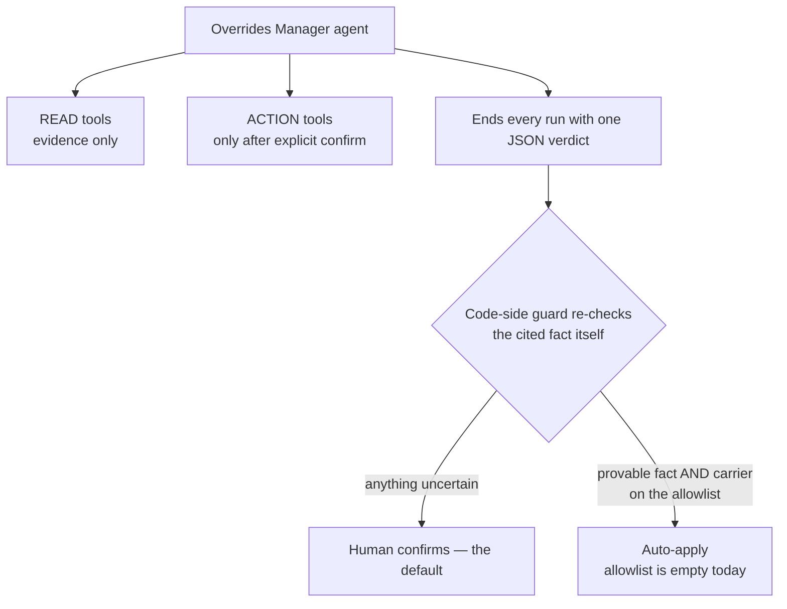

# Agent Tools and Safety

## Introduction

What the agent can touch, and what stops it from doing harm. Two halves: the **tools** (how
it reads evidence and applies changes) and the **safety layers** (why nothing applies
without a human, and why a hallucinated number can never reach the database).

## Diagram



## The tools

The agent reaches tools over two MCP endpoints (base `PORTPRO_MCP_BASE_URL`), with the tool
list derived from the kind registry ([[Architecture]]). It mints a fresh carrier-scoped
token per run.

**Read (evidence):**

| Tool | Answers |
|------|---------|
| `get-tariff-for-load` (+ tariff lookups) | what the charge is *supposed* to be |
| `compute-charge-fields` | the rate solver: what per-unit rate produces the target amount — tariff charges are rate × units, never a flat number |
| `get-charge-detail` | the charge's current state |
| `get-combined-document`, `get-document-signed-url` | the document and a preview |
| `get-override-history` | the customer's past overrides — has this exact change happened before? |
| `get-ai-rules-v2` | the governing business rule (covers charge *and* document rules) |
| `get-ai-request-log-by-id` | why the AI originally decided — its inputs and reasoning |
| `get_playbook_rules_for_charge` (in-process) | the customer's playbook rules on demand |

**Write (only after explicit confirmation):**

| Tool                                                                | Blast radius                                                                                                                               |
| ------------------------------------------------------------------- | ------------------------------------------------------------------------------------------------------------------------------------------ |
| `add-charge` / `update-charge` / `remove-charge`, approve/unapprove | this one load                                                                                                                              |
| `set-document-validation`                                           | this one document                                                                                                                          |
| `update-tariff-charge`                                              | the customer's tariff → **all future loads**                                                                                               |
| `retrigger-customer-tariff`                                         | the customer's **existing active loads** — recalculates them, overwriting their per-load manual overrides; >50 loads run in the background |

Rules baked into the prompt: tariff charges are written as **rate, never flat total** (the
solver runs in the same turn as the write); every id and amount must come from a tool
result — **never invented**; never assume USD, use the charge's own currency.

> ⚠️ Open item: the MCP layer does no ownership check on the ids passed to the two tariff
> write tools — the backend routes are carrier-scoped, but verify the rate-engine-v2 routes
> reject foreign ids. Also `retrigger`'s customer filter (`"caller._id"`) is unverified on
> live data — a wrong field means it silently matches *nothing* (never another customer).

## Safety layer 1 — suggest before apply

The agent never applies in the turn it proposes. Present → stop → act only on an explicit
instruction. Holds for every kind, every time. ([[The Review Flow]])

## Safety layer 2 — the evidence verdict + code-side guard

Every agent run ends with one fenced JSON block (stripped before the user sees the reply).
The fields that matter:

```json
{
  "reason_class": "data_fact | verbal | contract | missing | conflict",
  "recommendation": "apply_override | keep_ai | adjust | need_more_info",
  "recommendation_rationale": "why, grounded in the evidence",
  "confidence": "high | medium | low",
  "evidence": {
    "source_tool": "which tool produced the cited value",
    "requested_value": "what the human set",
    "observed_value": "what the source of truth returned",
    "charge_id": "which charge this is about"
  }
}
```

The guard (`override_evidence.py:classify_evidence`) **does not trust the agent's prose or
its self-reported confidence**. It re-checks the cited fact itself, in code:

- Reason isn't a checkable data fact (it's verbal, contractual, missing, conflicting)?
  → human path.
- The cited tool isn't a trusted source-of-truth tool? → human path.
- The evidence is about a *different* charge? → human path.
- The requested and observed values don't actually match? → human path.
- Only a verified, matching, on-topic data fact counts as **deterministic**.

Contract stability rule: `reason_class` and the `evidence` block are **frozen** — never
renamed or removed. Everything else is additive; the guard ignores unknown keys, so new
fields can never change apply behavior.

## Safety layer 3 — auto-apply is off

Even a deterministic verdict only auto-applies if the carrier is on an explicit allowlist
(`OVERRIDES_MANAGER_AUTO_APPLY_CARRIERS`). The feature shipped in **shadow mode with an
empty allowlist** — today, every change goes through a human, full stop. Auto-apply is a
future, per-carrier, deterministic-evidence-only opt-in.

## A failure worth remembering

Early on the agent **invented charge amounts** — its MCP toolset had silently bound zero
tools (wrong endpoint URL), and with no data the model guessed. Two fixes: bind the proven
endpoints with an explicit tool filter, and a hard prompt rule ("use only values you
read"). The lesson: an empty toolset is silent — **check that tool spans appear in the
Opik trace** before trusting any agent output.

## Related

[[Override Flow]] · [[Architecture]] · [[The Review Flow]] · [[User Flow Scenarios]]
