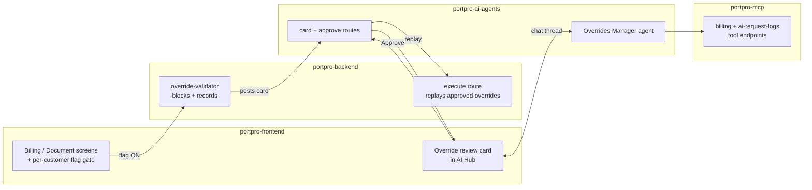

# Architecture

## Introduction

Four repos cooperate, but they stay decoupled: the **review card is the only contract**
between them. Inside the agent, the design answers one question — how do we support a new
kind of override later (not just charges and documents) without rewriting anything? The
answer is one generic review pipeline plus a small registry that lists what each kind
needs.

## Diagram



## The one pipeline, per-kind plugins

Every override — charge or document — goes through the same five steps:

```
gather evidence → judge the reason → recommend → wait for confirmation → apply
   (per kind)        (shared)         (shared)        (shared)          (per kind)
```

Only the first and last steps differ by kind. For a **charge**, evidence means the tariff,
the rate math, and the charge history; apply means a charge write. For a **document**,
evidence means the validation state and a preview; apply means setting validity. The
judging, recommending, and confirming in the middle are identical — that's why the agent
feels the same no matter what it reviews.

## The kind registry

`portpro-ai-agents/app/agents/overrides_manager/kinds.py` is the single source of truth.
Each kind is one declarative entry — which events belong to it, which read tools gather its
evidence, which action tools apply it, how to present it. No `if charge / elif document`
branches anywhere.

| | `charge` | `document` |
|---|---|---|
| events | add / update / remove pricing, approve / un-approve | validate / invalidate |
| evidence tools | tariff lookups, rate solver, charge detail | document state, signed preview |
| apply tools | charge writes, tariff sync, re-trigger | set-document-validation |

Two tool groups are shared by **every** kind:

- the customer's **override history** and the governing **business rule** (`get-ai-rules-v2`)
- the **AI's original decision** (`get-ai-request-log-by-id`) — "why did the machine decide
  this in the first place?"

The agent's tool list is *derived* from this registry at startup. **Adding a new override
kind = adding one registry entry** (plus an apply tool if it needs one). The pipeline, the
prompt scaffold, and the safety guard don't change.

## How the repos divide the work

| Repo | Role | Key code |
|------|------|----------|
| portpro-frontend | Gate the edit, host the review card | `OverrideReviewCard/`, billing/document screens |
| portpro-backend | Block + record the override; replay it on approval | `server/modules/override-validator/index.js` (capture), `ai-control-tower-service.js:2867` (execute) |
| portpro-ai-agents | The agent + the card/approve routes | `app/agents/overrides_manager/` (agent), `app/routes/messaging/override_review*.py` (routes), `app/services/messaging/override_*.py` (verify + safety) |
| portpro-mcp | The tools the agent calls | `/agents/billing`, `/agents/ai-request-logs` |

Decoupling rule: the backend and the agent never share code. The backend posts a card with
a payload; the agent reads that payload. That payload **is** the contract — and it must be
kept in sync by hand, which is exactly what broke once: see [[Capture and Replay Contract]].

## How messages travel (why Firebase)

The agent's replies are delivered through **Firebase Realtime DB**, not just the open HTTP
connection. Reason: review is asynchronous and multi-viewer — the reviewer may close the
tab and come back, several dispatchers may watch the same channel, and the agent's first
analysis runs with no client connected at all. Firebase fans the message out to every
subscriber of the thread; streaming over the held connection is only a bonus for whoever
is watching live.

For tool calls, the agent always **mints a fresh carrier-scoped token** — the end-user's
token is often expired by the time the agent runs.

## Safety properties (by construction)

- **Additive** — capture is a standalone route; zero hooks inside existing save paths.
  Flag off = the feature does not exist.
- **Fail-closed** — flag on + override endpoint down = the edit fails rather than slipping
  through unreviewed.
- **Replay, not bespoke writes** — an approved override goes through the same controllers a
  real user request would hit (scoping, audits, notes all behave normally).
- **Nothing auto-applies by default** — see [[Agent Tools and Safety]].

## Related

[[Override Flow]] · [[The Review Flow]] · [[Capture and Replay Contract]] · [[Agent Tools and Safety]]
