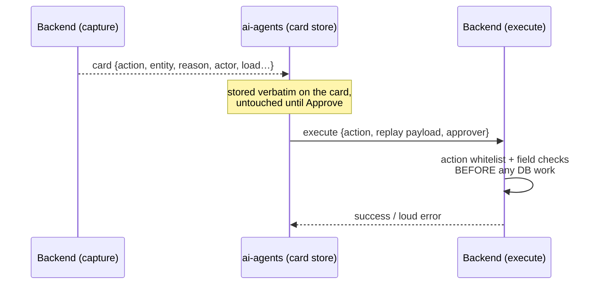

# Capture and Replay Contract

## Introduction

Two service-to-service calls hold the feature together: **capture** (backend → ai-agents:
"here's a blocked override, post the card") and **replay** (ai-agents → backend: "the
reviewer approved, execute it"). The card's stored payload is the contract between them —
whatever capture writes is exactly what replay reads later. Nothing validates that the two
sides agree, and that's how a real mismatch shipped. Verified field-by-field against
`override-validator-parbat` on 2026-06-10.

## Diagram

## What capture sends

The backend builds a small `entity` snapshot per event and posts the card with the **raw
event name** as `action` (`override-validator/index.js:91-135`):

| Event | `entity` |
|-------|----------|
| `ADD_PRICING` / `UPDATE_PRICING` | `{chargeId, pricing, pricingChargeName, pricingName, pricingAmount}` |
| `REMOVE_PRICING` | `{chargeId}` |
| `APPROVE_CHARGE` / `UNAPPROVE_CHARGE` | `{chargeId, requestedStatus, charges[]}` |
| `VALIDATE_DOCUMENT` / `INVALIDATE_DOCUMENT` | `{documentValidationStateId, documentId, docType, docUrl}` |

ai-agents stores all of it verbatim on the card (`override_review.py:206`) — no renaming,
no normalization.

## What replay expects

On Approve, ai-agents branches on the stored `action` to build the execute payload
(`override_review_actions.py:127-163`) — but it branches on **legacy names** from an
earlier version of the feature:

| Replay branch | Payload it builds |
|---------------|-------------------|
| `VALIDATE` | `{documentValidationStateId, reason}` |
| `INVALIDATE` | `{documentId, reason}` |
| `APPROVE_OVERRIDE` | `{chargeId, status, isSystemApproved, reason}` |
| `UNAPPROVE` | `{chargeId, status, reason}` |
| anything else | `{chargeId, pricing}` |

The backend execute route (`ai-control-tower-service.js:2867`) whitelists exactly:
`ADD_PRICING, UPDATE_PRICING, VALIDATE, INVALIDATE, APPROVE_OVERRIDE, UNAPPROVE` — and
validates required fields per action before touching the database. Then it replays through
the real controllers as the carrier user, with the approver stamped for attribution.

## The mismatch

Capture speaks new names; replay listens for old ones. Result per card type:

| Card carries | What happens on Approve |
|---|---|
| `ADD_PRICING` | ✅ works (falls into the default pricing branch, which is correct) |
| `UPDATE_PRICING` | ✅ works |
| `APPROVE_CHARGE` | ❌ no branch matches → default payload → execute rejects: `Unsupported override-review action` |
| `UNAPPROVE_CHARGE` | ❌ same |
| `VALIDATE_DOCUMENT` | ❌ same |
| `INVALIDATE_DOCUMENT` | ❌ same |
| `REMOVE_PRICING` | ❌ not even in the execute whitelist — no handler exists |

**5 of 7 override types cannot be approved via the card.** The failure is **loud** — the
execute route rejects before any DB work and the card shows the error. No wrong data is
ever written. It's a functional gap, not a data hazard, and it has **zero flag-off
impact** (no flag, no cards, no replay).

Two smaller gaps found in the same pass:

1. Capture never sends `isSystemApproved`, but the approve branch reads it — it would
   always be `False`. Probably correct (a human approved it), but it should be a decision,
   not an accident.
2. The evidence-gatherer looks for `entity.chargeName`; capture sends `pricingChargeName`.
   Harmless — it falls back to the charge id — but the evidence prose loses the name.

## Why nobody caught it

Each repo's tests hand-craft their own payload shapes; nothing replays a **real captured
card** end-to-end. The contract lives across two repos, so no single-PR review could see
both sides. Lesson: when a stored payload is the contract, test the round-trip, not the
halves.

## The fix

One small mapping in ai-agents' replay
(`{APPROVE_CHARGE→APPROVE_OVERRIDE, UNAPPROVE_CHARGE→UNAPPROVE, VALIDATE_DOCUMENT→VALIDATE,
INVALIDATE_DOCUMENT→INVALIDATE}`), plus a decision on `REMOVE_PRICING` (add an execute
handler, or hide Approve on those cards). ai-agents PR #10865 is already merged, so this
lands as a follow-up PR. Must be in before any customer pilot goes live.

## Related

[[Override Flow]] · [[The Review Flow]] · [[Architecture]]
