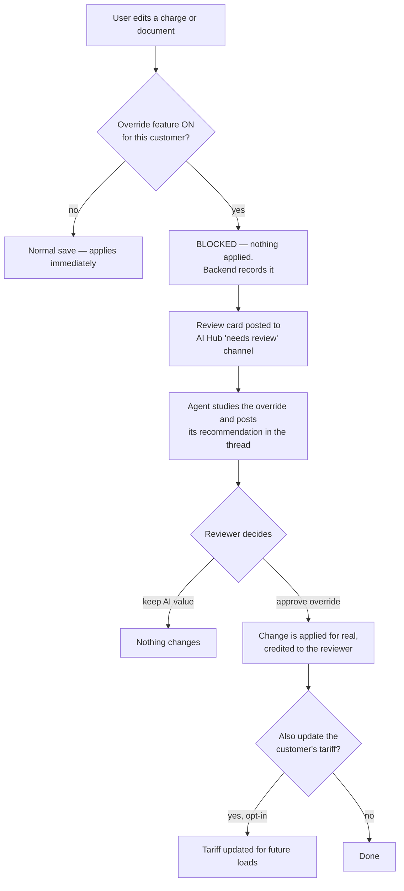

# Override Flow

> [!warning] ARCHIVED — V1
> Frozen 2026-06-12. This folder (`raw/Override Flow v1/`) documents the **v1
> architecture** as built on the `OVERRIDE-AGENT-PATCH` / `override-validator-parbat`
> branches. A new architecture round is underway — all new plans, decisions, and
> implementation steps live in [[Override Flow v2]] (`raw/Override Flow v2/`).
> Do not extend these notes; update v2 instead.

## Introduction

In PortPro, the AI/system decides many things about a load: a charge is $100, a charge set
is approved, a document is valid. Sometimes a human disagrees and **overrides** the
decision — changes the amount, un-approves the charge, marks the document invalid.

The Override Flow stops those overrides from applying silently. For customers where the
feature is turned on, the override is **blocked and captured** instead of applied. A review
card appears in the AI Hub, an AI agent (the **Overrides Manager**) studies the override
and gives an opinion, and a human reviewer makes the final call. Only then does the change
actually happen.

Why: a silent override might be a typo, a test, or a number with no business reason — and
it can quietly corrupt billing. A *good* override might mean the tariff or rule is wrong
and should be fixed for the future. Either way, someone should look at it first.

## Diagram

## How it works

1. **Gate** — the frontend checks a per-customer flag (`overrideConfiguration`). Flag off →
   normal save path, nothing new happens. Flag on → the edit goes to the backend's
   override-validator instead. → [[The Review Flow]]
2. **Block + capture** — the backend re-checks the flag, requires a reason, and blocks the
   change. It records what was attempted (audit trail + history) and posts a review card.
   → [[Capture and Replay Contract]]
3. **Agent review** — the Overrides Manager agent reads the tariff, the charge math, the
   customer's override history, the playbook rules, and *why the AI originally decided* —
   then posts a recommendation with its reasoning. → [[Architecture]]
4. **Conversation** — the reviewer can ask questions ("show me the history", "is there a
   playbook rule?"). The thread stays open before and after a decision.
   → [[User Flow Scenarios]]
5. **Decision** — the reviewer either keeps the AI value or approves the override. Approval
   replays the original action through the real backend controllers, attributed to the
   reviewer. Nothing ever auto-applies by default. → [[Agent Tools and Safety]]

## Status (2026-06-10)

Branch: `override-validator-parbat` in all four repos.

| Repo | PR | State |
|------|----|-------|
| portpro-mcp | #2991 | **Merged** |
| portpro-ai-agents | #10865 | **Merged** |
| portpro-frontend | #51152 | Open, approved |
| portpro-backend | #46753 | Open ⚠️ base is `SANDBOX-UNIVERSAL-backup-2026-06-09`, not PRODUCTION-DRAYOS |

Flag-off customers see **zero change** — the whole chain only runs for flag-on customers.

**Open issues before any pilot goes live:**

1. **Approve-replay broken for 5 of 7 override types** — an action-name mismatch between
   capture and replay. Fails loudly (error on the card), no bad data. Details + fix in
   [[Capture and Replay Contract]].
2. **No double-click protection on the execute route** — a double-Approve can replay twice.
3. **Tariff re-trigger filter unverified on live data** — wrong field would silently match
   nothing (never another customer's loads). See [[Agent Tools and Safety]].

## Read next

[[Architecture]] · [[The Review Flow]] · [[Capture and Replay Contract]] · [[Agent Tools and Safety]] · [[User Flow Scenarios]]
