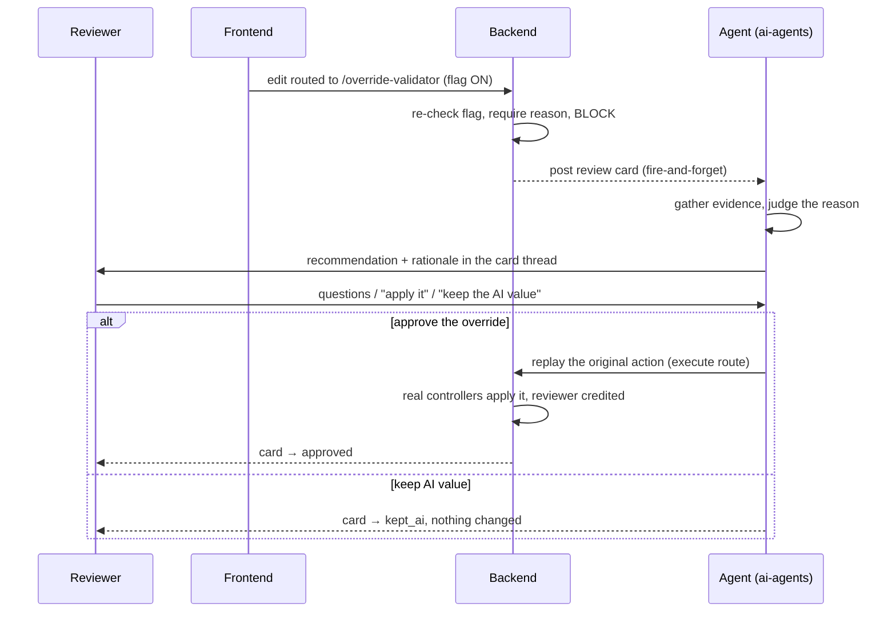

# The Review Flow

## Introduction

The life of one override, from the human's click to the final decision. Five stages:
block, card, analyze, converse, decide.

## Diagram

## How it works

1. **Block** — with the flag on, the frontend sends the edit to `POST /override-validator`
   instead of the normal save. The backend re-checks the flag server-side (the frontend
   gate is just a routing hint), requires a non-empty **reason**, and blocks the change.
   It writes an `_OVERRIDE_BLOCKED` entry on the load's audit timeline and a history row
   (what was attempted, plus a snapshot of the tariff at that moment).
   → `portpro-backend/server/modules/override-validator/index.js`

2. **Card** — the backend posts a review card to the carrier's "needs review" channel in
   the AI Hub. Fire-and-forget: if the card post fails, the override is still blocked.
   The card carries the full override payload — see [[Capture and Replay Contract]].

3. **Analyze (proactive)** — the moment the card lands, the agent runs once on its own and
   posts the **first** analysis into the thread, before the reviewer even opens it. It
   reads: the tariff (what the charge *should* be), the rate math, the customer's override
   history (has this happened before?), the playbook rules, and the AI's original
   reasoning. Then it leads with a recommendation: *apply*, *keep the AI value*, *adjust to
   a better number*, or *need more info* — always with the why.
   → `app/services/messaging/override_verifier.py`

4. **Converse** — every reviewer reply in the thread routes back to the agent. Questions
   are fine before *and after* a decision — the thread never goes silent. The only moment
   the agent won't answer is while an apply is literally in flight (prevents a
   double-execute race). → [[User Flow Scenarios]]

5. **Decide** — two ways a change actually happens:
   - **Reviewer tells the agent** ("apply 450") — the agent applies it through its action
     tools, using only values it actually read. → [[Agent Tools and Safety]]
   - **Reviewer hits Approve on the card** — ai-agents replays the original blocked action
     via the backend's execute route, through the same controllers a real user request
     hits, credited to the approver.
     ⚠️ This path currently fails for 5 of 7 override types — see
     [[Capture and Replay Contract]].

## The golden rule: suggest before apply

The agent **never applies anything in the same turn it proposes it**. It presents, stops,
and acts only on an explicit instruction in a later message. This holds even for trivial
cases. It's the single most important safety behavior.

## Card states (`review_status`)

| State | Meaning |
|-------|---------|
| `pending_review` | Card just posted. |
| `in_discussion` | Agent has presented; conversation ongoing. |
| `executing` | Apply in flight — the only state where the agent won't reply. |
| `approved` | Override applied; the human's value won. |
| `kept_ai` | Reviewer kept the AI value; nothing changed. |
| `execution_failed` | Apply attempted and failed. |
| `escalated` | Handed off, out of the agent's scope. |

Terminal states stay conversational — an earlier version went silent after a decision,
which was fixed deliberately.

> Known gap: the execute route has no idempotency key, so a double-Approve that slips past
> the `executing` window replays twice. Hardening candidate.

## After an apply: the tariff chain (charges only)

Three steps, each strictly opt-in with its own confirmation, because each widens the blast
radius:

1. **Per-load apply** — changes the charge on *this load only*.
2. **Tariff sync** — writes the new rate into the *customer's tariff* → all **future**
   loads price differently.
3. **Re-trigger** — recalculates the customer's *existing active* loads from the new
   tariff, **overwriting their per-load manual overrides**. Completed/billed loads and
   other customers are never touched. Sets over 50 loads run in the background.

The agent warns before steps 2 and 3 and never chains them without separate confirmations.

## Related

[[Override Flow]] · [[Architecture]] · [[Capture and Replay Contract]] · [[Agent Tools and Safety]] · [[User Flow Scenarios]]
