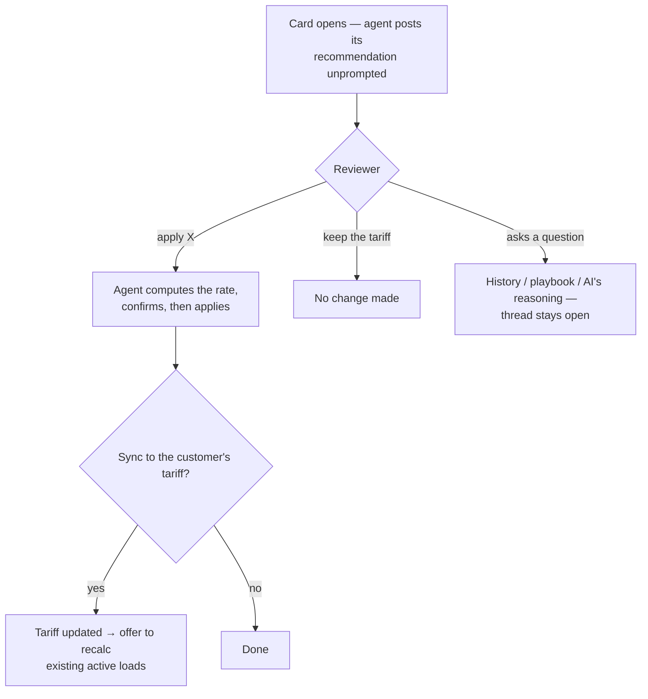

# User Flow Scenarios

## Introduction

What the review conversation actually looks like — **User** asks, **Agent** answers.
Amounts and ids are illustrative. Four rules show up everywhere: suggest before apply;
tariff charges are a rate, never a flat total; only values the agent actually read; the
charge's own currency.

## Diagram

## The core path — a tariff charge

**Agent** *(unprompted, when the card opens)*: Recommend applying 700. The reason
"customer-confirmed rate" matches 5 prior line-haul overrides for this customer and no
playbook rule blocks it. Line Haul is computed — to make 700 that's a rate of 4.00/mi over
175 mi. Apply this, or keep the tariff (655)?

**User:** apply 700

**Agent:** Done — Line Haul is now 700 (4.00/mi × 175 mi). Want me to sync this to the
customer's tariff too? That changes pricing for ALL future loads for this customer.

**User:** yes sync it

**Agent:** Synced — the tariff rate is now 4.00/mi. Re-apply to the customer's existing
ACTIVE loads as well? That recalculates them and overwrites their per-load manual
overrides; completed/billed loads and other customers are untouched.

**User:** yes

**Agent:** Re-triggered — 12 active loads recalculated.

*Three separate confirmations: per-load → tariff → re-trigger. The agent re-computed the
rate in the same turn as each write — it never flat-wrote 700.*

## A weak reason

**Agent:** There's no tariff for this charge. The override sets it to 150 (current 100).
The reason given is "Testing" — not a billing justification — so I'd lean toward keeping
100, but it's your call. Confirm and I'll apply 150.

**User:** apply it anyway

**Agent:** Applied — charge is now 150.

*The agent advises, the human decides. Even a weak reason applies if the human insists —
but never silently.*

## The math doesn't work

**User:** apply 500

**Agent:** I can't compute a rate for 500 — this charge is per-day and the load has 0
chargeable days, so there's no basis to spread it over. Give me a per-day rate and I'll
apply it.

**User:** use a rate of 3.50/mi

**Agent:** 3.50/mi makes 612.50, not 700. Want 612.50, or 4.00/mi to hit 700?

*It never writes fields that don't reconcile to the stated target.*

## Read-only questions — the thread stays open

**User:** is there a playbook for chassis rental?

**Agent:** Yes — one rule: "Chassis Rental capped at 50/day for this customer." The
override sets it to 75/day, which exceeds that cap.

**User:** show me the history for line haul

**Agent:** 5 prior overrides, all pushing line haul above the 655 tariff on this lane:

| Date | Override | Lane | Tariff-then |
|------|----------|------|-------------|
| 05-02 | 700 | Newark → Edison | 655 |
| 04-18 | 690 | Newark → Edison | 655 |

**User:** why did the AI set it to 655?

**Agent:** It applied the customer's radius tariff (rate × 175 mi), following the rule
"apply customer radius tariff to line haul." Your override to 700 is above that — the
"customer-confirmed" reason is what would justify it.

*(If there's no playbook rule or no history, the agent says so — it never invents one.)*

**User** *(after the decision is already made)*: what was the tariff again?

**Agent:** 655. Want to revisit the override?

*Terminal states stay conversational — only an in-flight apply blocks a reply.*

## Documents — same flow, different evidence

**Agent** *(card opens)*: The AI invalidated this POD because it found no delivery
signature (rule: "POD must show delivery signature"). The reviewer wants it valid. If
you've confirmed the signature is present, I'll validate — confirm?

**User:** yes, signature is on page 2

**Agent:** Validated.

## When writes fail

**Agent** *(AI-updates gate off for this carrier)*: I can analyze and recommend, but I
can't apply changes — AI updates aren't enabled for this account.

**Agent** *(downstream write rejected)*: The tariff sync failed — the pricing service
rejected the write (a permissions issue downstream, not the value). The per-load change is
still applied. Retry, or flag it?

*Never claims a false success.*

## How the agent picks its stance

| The human's reason | The evidence | Agent leads with |
|--------------------|--------------|------------------|
| Strong ("customer-confirmed") | history repeats it | apply |
| Cites a rule that exists | rule authorizes it | apply |
| Cites a rule that doesn't exist | contradiction | keep the AI value |
| Weak ("Testing", blank) | above tariff, no rule | keep the AI value |
| Rebuts the AI with a checkable fact | the fact verifies | apply |
| Plausible, but a better number exists | tariff/math differs | adjust |
| Missing a fact | incomplete | ask for more info |

Always advisory — every message still ends by asking the reviewer to confirm. The
structured verdict behind each reply is in [[Agent Tools and Safety]].

## Related

[[Override Flow]] · [[The Review Flow]] · [[Agent Tools and Safety]]
