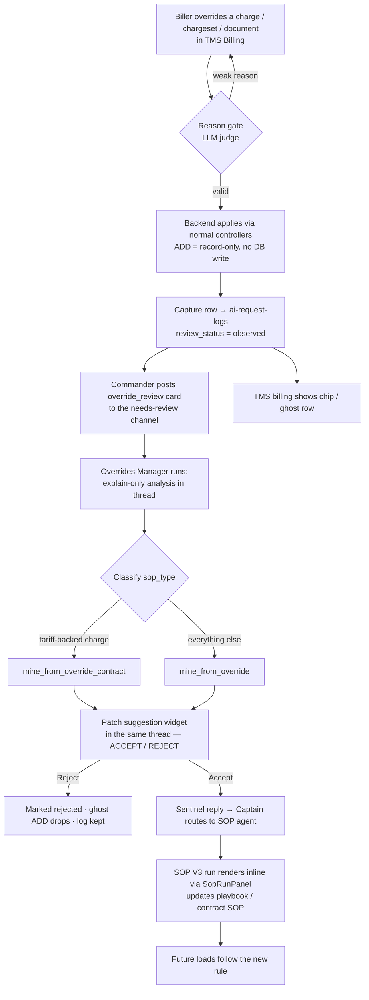

# Override Flow v2

## Introduction

The Override Flow lets a biller **manually override** a billing decision the AI made — change a
charge rate, add or remove a charge, approve/unapprove a chargeset, or validate/invalidate/remove
a document — and turns that one human action into a learning signal for the system. v2 is a
rethink of v1: in v1 the override was **blocked** and held for human approve/reject before it could
replay; in v2 the override **applies immediately** and is captured **observationally**. Nothing
stands between the biller and getting their work done. The system watches, explains what happened,
and proposes a permanent rule change so the same override is not needed next time.

The whole feature spans three repos — `portpro-frontend` (TMS billing + Commander cockpit),
`portpro-backend` (the override apply path), and `portpro-ai-agents` (the Overrides Manager agent
and Commander messaging). The join between them is the **ai-request-logs ledger**: the backend
writes a capture row, the agent enriches it, and the frontend renders it on two surfaces at once.

> **Companion notes:** [[User Flow]] (the operator's journey) · [[Technical Reference]] (how it is
> wired — components, data flow, APIs, files) · [[codes/User Flow Code Walkthrough]] (every user step
> → repo + file + code block) · thematic code walks under [[codes/Backend Validator and Capture]],
> [[codes/Overrides Manager and Mining]], [[codes/Patch Accept and SOP Routing]], [[codes/Billing Surface and Reject]].
> v1 (archived) lives in `raw/Override Flow v1/` — start at [[Override Flow]].

## Features

- **Apply immediately, observe quietly** — a valid override is applied by the *normal* controllers
  the instant it passes the reason gate. No blocking, no pending state, no replay queue.
- **Record-only ADD** — overriding in a *brand-new* charge does not write to the billing charge DB.
  It is recorded to the ledger and shown as a read-only "ghost" row. UPDATE / REMOVE / APPROVE /
  document overrides do apply for real (those entities already exist).
- **Explain-only agent** — the Overrides Manager posts a plain-prose factual analysis (tariff,
  playbook, history, the AI's original rationale, and the human's reason). No recommendation, no
  verdict, no "confirm?" — and no buttons on the card.
- **Classify + auto-mine** — the same agent run classifies the override (tariff-backed charge →
  `contract`; everything else → `playbook`) and automatically mines exactly one patch suggestion.
- **One decision surface** — the mined patch suggestion is the *only* interactive widget in the
  whole flow, and it lives only in the override card's thread. **Accept** routes the change to the
  customer **SOP agent** (SOP V3) to actually edit the playbook/contract; **Reject** drops it.
- **Two synchronized surfaces** — every override shows up both as a card in the Commander "needs
  review" channel and as a chip/ghost row in the TMS billing table, driven by the same ledger row.
- **Flag-gated Reject** — an optional Reject control (off by default) lets a biller discard a
  captured override; it removes the ghost ADD from billing but keeps the ledger row for audit.

## Example

A biller at carrier *Acme Drayage* is invoicing load `MTJO5_PHI_M109061` for customer *Globex*.
The AI priced the **Fuel Surcharge** at `$120`. The biller knows Globex's negotiated rate is `$95`
and edits the charge.

1. A reason modal appears. The biller types *"Globex FSC is capped at $95 per their 2026 contract."*
   An LLM gate accepts the reason.
2. The charge **applies right away** — the invoice now reads `$95`. A toast says *"Override applied
   — logged for AI review."* A card appears in the carrier's Commander "needs review" channel; the
   billing row gets an **"Overridden"** chip with a `→ $120` hint.
3. Seconds later the **Overrides Manager** replies in the card's thread: *"Globex's active tariff
   lists Fuel Surcharge at $120/load (computed per-unit). The playbook has no FSC cap rule. The AI
   applied the tariff rate. The biller overrode to $95, reason: contract cap."* No recommendation.
4. The agent classifies it as **contract** (the charge is tariff-backed) and mines a patch
   suggestion. A patch widget posts into the same thread: *"ADD to Negotiated Rates: Fuel Surcharge
   = $95 for Globex."*
5. The biller clicks **Accept**. The change is routed to the customer SOP agent, whose run renders
   inline in the thread (a live plan stepper). The agent updates Globex's contract SOP and
   reconciles the tariff.
6. Next month's Globex loads price Fuel Surcharge at `$95` automatically. The manual override is no
   longer needed.

## Design decisions (the ones that shaped v2)

| Decision | Why |
|----------|-----|
| **Block → observe.** The override applies; capture is best-effort and success-only. | A failed override means nothing happened, so there is nothing to learn. The biller is never blocked. |
| **Apply ownership is the backend.** The validator applies via the real controllers; the FE keeps `handled:true` and never falls through to its own apply path. | Two apply paths (FE-flip + BE-apply) = double apply. One backend entry runs the controller validations exactly once. |
| **ADD is record-only.** A new charge override is captured but never committed to the bill. | A speculative new charge should not hit a customer's invoice from an observation; it shows as a ghost row instead. |
| **The agent never applies and never recommends.** It explains, classifies, and calls one mining tool. | The learning surface is the patch suggestion, not the override card. Keeps the agent's job small and auditable. |
| **One mine call per run**, chosen by `sop_type` (contract vs playbook). | Deterministic — never both tools, never twice. |
| **Accept routes to the SOP agent via a sentinel message**, rendered inline with the existing `SopRunPanel`. | Reuse the proven customer-SOP-chat machinery instead of building a chat-in-chat; the SOP agent owns the actual write. |
| **No card-level Approve/Reject, no replay.** | v1's pending/replay machinery is dead under observe mode; only the flag-gated Reject survives. |

## Diagram

## How it works

1. **Override + reason gate.** The biller edits a charge/chargeset/document in TMS billing. A reason
   modal runs an LLM judge (fail-open); a weak reason is rejected with feedback.
   → [[User Flow]] · [[codes/Backend Validator and Capture]] · `portpro-frontend/src/utils/overrideValidator.js`
2. **Apply (block → observe).** The backend `override-validator` applies the action through the same
   controllers the normal endpoint uses. `ADD_PRICING` is the one exception — record-only, no DB write.
   → [[codes/Backend Validator and Capture]] · `portpro-backend/server/modules/override-validator/index.js`
3. **Capture.** Fire-and-forget, the backend posts a snapshot to ai-agents and writes an audit
   (`*_OVERRIDE_APPLIED`, or `CHARGE_ADD_OVERRIDE_BLOCKED` for record-only ADD).
   → [[codes/Backend Validator and Capture]]
4. **Log + card.** ai-agents writes the ledger row with `review_status:"observed"` and Commander posts
   the buttonless `override_review` card to the carrier's needs-review channel.
   → [[Technical Reference]] · [[codes/Overrides Manager and Mining]] · `portpro-ai-agents/app/routes/messaging/override_review.py`
5. **Billing reflects it.** The TMS billing table shows a read-only "Overridden" chip on the changed
   row (UPDATE) or a ghost row (record-only ADD), pulled from get-override-history.
   → [[codes/Billing Surface and Reject]]
6. **Explain + classify + mine.** A claim gate picks up the observed card; the Overrides Manager posts
   a prose analysis, classifies the `sop_type`, and auto-calls exactly one mine tool.
   → [[codes/Overrides Manager and Mining]]
7. **Patch suggestion.** The mined patch posts as a widget into the same thread — the flow's only
   buttons: Accept / Reject.
   → [[codes/Patch Accept and SOP Routing]]
8. **Accept → SOP agent.** Accept records a `route` decision and posts a sentinel-prefixed message into
   the thread; Captain's classifier deterministically routes the sentinel to the SOP agent (SOP V3),
   whose run renders inline via `SopRunPanel`. The SOP agent edits the playbook or contract SOP (and,
   for contract, reconciles the tariff).
   → [[codes/Patch Accept and SOP Routing]]
9. **Reject (optional, flag-gated).** Discards the captured override — removes a ghost ADD from billing,
   keeps the ledger row, idempotent across re-mounts.
   → [[codes/Billing Surface and Reject]]

## Related
[[User Flow]] · [[Technical Reference]] · [[codes/Backend Validator and Capture]] ·
[[codes/Overrides Manager and Mining]] · [[codes/Patch Accept and SOP Routing]] ·
[[codes/Billing Surface and Reject]] · [[Override Flow]] (v1, archived)
