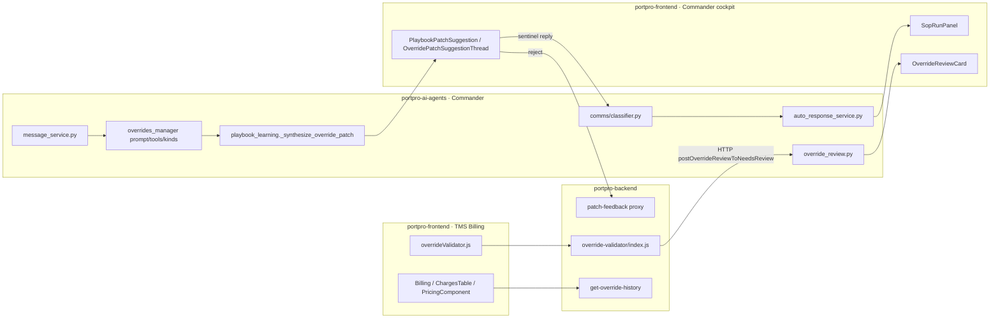

# Override Flow v2 — Technical Reference

The "how it's wired" map: architecture pillars, components, data flow, key files, APIs, and
test/ship state. The end-user walkthrough is in [[User Flow]]; the conceptual overview and design
decisions are in [[Override Flow v2]]; verbatim code walkthroughs are under `codes/`.

---

## 1. One-paragraph summary

A manual billing override **applies immediately** (v1 blocked it) and is captured
**observationally**. The **Overrides Manager** agent posts a plain-prose explanation (evidence, no
recommendation, no buttons), classifies the override, and auto-mines a patch suggestion. The patch
widget — thread-only — is the **only** place with buttons: **Accept** routes to the customer **SOP
agent** (SOP V3) to update the contract/playbook, **Reject** (flag-gated) drops the captured row but
keeps the ledger log. Nothing blocks the biller; the system observes and learns.

## 2. Architecture pillars

| # | Pillar | Mechanism |
|---|--------|-----------|
| 1 | **Block → observe** | `override-validator` applies via the *normal* controllers, success-only capture. No pending state, no replay. |
| 2 | **Record-only ADD** | `ADD_PRICING` does **not** write the billing charge DB — captured to the ledger, shown as a read-only ghost row. UPDATE / REMOVE / APPROVE / document still apply. |
| 3 | **Explain-only agent** | Overrides Manager posts prose analysis (tariff + playbook + history + AI rationale + the human reason). No recommendation, no Approve/Reject on the card. |
| 4 | **Classify + auto-mine** | tariff-backed charge → `sop_type=contract` → `mine_from_override_contract`; everything else → `sop_type=playbook` → `mine_from_override`. One tool call, same turn. |
| 5 | **Patch widget, thread-only** | The mined suggestion is the only buttoned widget. **Accept** → sentinel reply into the thread → Captain → `sop_agent` (SOP V3), rendered inline via `SopRunPanel`. **Reject** → patch-feedback `reject`. |
| 6 | **Reject control (flag-gated)** | `OverrideRejectButton` on every card surface. Reject keeps the ledger log, drops the ADD ghost from billing, idempotent. |

v1 machinery removed: pending-override stamp, replay executor, execute/decision routes, comms stash
bridge, evidence guard, card Approve/Reject + replay buttons.

## 3. Component map



## 4. Repos, branches, PRs

- **Canonical:** `feat/override-v2` on `portpro-ai-agents`, `portpro-backend`, `portpro-frontend`.
  Bases: ai = `PRODUCTION`, BE/FE = `PRODUCTION-DRAYOS`.
- **Sandbox (`SANDBOX-UNIVERSAL`) — MERGED:** ai #11010 / BE #47192 / FE #51510, plus the chip/ghost
  and record-only-ADD follow-ups (FE #51527 / #51531, BE #47246 / ai #11062 etc.) and reject FE #51528.
- **Dev env — MERGED:** FE #51536 (→ `DEVELOPMENT-DRAYOS`), BE #47215 (→ `DEVELOPMENT-DRAYOS`),
  ai #11043 (→ `AI-DEVELOPMENT`).
- **Production:** the **core v2 stack is NOT in production yet.** The prod-base PRs
  (FE #51401, BE #47082, ai #10901 for the review-widget) were closed; the v2 feature lives in
  sandbox + dev. The only override work that has reached a PRODUCTION branch is the carrier-owner
  channel-admin fix (ai #11538) and apply-override-after-tariff (ai #11430) — both adjacent, not the
  v2 observe pipeline itself.
- **Sentinel constant (MUST stay in sync FE ↔ ai):** `OVERRIDE_PATCH_ACCEPT_SENTINEL = "[[OVERRIDE_PATCH_ACCEPT]]"`.

## 5. Key files by repo

### portpro-ai-agents (Commander)
- `app/agents/comms/classifier.py` — first-priority short-circuit: `if OVERRIDE_PATCH_ACCEPT_SENTINEL in message: return "sop_agent"`. Routes patch-accept to SOP V3 before the override_review / playbook_patch short-circuits. → [[codes/Patch Accept and SOP Routing]]
- `app/services/messaging/auto_response_service.py` — override-thread priority routing to Captain; session-id normalize (`thread_<id>` → `channel_<ch>_<parent>`) for the SOP bridge; observe-capture; full SOP `dispatch_meta` + `sop_run_id` plumbing in the **thread-reply** handler (SOP plumbing must exist in all 3 handlers: thread-reply, mention, DM). → [[codes/Patch Accept and SOP Routing]]
- `app/services/messaging/message_service.py` — `begin/finish_override_verification` accept `'observed'`; `reject_override_review` WHERE `IN ('pending_review','in_discussion','execution_failed','observed')`. → [[codes/Overrides Manager and Mining]] · [[codes/Billing Surface and Reject]]
- `app/routes/messaging/override_review.py` — writes the ledger log + posts the `override_review` card with `review_status:"observed"`. → [[codes/Overrides Manager and Mining]]
- `app/routes/messaging/override_review_actions.py` — `POST .../override-review/{id}/reject` (keeps log, Firebase `review_update`, `sync_override_log_status`), `/approve`, `/apply-as-new-charge`. → [[codes/Billing Surface and Reject]]
- `app/agents/overrides_manager/{prompt,tools,kinds}.py` — explain-only prompt, read-only kind registry, auto-dispatched mine tools; classify → `sop_type`. → [[codes/Overrides Manager and Mining]]
- `app/routes/playbook_learning.py` + `app/agents/patch_agent/*` — `_synthesize_override_patch`, `mine_from_override` / `mine_from_override_contract`, patch-agent decision tool, Opik-traced under `patch_agent`. → [[codes/Overrides Manager and Mining]]

### portpro-backend (TMS)
- `server/modules/override-validator/index.js` — block→observe runner: applies via controllers, success-only capture, `isRecordOnly = event === 'ADD_PRICING'` (skips `applyOverrideAction`), returns `{success, applied, blocked:!applied, event, result}`, audit taxonomy `*_OVERRIDE_APPLIED` + `CHARGE_ADD_OVERRIDE_BLOCKED`. Capture POST → ai (`AGENT_API_URL`, `postOverrideReviewToNeedsReview`). Also serves **get-override-history** (reads the AiRequestLogs store, not a load-charge controller) and the **patch-feedback proxy**. → [[codes/Backend Validator and Capture]] · [[codes/Billing Surface and Reject]]
- Removed: v1 review/replay machinery (execute/decision routes, replay executor, pending-override stamp).

### portpro-frontend (cockpit + billing)
- `src/utils/overrideValidator.js` — `tryOverrideValidator` single entry; observe semantics (`handled:true` always). → [[codes/Backend Validator and Capture]]
- `AIHub/AIWorkbenchV2/components/messages/Message.jsx` — minimal `override_review` card in the feed.
- `messages/ThreadSidebar.jsx` — full override card (flat) + `SopRunPanel` mount for `sop_run_id` replies + `onAcceptRouteToThread` wiring. → [[codes/Patch Accept and SOP Routing]]
- `messages/widgets/OverrideReviewCard/{index,OverrideReviewCardBody,OverrideRejectButton}.jsx` — buttonless card + flag-gated reject. → [[codes/Billing Surface and Reject]]
- `messages/widgets/PlaybookPatchSuggestion/{index,OverridePatchSuggestionThread}.jsx` — patch widget + sentinel composer. → [[codes/Patch Accept and SOP Routing]]
- `CommandCenter/components/OverrideTaskCard.jsx` — Verify-tab card + reject.
- `Load/Billing/index.js` + `BillingCard/Charges/ChargesTable.js` + `Load/PricingComponent.js` — ghost rows, "Overridden" chip, "→ prev value" hint. → [[codes/Billing Surface and Reject]]
- Services: `overrideValidator.services.js`, `overrideReview.services.js` (`rejectOverrideReview`), `Common.services.js` (`isOverrideRejectEnabled`).

## 6. Data flow (TMS ↔ Commander)

```
[1] biller overrides charge in TMS Billing
      FE → BE override-validator → applies via controller (observe); ADD = record-only (no DB write)
[2] BE → HTTP postOverrideReviewToNeedsReview → ai (AGENT_API_URL)
[3] ai: writes ai-request-log (category=manual_override, review_status='observed')
      Captain posts override_review card → carrier "needs review" channel
[4] Firebase push (review_update / sop_*) + FE pulls ai-request-logs (My Tasks / Verify)
      TWO surfaces share ONE log row: Commander channel card + TMS billing chip/ghost
[5] Overrides Manager runs (explain-only): gathers evidence → posts prose analysis
      → classify → mine_from_override[_contract] → patch card in thread
[6] user ACCEPT → FE posts sentinel reply into the thread
      → Captain classifier sees the sentinel → routes sop_agent (SOP V3) → renders inline via SopRunPanel
[7] sop_agent updates contract/playbook; (contract) → delegate_to_tariff_agent → MCP → BE
```

Integration patterns: **request+callback** (override-validator → ai), **agent write-back**
(ai → MCP → BE), **realtime** (ai → Firebase → FE), **pull** (FE → ai-request-logs). The
**ai-request-logs ledger is the join table**: BE writes the capture, ai enriches, FE renders.

## 7. Reject flow + idempotency

- Gate: `isOverrideRejectEnabled()` (Common.services) — falls back to `isEnabled` (the dedicated
  `rejectEnabled` flag is never set anywhere yet).
- Click → `rejectOverrideReview(messageId)` → ai `POST .../override-review/{id}/reject` → log kept,
  `review_update` emitted, status synced. The server 409s a second reject (idempotent backstop).
- FE idempotency: a module-level `_rejectedMessageIds` Set keeps the button disabled/"Rejected"
  across re-mounts on **all** surfaces (a parent re-render rebuilds the card from stale
  `review_status`). `onRejected` → list refetch so the card leaves the Verify queue.
- A rejected `ADD_PRICING` ghost drops from the billing charges table; the log row remains.
- Details + code: [[codes/Billing Surface and Reject]].

## 8. Testing

- **ai (pytest):** override/patch suite — `override_commander_routing`, `override_review_lifecycle`,
  `override_v2_sop_type_target`, `playbook_mine_from_*`, `add_task_service`, `customer_pattern_miner`
  — green.
- **BE (jest):** `tests/unit/modules/override-validator/override-validator.test.js` — 21 passing
  (record-only ADD asserted).
- **FE (jest):** `overrideReview.services.test.js` + `OverrideReviewCard.test.jsx` — 9 passing. Env
  recipe: jsdom30 + loose babel (`babel.ov2tmp.config.js`: class-properties / private-methods loose)
  + moment-tz shim; run from the worktree (symlinked node_modules break `/tmp` runs).

## 9. Known gaps / watch-list

- **Core v2 is not in production** — sandbox + dev only (see §4). Promotion to prod is pending.
- **No FE `review_update` Firebase handler** — the channel card doesn't auto-flip on a live push; it
  relies on the `_rejectedMessageIds` Set + next refetch. True cross-user/cross-session instant flip
  needs a `review_update` handler that patches the channel message in place.
- **Reject is flag-gated** — invisible until override config enables it on an env.
- **Contract-patch Accept** updates the contract SOP text and reconciles the tariff via
  `delegate_to_tariff_agent`; this reconciliation path is the most fragile seam (needs the
  `contract-tariff-reconciliation` skill assigned + Tariff V2 flag on).
- **SOP plumbing lives in 3 channel response handlers** (thread-reply / mention / DM) — any new SOP
  path must touch all three.
- `override_review_actions.py` deprecated v1 routes can be deleted once dev v1 cards drain.

## 10. Related

[[Override Flow v2]] · [[User Flow]] · [[codes/Backend Validator and Capture]] ·
[[codes/Overrides Manager and Mining]] · [[codes/Patch Accept and SOP Routing]] ·
[[codes/Billing Surface and Reject]] · [[Override Flow]] (v1, archived).
Memory: `override_v2_architecture`, `billing_override_logs_render`, `override_playbook_sync`.
