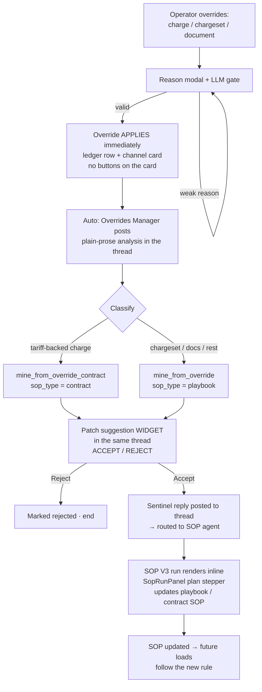

# User Flow

## Introduction

The operator's journey through Override Flow v2. There are only **three human touchpoints**: making
the override, typing the reason, and one Accept (or Reject) click on the patch widget. Everything
else is automatic. The whole conversation happens on a single surface — the override card's thread
in the Commander cockpit — and the billing table reflects the same override in parallel. The agent
never applies the override and never tells the operator what to do; it explains, classifies, and
mines a suggested rule change.

## Who it serves

- **Biller / operator** — overrides a charge or document and gets on with invoicing; never blocked.
- **Overrides Manager (agent)** — explains every override and proposes a permanent fix.
- **The system** — learns the carrier/customer's real rules so the override stops recurring.

## Diagram

## Steps

1. **Override.** The operator edits a charge rate, adds/removes a charge, approves/unapproves a
   chargeset, or validates/invalidates/removes a document in the TMS billing screen.
2. **Reason gate.** A reason modal appears. An LLM judge validates the reason (fail-open). A weak or
   empty reason gets red feedback and a retry.
3. **Apply + capture *(the v2 change)*.** On a valid reason the override **applies immediately** —
   v1 blocked it here. The billing value updates; a ledger row is written; a buttonless informational
   card posts to the Commander "needs review" channel; the billing row gets an "Overridden" chip (or
   a read-only ghost row for a brand-new charge).
4. **Auto-analysis.** Right after the card posts, the Overrides Manager replies in the card's thread
   with **plain text only**: the tariff, playbook, history, and AI-decision facts plus the operator's
   reason. No recommendation, no confirm question.
5. **Classify + mine.** The same run classifies the override — a **tariff-backed charge** →
   `sop_type=contract` → `mine_from_override_contract`; **everything else** (non-tariff charge,
   chargeset approve/unapprove, any document override) → `sop_type=playbook` → `mine_from_override`.
   Exactly one mine call, fire-and-forget.
6. **Patch widget.** Moments later the patch suggestion posts as a widget **into the same thread**
   (never top-level). It shows the proposed change — action, section, rule text, rationale,
   confidence, the evidence load — and the flow's **only** buttons: ACCEPT / REJECT.
7. **Reject** → the suggestion is marked rejected; the flow ends. (A separate, flag-gated Reject on
   the override card itself can discard the captured override — see [[codes/Billing Surface and Reject]].)
8. **Accept** → the widget records a `route` decision and posts a self-contained, sentinel-prefixed
   instruction into the thread. Captain's classifier sees the sentinel and routes it to the **customer
   SOP agent** (SOP V3). The SOP run renders **inline in the same thread** via the reused `SopRunPanel`
   plan stepper — no separate chat window. The agent walks the playbook / contract-SOP update through
   its normal flow (for a contract patch it also reconciles the tariff). The operator can keep chatting
   in-thread.
9. **Done.** The SOP is updated, so future loads for that customer follow the new rule and the manual
   override is no longer needed.

> **Step-by-step code:** each step below mapped to its repo + file + code block —
> [[codes/User Flow Code Walkthrough]].

## Related
[[codes/User Flow Code Walkthrough]] · [[Override Flow v2]] · [[Technical Reference]] ·
[[codes/Patch Accept and SOP Routing]] · [[codes/Backend Validator and Capture]]
