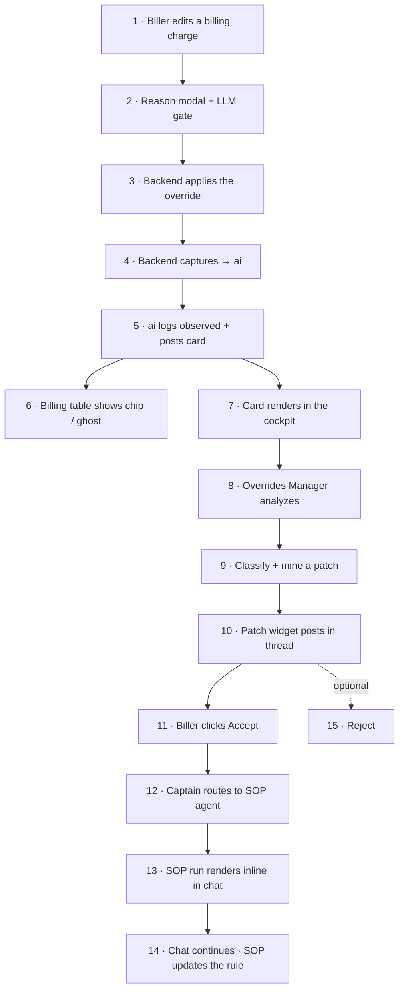

# User Flow Code Walkthrough — override → chat completion

> Explains: [[User Flow]] · [[Override Flow v2]].
> One pass through the **whole user journey in execution order**, and for each step: the **repo**,
> the **code file**, and the **highlighted code block** behind it — from the biller overriding a
> billing charge, through the agent analysis, to the patch Accept and the SOP chat that finishes it.
> Thematic deep-dives: [[codes/Backend Validator and Capture]] · [[codes/Overrides Manager and Mining]]
> · [[codes/Patch Accept and SOP Routing]] · [[codes/Billing Surface and Reject]].

## Flow map



---

## Step 1 — Biller edits a load billing charge

**Repo:** `portpro-frontend` · **File:** `src/pages/tms/Load/Components/BillingCard/Charges/ChargesTable.js`

```js
// portpro-frontend/.../BillingCard/Charges/ChargesTable.js:1086-1101
                if (ovAdd.blocked) {
                    this.refreshAfterBlockedOverride();
                    this.props.onOverrideCaptured?.({
                        chargeId: payload.chargeId, pricing: payload.pricing,
                        chargeName: payload?.pricing?.chargeName || payload?.pricing?.name,
                        reason: ovAdd.reason, action: OVERRIDE_EVENTS.ADD_PRICING,
                    });
                }
```
The billing charges table is where it starts. When the biller saves an edit/add/remove on a charge,
the table calls the override validator (next step). On a captured ADD it fires `onOverrideCaptured`
so the row updates instantly. The `UPDATE_PRICING` branch (~L1275) does the same with a `pricingId`.

## Step 2 — Reason modal + LLM gate

**Repo:** `portpro-frontend` · **File:** `src/utils/overrideValidator.js`

```js
// portpro-frontend/src/utils/overrideValidator.js:64-89
export const tryOverrideValidator = async ({ event, payload, customerId, overrideDetails }) => {
  if (!isOverrideEnabledForCustomer(customerId)) {
    return { handled: false };
  }
  const referenceNumber =
    payload?.reference_number || payload?.referenceNumber || payload?.loadRef || null;
  const details = overrideDetails || buildFallbackDetails(payload);
  const outcome = await promptOverrideReason({
    validateReason: (candidateReason) =>
      validateOverrideReason({ event, reason: candidateReason, referenceNumber, overrideDetails: details }),
    submitReason: (finalReason) =>
      callOverrideValidator({ event, payload, customerId, reason: finalReason }),
  });
```
The single FE entry point. `promptOverrideReason` opens the modal and runs **two phases inside it**:
`validateReason` (the LLM judge — "Analyzing…", fail-open) then `submitReason` (the capture call —
"Submitting…"). A weak reason gets red feedback and a retry.

```js
// portpro-frontend/src/utils/overrideValidator.js:90-99
  if (!outcome) return { handled: true, cancelled: true };
  if (outcome.error) {
    toastr.show(extractValidatorError(outcome.error), "error");
    return { handled: true, error: outcome.error };
  }
  toastr.show(outcome.result?.message || "Override applied — logged for AI review", "info");
  return { handled: true, blocked: true, result: outcome.result, reason: outcome.reason };
```
**Observe semantics:** every outcome returns `handled:true` so the caller never double-applies. In
observe mode the `error` branch is a *real* controller validation failure (credit hold, terminal
scope, charge-code), because the backend runs the actual controllers.

## Step 3 — Backend applies the override (block → observe)

**Repo:** `portpro-frontend` · **File:** `src/services/overrideValidator.services.js`

```js
// portpro-frontend/src/services/overrideValidator.services.js:69-89
export const callOverrideValidator = ({ event, payload, customerId, reason }) => {
  const url = "override-validator";
  return new Promise((resolve, reject) => {
    HTTP("post", url, { event, payload, customerId, reason }, { authorization: getStorage("token") })
      .then((result) => {
        if (result?.status === 200) resolve(result?.data?.data);
        else reject(result?.data || new Error("Override validation failed"));
      })
      .catch((error) => reject(error));
  });
};
```
POSTs the event/payload/reason to the backend `override-validator` endpoint.

**Repo:** `portpro-backend` · **File:** `server/modules/override-validator/index.js`

```javascript
// portpro-backend/server/modules/override-validator/index.js:160-185
    const isRecordOnly = event === 'ADD_PRICING';
    const result = isRecordOnly
      ? null
      : await applyOverrideAction(userData, event, payload, overrideReason);
    const applied = !isRecordOnly;
```
The override applies through `applyOverrideAction` — the **same controller** the normal endpoint uses,
so validations run once. `ADD_PRICING` is the lone exception: **record-only**, never committed to the
bill (it shows as a ghost row instead).

```javascript
// portpro-backend/server/modules/override-validator/index.js:297-298
    return { success: true, applied, blocked: !applied, event, result: result ?? null };
```
`blocked:!applied` is the legacy key the FE refetches on.

## Step 4 — Backend captures → ai (fire-and-forget) + audit

**Repo:** `portpro-backend` · **File:** `server/modules/override-validator/index.js`

```javascript
// portpro-backend/server/modules/override-validator/index.js:177-211
    (async () => {
      let snapshot = null;
      try { snapshot = await buildOverrideSnapshot?.(userData.carrierId, referenceNumber, event, entity); }
      catch (snapErr) { logger?.warn?.(`[override-validator] snapshot build failed: ${snapErr?.message}`); }
      try {
        await postOverrideReviewToNeedsReview({
          carrier_id: userData.carrierId,
          override_kind: DOCUMENT_EVENTS.has(event) ? 'document' : 'charge',
          action: event, reason: overrideReason,
          actor: { user_id: userData.userId?.toString?.() || userData._id?.toString?.(), name: userData.name },
          reference_number: referenceNumber, load_id: payload.loadId?.toString?.() || null,
          customer_id: customerId?.toString?.() || null,
          entity: { ...cardEntity, requestedAction: event, blocked: !applied, applied },
          snapshot, occurred_at: new Date().toISOString(),
        });
      } catch (cardErr) { logger?.warn?.(`[override-validator] record-card post failed: ${cardErr?.message}`); }
    })();
```
Capture is a detached async IIFE — a slow/failing ai call never blocks the biller. Fires on apply
**success only**. The audit type is `*_OVERRIDE_APPLIED` (or `CHARGE_ADD_OVERRIDE_BLOCKED` for
record-only ADD). → detail: [[codes/Backend Validator and Capture]].

## Step 5 — ai logs "observed" + posts the card

**Repo:** `portpro-ai-agents` · **File:** `app/routes/messaging/override_review.py`

```python
# portpro-ai-agents/app/routes/messaging/override_review.py:138-148
            "entity": req.entity,
            "snapshot": req.snapshot,
            "occurred_at": req.occurred_at,
            "review_status": "observed",
        },
    }
```
Writes the ai-request-log (`category=manual_override`). `review_status:"observed"` is the v2 marker —
already applied, never awaiting a decision. This row is the **join table** for the two surfaces.

```python
# portpro-ai-agents/app/routes/messaging/override_review.py:221-233
        service = AgentMessagingService()
        result = await service.post_override_review(
            carrier_id=body.carrier_id, channel_name=OVERRIDE_REVIEW_CHANNEL_NAME,
            agent_id=OVERRIDE_REVIEW_AGENT_ID, content=content,
            exception_type=OVERRIDE_REVIEW_EXCEPTION_TYPE, exception_data=exception_data,
            exception_id=log_id, load_id=body.load_id, customer_id=body.customer_id,
            actor_user_id=body.actor.user_id if body.actor else None)
```
Posts the buttonless `override_review` card to the carrier's "needs review" channel, linked to the
log via `exception_id`.

## Step 6 — Billing table reflects the override (chip / ghost)

**Repo:** `portpro-frontend` · **File:** `src/pages/tms/Load/Billing/index.js`

```js
// portpro-frontend/src/pages/tms/Load/Billing/index.js:142-160
        if (row?.overrideType === 'ADD_PRICING') {
          if (row?.decision === 'rejected') return;              // rejected ADD hides; log stays
          if (!grouped[row.chargeId]) grouped[row.chargeId] = [];
          grouped[row.chargeId].push(row);
          return;
        }
        if (row?.decision === 'observed' && row?.overrideType === 'UPDATE_PRICING') {
          const cs = (marks[row.chargeId] = marks[row.chargeId] || { byPricingId: {}, byChargeName: {} });
          const mark = { reason: row.reason, action: row.overrideType, at: row.createdAt,
            by: row?.actor?.name, changedFields: row.changedFields || null,
            previousPricing: row.previousPricing || null };
          const pid = row?.pricing?._id;
          if (pid && !cs.byPricingId[pid]) cs.byPricingId[pid] = mark;
        }
```
Pulled from get-override-history: ADD_PRICING → ghost row; observed UPDATE_PRICING → a "mark" (the
"Overridden" chip + "→ prev value" hint) keyed by pricing `_id`. → detail: [[codes/Billing Surface and Reject]].

## Step 7 — Card renders in the Commander cockpit

**Repo:** `portpro-frontend` · **File:** `.../AIWorkbenchV2/components/messages/Message.jsx` (feed) and `messages/ThreadSidebar.jsx` (thread)

```jsx
// portpro-frontend/.../messages/Message.jsx:829-836
      {isOverrideReviewCard && overrideReviewData && (
        <div className="px-10 pb-10">
          <OverrideReviewCard data={overrideReviewData} variant="minimal" messageId={msg.id || msg._id} />
        </div>
      )}
```
```jsx
// portpro-frontend/.../messages/ThreadSidebar.jsx:1496-1500
              <div className="mt-1">
                <OverrideReviewCard data={message.exception_data} flat messageId={message?.id || message?._id} />
              </div>
```
Minimal card in the channel feed, full card in the thread header. **No Approve/Reject** — observe
mode. The only control is the flag-gated reject. → detail: [[codes/Billing Surface and Reject]].

## Step 8 — Overrides Manager analyzes (claim + explain-only)

**Repo:** `portpro-ai-agents` · **File:** `app/services/messaging/message_service.py`

```python
# portpro-ai-agents/app/services/messaging/message_service.py:538-561
    async def begin_override_verification(self, message_id: UUID) -> bool:
        status = await self.db.execute_query(
            """
            UPDATE channel_messages
            SET exception_data = jsonb_set(COALESCE(exception_data,'{}'::jsonb),'{review_status}','"in_discussion"'),
                updated_at = NOW()
            WHERE id = $1 AND is_deleted = FALSE AND exception_type = 'override_review'
              AND COALESCE(exception_data->>'review_status','pending_review') IN ('pending_review','observed')
            """, message_id)
        return self._parse_rowcount(status) == 1
```
Atomic claim — single-row UPDATE is the dupe-run guard. The `'observed'` in the WHERE is the v2 fix
that lets observe cards get analyzed at all.

**Repo:** `portpro-ai-agents` · **File:** `app/agents/overrides_manager/prompt.py`

```python
# portpro-ai-agents/app/agents/overrides_manager/prompt.py:1-12
"""
Overrides Manager — system prompt (v2, observe mode).
The agent receives an ALREADY-APPLIED manual override ... The agent's job is EXPLAIN-ONLY:
  1. Gather the evidence sources (tariff, playbook, history, rate computation, AI rationale)
     with READ-ONLY tools.
  2. Post a short, plain-prose FACTUAL ANALYSIS ... with NO recommendation, NO verdict, and
     NO "confirm?" question.
  3. In the SAME run, classify the override's sop_type and AUTOMATICALLY call exactly ONE mine tool.
"""
```
The agent posts a prose analysis into the thread — evidence only, no recommendation, no buttons.

## Step 9 — Classify + mine a patch

**Repo:** `portpro-ai-agents` · **File:** `app/agents/overrides_manager/prompt.py` (rule) + `tools.py` (dispatch)

```python
# portpro-ai-agents/app/agents/overrides_manager/prompt.py:153-164
- **sop_type = contract** → `mine_from_override_contract` — ONLY when override_kind is charge
  AND the charge is TARIFF-BACKED.
- **sop_type = playbook** → `mine_from_override` — for EVERYTHING else.
- Exactly ONE mine call per run — never both, never twice.
```
```python
# portpro-ai-agents/app/agents/overrides_manager/tools.py:142-157
    from app.routes.playbook_learning import _synthesize_override_patch
    thread_id = (tool_context.state.get("thread_parent_message_id") or "").strip() or None
    effective_channel_id = None if thread_id else (str(channel_id) if channel_id else None)
    asyncio.create_task(_synthesize_override_patch(
        request_log_id=str(request_log_id), carrier_id=str(carrier_id), customer_id=str(customer_id),
        body_channel_id=effective_channel_id, body_thread_id=thread_id, sop_type_target=sop_type_target))
```
`carrier_id` + `thread_parent_message_id` come from the **session**, not the model (kills wrong-id
hallucinations). Synthesis (Generator → Reviewer → Arbiter) runs in-process, fire-and-forget. →
detail: [[codes/Overrides Manager and Mining]].

## Step 10 — Patch widget posts into the thread

**Repo:** `portpro-frontend` · **File:** `.../messages/widgets/PlaybookPatchSuggestion/index.jsx`

```jsx
// portpro-frontend/.../PlaybookPatchSuggestion/index.jsx:49-60
const PlaybookPatchSuggestion = ({ data, onDecision, onAccept, variant = "playbook" }) => {
  const isContract = variant === "contract";
  const submit = async (decision) => {
    if (busy || !data?.suggestion_id) return;
    setBusy(true);
    try {
      if (decision === "accept" && typeof onAccept === "function") {
        await onAccept(data);
        toastr.show("Patch routed to the SOP agent — follow the conversation below.", "success");
        onDecision?.();
        return;
      }
```
The mined suggestion renders as the flow's **only** interactive widget — thread-only. `variant`
("playbook"|"contract") is framing; Accept delegates to `onAccept`, Reject is unchanged.

## Step 11 — Biller clicks Accept → sentinel reply

**Repo:** `portpro-frontend` · **File:** `.../PlaybookPatchSuggestion/OverridePatchSuggestionThread.jsx`

```jsx
// portpro-frontend/.../PlaybookPatchSuggestion/OverridePatchSuggestionThread.jsx:33-52
const OVERRIDE_PATCH_ACCEPT_SENTINEL = "[[OVERRIDE_PATCH_ACCEPT]]";

const composeSopMessage = (data) => {
    const entityLabel = sopTypeTarget === "contract" ? "contract" : "playbook";
    const action = data?.action || "ADD_RULE";
    const section = data?.section || "(no section)";
    const newText = data?.new_text || "";
    return (
      `${OVERRIDE_PATCH_ACCEPT_SENTINEL} ` +
      `For customer ${customerLabel}, update the ${entityLabel}: ` +
      `${action} in section "${section}"` +
      (data?.target_rule ? ` replacing rule "${data.target_rule}"` : "") + `: ${newText}.`);
};
```
```jsx
// portpro-frontend/.../PlaybookPatchSuggestion/OverridePatchSuggestionThread.jsx:72-79
const handleAccept = async (data) => {
    await submitPlaybookPatchDecision({ suggestionId: data.suggestion_id, decision: "route" });
    if (typeof onAcceptRouteToThread === "function") {
      await onAcceptRouteToThread(composeSopMessage(data));
      setRouted(true);
    }
};
```
Accept records a `route` decision (NOT apply — the SOP agent applies, no double-apply) then posts a
self-contained, **sentinel-prefixed** instruction into the thread.

## Step 12 — Captain routes the sentinel → SOP agent

**Repo:** `portpro-ai-agents` · **File:** `app/agents/comms/classifier.py`

```python
# portpro-ai-agents/app/agents/comms/classifier.py:312-329
    if message and OVERRIDE_PATCH_ACCEPT_SENTINEL in message:
        logger.info("[CaptainClassifier] Short-circuit: override patch-accept sentinel → sop_agent")
        return "sop_agent", 10
```
Checked **first**, before the override_review / playbook_patch short-circuits — an override thread
carries both contexts, so this deterministic guard prevents a mis-route.

**Repo:** `portpro-ai-agents` · **File:** `app/services/messaging/auto_response_service.py`

```python
# portpro-ai-agents/app/services/messaging/auto_response_service.py:689-703
            session_id = agent_session_id or f"thread_{parent_message_id}"
            if session_id.startswith("thread_"):
                session_id = f"channel_{channel_id}_{parent_message_id}"
```
```python
# portpro-ai-agents/app/services/messaging/auto_response_service.py:856-870 (abridged)
            dispatch_meta: Dict[str, Any] = {}
            async for chunk, is_final in runner(..., dispatch_meta=dispatch_meta, **_sop_scope_kwargs):
                ...
            sop_run_id = dispatch_meta.get("sop_run_id")
            sop_customer_id = dispatch_meta.get("sop_customer_id")
```
Normalizes the session id for the SOP bridge, scopes the run to the override's bill-to customer, and
reads `sop_run_id` back to stamp on the posted message. → detail: [[codes/Patch Accept and SOP Routing]].

## Step 13 — SOP run renders inline in the chat

**Repo:** `portpro-frontend` · **File:** `.../messages/ThreadSidebar.jsx`

```jsx
// portpro-frontend/.../messages/ThreadSidebar.jsx:1932-1951
                        typeof reply.sop_run_id === "string" && reply.sop_run_id.trim() ? (
                          <div className="mt-1 min-width-0">
                            <SopRunPanel
                              runId={reply.sop_run_id.trim()}
                              customerId={typeof reply.sop_customer_id === "string" && reply.sop_customer_id.trim()
                                  ? reply.sop_customer_id.trim() : null}
                              conversationId={null}
                              events={Array.isArray(reply.sop_events) ? reply.sop_events : null}
                            />
                          </div>
                        ) :
```
A bot reply carrying `sop_run_id` mounts the **same `SopRunPanel`** the main conversation uses — the
SOP V3 run (its plan stepper) renders inline in the override thread. No chat-in-chat.

## Step 14 — Chat continues; the SOP agent updates the rule

The thread is now a live SOP V3 conversation. The biller can keep chatting; the SOP agent walks the
playbook/contract-SOP update through its normal flow. For a **contract** patch the SOP agent also
reconciles the tariff via `delegate_to_tariff_agent` → MCP → backend charge-profile write. Once the
SOP is updated, future loads for that customer follow the new rule and the manual override is no
longer needed. (SOP V3 internals live outside this folder — see the SOP / playbook notes.)

## Step 15 — Reject (optional, flag-gated)

**Repo:** `portpro-frontend` · **File:** `.../OverrideReviewCard/OverrideRejectButton.jsx`

```jsx
// portpro-frontend/.../OverrideReviewCard/OverrideRejectButton.jsx:31-46
  const onReject = async (e) => {
    if (e && e.stopPropagation) e.stopPropagation();
    if (done || busy) return;
    setState("rejecting");
    try {
      await rejectOverrideReview(messageId);
      _rejectedMessageIds.add(messageId);
      setState("rejected");
      if (typeof onRejected === "function") onRejected();
    } catch (err) { setState("idle"); }
  };
```
**Repo:** `portpro-ai-agents` · **File:** `app/routes/messaging/override_review_actions.py`

```python
# portpro-ai-agents/app/routes/messaging/override_review_actions.py:448-457
    rejected = await message_service.reject_override_review(
        message_id, _user_id_from_user(user), _user_name_from_user(user), note=body.note)
    if not rejected: return create_error_response(409, "Override review was already decided")
    carrier_id = _carrier_id_from_user(user)
    await _call_backend_decision(str(carrier_id), message.exception_data or {}, str(message_id))
    await _emit_card_update(carrier_id, channel.id, message_id, "rejected")
    await sync_override_log_status(carrier_id, message.exception_data, "rejected")
    return {"success": True, "review_status": "rejected"}
```
Reject keeps the ledger log, drops a ghost ADD from billing, 409s a second reject (idempotent). →
detail: [[codes/Billing Surface and Reject]].

## Related
[[User Flow]] · [[Override Flow v2]] · [[Technical Reference]] · [[codes/Backend Validator and Capture]] ·
[[codes/Overrides Manager and Mining]] · [[codes/Patch Accept and SOP Routing]] · [[codes/Billing Surface and Reject]]
