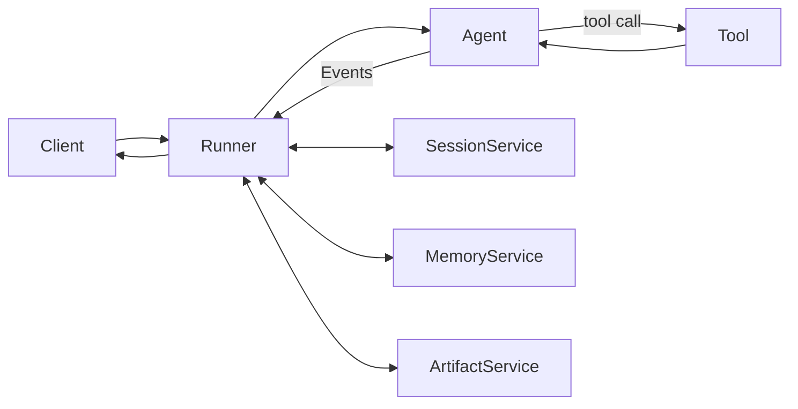

# ADK Core Components

Reference of every Google ADK primitive an agent dev must know. One section per component: **What / When / Code / Gotchas / Docs**.

Layout context: [[Google ADKs]]. Real flow: [[ADK Implementation Example]].

---

## 1. Mental Model



- **Runner** drives one invocation. Pulls/saves Session. Streams Events.
- **Agent** = LLM + instruction + tools + sub_agents.
- **Session** = ordered Events + `state` dict.
- **Event** = each agent turn (text, tool call, state delta, transfer).
- **Services** = Session / Memory / Artifact — pluggable backends.

---

## 2. Agents

### `Agent` (alias `LlmAgent`)

- **What**: single LLM with instruction + tools
- **When**: 90% of cases — one specialist
- **Code**:

```python
from google.adk.agents import Agent

root_agent = Agent(
    name="research_agent",
    model="gemini-2.0-flash",
    description="Answers from internal docs.",
    instruction="Use rag_search. Cite document_id.",
    tools=[rag_search_tool],
)
```

- **Gotchas**: `name` must be unique in registry; `description` used by parent agents to route
- **Docs**: google.github.io/adk-docs/agents/llm-agents/

### `SequentialAgent`

- **What**: runs sub_agents in fixed order, output of one → state of next
- **When**: deterministic pipeline (plan → search → write)
- **Code**:

```python
from google.adk.agents import SequentialAgent

pipeline = SequentialAgent(
    name="research_pipeline",
    sub_agents=[planner, searcher, writer],
)
```

- **Gotchas**: pass data via `session.state` keys + `output_key` on each sub-agent

### `ParallelAgent`

- **What**: runs sub_agents concurrently, merges results
- **When**: fan-out (query 3 sources in parallel)
- **Code**:

```python
from google.adk.agents import ParallelAgent

fanout = ParallelAgent(
    name="multi_source",
    sub_agents=[web_search, kb_search, sql_search],
)
```

- **Gotchas**: sub-agents must not mutate same state key; collect via distinct `output_key`

### `LoopAgent`

- **What**: re-runs sub_agents until stop condition / max iterations
- **When**: iterative refinement (critic-revisor)
- **Code**:

```python
from google.adk.agents import LoopAgent

refiner = LoopAgent(
    name="refine_until_good",
    sub_agents=[generator, critic],
    max_iterations=5,
)
```

- **Gotchas**: any sub-agent can call `tool_context.actions.escalate = True` to break loop

### `BaseAgent` (custom)

- **What**: subclass for fully custom control flow
- **When**: ADK workflow agents don't fit (e.g., conditional branching, external triggers)
- **Code**:

```python
from google.adk.agents import BaseAgent

class MyAgent(BaseAgent):
    async def _run_async_impl(self, ctx):
        async for ev in self.sub_agents[0].run_async(ctx):
            yield ev
```

- **Docs**: google.github.io/adk-docs/agents/custom-agents/

---

## 3. Models

### Gemini via Vertex AI

```python
import os
os.environ["GOOGLE_GENAI_USE_VERTEXAI"] = "TRUE"
os.environ["GOOGLE_CLOUD_PROJECT"] = "..."
os.environ["GOOGLE_CLOUD_LOCATION"] = "us-central1"

agent = Agent(model="gemini-2.0-flash", ...)
```

### Gemini via AI Studio

```python
os.environ["GOOGLE_API_KEY"] = "..."
agent = Agent(model="gemini-2.0-flash", ...)
```

### LiteLLM (Claude / GPT / local)

```python
from google.adk.models.lite_llm import LiteLlm

agent = Agent(
    model=LiteLlm(model="anthropic/claude-sonnet-4-6"),
    ...,
)
```

### Generation config

```python
from google.genai import types

agent = Agent(
    model="gemini-2.0-flash",
    generate_content_config=types.GenerateContentConfig(
        temperature=0.2, max_output_tokens=2048,
    ),
)
```

- **Docs**: google.github.io/adk-docs/agents/models/

---

## 4. Tools

### `FunctionTool` — wrap Python fn

```python
from google.adk.tools import FunctionTool

async def get_weather(city: str) -> dict:
    """Return weather for city."""
    return {"city": city, "temp_c": 22}

weather_tool = FunctionTool(func=get_weather)
```

- **Gotchas**: docstring + type hints become tool schema for LLM. Return JSON-serializable dict.

### `LongRunningFunctionTool`

- **What**: tool that yields intermediate updates, supports human-in-loop
- **When**: approvals, long jobs, multi-step external workflows
- **Code**:

```python
from google.adk.tools import LongRunningFunctionTool

async def approve_refund(amount: float):
    yield {"status": "pending_approval"}
    # ... wait for approval ...
    yield {"status": "approved"}

tool = LongRunningFunctionTool(func=approve_refund)
```

### `AgentTool` — peer agent as tool

```python
from google.adk.tools.agent_tool import AgentTool

orchestrator = Agent(
    name="orchestrator",
    tools=[AgentTool(agent=research_agent.root_agent)],
)
```

- **vs `sub_agents`**: AgentTool = caller stays in control. sub_agents = transfer ownership.

### Built-in tools

```python
from google.adk.tools import google_search, built_in_code_execution
from google.adk.tools.vertex_ai_search_tool import VertexAiSearchTool

agent = Agent(
    tools=[
        google_search,
        built_in_code_execution,
        VertexAiSearchTool(data_store_id="projects/.../dataStores/..."),
    ],
)
```

- **Gotchas**: built-in tools only work with Gemini models, not LiteLLM

### `MCPToolset` — MCP servers as tools

```python
from google.adk.tools.mcp_tool import MCPToolset, StdioServerParameters

toolset = MCPToolset(
    connection_params=StdioServerParameters(
        command="npx", args=["-y", "@modelcontextprotocol/server-github"],
    ),
)
agent = Agent(tools=[toolset])
```

### `OpenAPIToolset` — REST API spec → tools

```python
from google.adk.tools.openapi_tool import OpenAPIToolset

with open("petstore.yaml") as f:
    toolset = OpenAPIToolset(spec_str=f.read(), spec_str_type="yaml")
agent = Agent(tools=[toolset])
```

### Tool Auth (`AuthScheme`)

```python
from google.adk.auth import OAuth2Auth, AuthCredential, AuthCredentialTypes

cred = AuthCredential(
    auth_type=AuthCredentialTypes.OAUTH2,
    oauth2=OAuth2Auth(client_id="...", client_secret="..."),
)
toolset = OpenAPIToolset(spec_str=..., auth_credential=cred)
```

- **Docs**: google.github.io/adk-docs/tools/

---

## 5. Sessions

### `Session`

- **What**: one conversation. Holds `events` (ordered turns) + `state` (dict).
- Fields: `id`, `app_name`, `user_id`, `events`, `state`, `last_update_time`

### `SessionService` backends

```python
# InMemory — tests / local
from google.adk.sessions import InMemorySessionService
svc = InMemorySessionService()

# Database — production (Postgres / SQLite)
from google.adk.sessions import DatabaseSessionService
svc = DatabaseSessionService(db_url="postgresql+asyncpg://...")

# Vertex AI — managed
from google.adk.sessions import VertexAiSessionService
svc = VertexAiSessionService(project="...", location="...")
```

### Lifecycle

```python
session = await svc.create_session(app_name="app", user_id="u1", session_id="s1")
await svc.append_event(session, event)
session = await svc.get_session(app_name="app", user_id="u1", session_id="s1")
```

- **Gotchas**: `DatabaseSessionService` auto-creates tables on first run; pre-migrate in production
- **Docs**: google.github.io/adk-docs/sessions/

---

## 6. Memory

Long-term, cross-session knowledge. Different from `session.state` (per-session).

```python
# In-memory (tests)
from google.adk.memory import InMemoryMemoryService
mem = InMemoryMemoryService()

# Vertex AI RAG-backed
from google.adk.memory import VertexAiRagMemoryService
mem = VertexAiRagMemoryService(
    rag_corpus="projects/.../ragCorpora/...",
)

runner = Runner(agent=root_agent, session_service=sess, memory_service=mem)
```

Agent loads via built-in `load_memory` tool.

- **Docs**: google.github.io/adk-docs/sessions/memory/

---

## 7. Artifacts

Binary blobs (PDFs, images, audio). Out of session state.

```python
from google.adk.artifacts import InMemoryArtifactService, GcsArtifactService

art = GcsArtifactService(bucket_name="my-artifacts")
runner = Runner(agent=root_agent, session_service=sess, artifact_service=art)
```

In tool:

```python
from google.genai import types

async def save_chart(tool_context):
    part = types.Part.from_bytes(data=png_bytes, mime_type="image/png")
    await tool_context.save_artifact(filename="chart.png", artifact=part)
```

- **Docs**: google.github.io/adk-docs/artifacts/

---

## 8. State Management

`session.state` = dict. Key prefixes scope visibility.

| Prefix | Scope | Example |
|--------|-------|---------|
| (none) | session-only | `state["query"]` |
| `user:` | per-user across sessions | `state["user:lang"]` |
| `app:` | global, all users | `state["app:version"]` |
| `temp:` | invocation-only, not persisted | `state["temp:scratch"]` |

```python
# Read
val = tool_context.state.get("user:lang", "en")

# Write (creates state_delta event)
tool_context.state["query_count"] = tool_context.state.get("query_count", 0) + 1
```

Auto-write via `output_key`:

```python
summarizer = Agent(name="summarizer", model=..., output_key="summary")
# After run: session.state["summary"] = <agent output>
```

---

## 9. Schemas (Structured I/O)

### `input_schema`

```python
from pydantic import BaseModel

class Query(BaseModel):
    text: str
    lang: str = "en"

agent = Agent(input_schema=Query, ...)
```

### `output_schema` — typed output

```python
class Answer(BaseModel):
    answer: str
    citations: list[str]

agent = Agent(output_schema=Answer, output_key="result")
```

- **Gotchas**: `output_schema` disables tool calls — agent must respond directly with JSON. Use separate tool-using agent + post-process if needed.

---

## 10. Runner

### `Runner.run_async`

```python
from google.adk.runners import Runner

runner = Runner(app_name="app", agent=root_agent, session_service=svc)

async for event in runner.run_async(
    user_id="u1", session_id="s1", new_message=content,
):
    print(event)
```

### `InMemoryRunner` — testing shortcut

```python
from google.adk.runners import InMemoryRunner

runner = InMemoryRunner(agent=root_agent, app_name="test")
async for ev in runner.run_async(user_id="u", session_id="s", new_message=msg):
    ...
```

### `run_live` — bidirectional Live API (voice/video)

```python
from google.adk.agents.run_config import RunConfig

async for ev in runner.run_live(
    user_id="u1", session_id="s1",
    run_config=RunConfig(response_modalities=["AUDIO"]),
):
    ...
```

- **Docs**: google.github.io/adk-docs/runtime/

---

## 11. Events

Agent yields one `Event` per turn or partial token.

```python
event.author             # "research_agent" / "user" / "system"
event.content.parts      # [Part(text=...), Part(function_call=...)]
event.partial            # True = mid-stream token; False = final
event.is_final_response()# True only on completed turn
event.actions.state_delta        # {"key": new_val}
event.actions.transfer_to_agent  # "research_agent"
event.actions.escalate           # break LoopAgent
event.actions.artifact_delta     # {"chart.png": version}
```

Tool calls show as `Part.function_call`, results as `Part.function_response`.

---

## 12. Callbacks

Hook into agent/model/tool lifecycle. Return non-None to short-circuit.

```python
from google.adk.agents.callback_context import CallbackContext
from google.genai import types

def block_pii(ctx: CallbackContext) -> types.Content | None:
    last = ctx.user_content.parts[0].text
    if contains_pii(last):
        return types.Content(role="model", parts=[types.Part(text="Blocked.")])
    return None

agent = Agent(
    name="x", model="gemini-2.0-flash",
    before_agent_callback=block_pii,
)
```

| Hook | Fires | Use |
|------|-------|-----|
| `before_agent_callback` | before agent runs | guardrails, redaction |
| `after_agent_callback` | after final response | logging, post-process |
| `before_model_callback` | before LLM call | prompt mutation, mock |
| `after_model_callback` | after LLM response | response filter |
| `before_tool_callback` | before tool exec | arg validation, mocking |
| `after_tool_callback` | after tool result | result rewrite, audit |

- **Docs**: google.github.io/adk-docs/callbacks/

---

## 13. Context Objects

### `ToolContext` — passed into tools

```python
async def my_tool(query: str, tool_context):
    tool_context.state["last_query"] = query
    user_id = tool_context.invocation_context.user_id
    art = await tool_context.load_artifact("config.json")
    return {"ok": True}
```

Access: `state`, `actions`, `load_artifact`, `save_artifact`, `search_memory`, `invocation_context`.

### `CallbackContext` — passed into callbacks

Same surface as ToolContext minus actions on tool calls.

### `InvocationContext`

Runtime context for one `run_async` call. Holds session, services, run_config. Rarely accessed directly.

---

## 14. Multi-Agent Patterns

### Hierarchical (transfer)

```python
coordinator = Agent(
    name="coordinator",
    sub_agents=[research, billing, support],
    instruction="Transfer to the right specialist.",
)
```

LLM auto-injects `transfer_to_agent`. Caller hands off control.

### Peer-as-tool

```python
boss = Agent(
    name="boss",
    tools=[AgentTool(agent=intern.root_agent)],
)
```

Caller stays in control, gets tool result back.

### Workflow

`SequentialAgent` / `ParallelAgent` / `LoopAgent` — deterministic, no LLM routing.

### Decision

| Need | Use |
|------|-----|
| LLM picks specialist | `sub_agents` + transfer |
| Caller delegates + waits | `AgentTool` |
| Fixed pipeline | `SequentialAgent` |
| Fan-out + merge | `ParallelAgent` |
| Iterate until good | `LoopAgent` |

- **Docs**: google.github.io/adk-docs/agents/multi-agents/

---

## 15. Streaming

### Token streaming (SSE)

```python
async for event in runner.run_async(...):
    if event.partial:
        token = event.content.parts[0].text
        yield f"data: {token}\n\n"
```

### Live API (voice/video bidirectional)

```python
from google.adk.agents.run_config import RunConfig

cfg = RunConfig(
    response_modalities=["AUDIO"],
    streaming_mode="BIDI",
)
async for ev in runner.run_live(..., run_config=cfg):
    ...
```

- **Gotchas**: Live requires Gemini Live-capable model + websocket transport (not plain HTTP SSE)
- **Docs**: google.github.io/adk-docs/streaming/

---

## 16. Planners

Force ReAct-style reasoning before tool calls.

```python
from google.adk.planners import PlanReActPlanner, BuiltInPlanner

agent = Agent(
    model="gemini-2.0-flash",
    planner=PlanReActPlanner(),  # explicit Plan → Action → Reflection
    tools=[...],
)

# Or use model's built-in thinking
agent = Agent(model="gemini-2.5-pro", planner=BuiltInPlanner())
```

- **When**: complex multi-step tasks where you want explicit thought traces
- **Docs**: google.github.io/adk-docs/agents/llm-agents/#planning

---

## 17. Code Execution

Let agent run code as a tool.

```python
from google.adk.tools import built_in_code_execution
from google.adk.code_executors import VertexAiCodeExecutor

# Gemini native (recommended)
agent = Agent(model="gemini-2.0-flash", tools=[built_in_code_execution])

# Vertex sandboxed
agent = Agent(
    model="gemini-2.0-flash",
    code_executor=VertexAiCodeExecutor(),
)
```

- **Gotchas**: built-in code execution mutually exclusive with `output_schema`
- **Docs**: google.github.io/adk-docs/tools/built-in-tools/#code-execution

---

## 18. Auth (Tools)

OAuth2 flow for tools that call user-scoped APIs.

```python
from google.adk.auth import OAuth2Auth, AuthCredential, AuthCredentialTypes, AuthScheme

scheme = AuthScheme(...)  # from OpenAPI spec usually
cred = AuthCredential(
    auth_type=AuthCredentialTypes.OAUTH2,
    oauth2=OAuth2Auth(
        client_id="...", client_secret="...",
        authorization_url="https://...",
        token_url="https://...",
        scopes=["read"],
    ),
)
toolset = OpenAPIToolset(spec_str=..., auth_scheme=scheme, auth_credential=cred)
```

Inside tool, ADK injects token via `tool_context.get_auth_response()`.

- **Docs**: google.github.io/adk-docs/tools/authentication/

---

## 19. Eval

### Eval set format

`agents/research_agent/eval/conversation.test.json`:

```json
[
  {
    "query": "what is X?",
    "expected_tool_use": [{"tool_name": "rag_search", "tool_input": {"query": "X"}}],
    "reference": "X is ..."
  }
]
```

`test_config.json`:

```json
{
  "criteria": {
    "tool_trajectory_avg_score": 0.8,
    "response_match_score": 0.7
  }
}
```

### Run

```bash
adk eval src/agents/research_agent src/agents/research_agent/eval/conversation.test.json
```

CI: fail build if scores drop below thresholds.

- **Docs**: google.github.io/adk-docs/evaluate/

---

## 20. CLI

| Command | Purpose |
|---------|---------|
| `adk web <agent_dir>` | local Dev UI, manual testing |
| `adk run <agent_dir>` | terminal chat |
| `adk eval <agent_dir> <test_file>` | run eval sets |
| `adk api_server <agent_dir>` | local API (= `get_fast_api_app`) |
| `adk deploy agent_engine` | push to Vertex Agent Engine |
| `adk deploy cloud_run` | containerize + Cloud Run |

- **Docs**: google.github.io/adk-docs/get-started/cli/

---

## 21. Deployment

### Vertex AI Agent Engine (managed)

```python
from vertexai.preview import reasoning_engines
from vertexai import agent_engines

app = reasoning_engines.AdkApp(agent=root_agent, enable_tracing=True)
remote = agent_engines.create(
    agent_engine=app,
    requirements=["google-adk", "pgvector"],
)
```

### Cloud Run via `get_fast_api_app`

```python
# main.py
from google.adk.cli.fast_api import get_fast_api_app

app = get_fast_api_app(
    agent_dir="./agents",
    session_db_url="postgresql+asyncpg://...",
    allow_origins=["https://my-fe.com"],
    web=False,
)
```

`gcloud run deploy ...`

### Hand-rolled FastAPI

See [[ADK Implementation Example#3. Chat Route]] — full control over routes/auth/streaming. Recommended for public FE-facing API.

- **Docs**: google.github.io/adk-docs/deploy/

---

## 22. Observability

OpenTelemetry built-in. Export to Cloud Trace / OTLP.

```python
from opentelemetry import trace
from opentelemetry.exporter.cloud_trace import CloudTraceSpanExporter
from opentelemetry.sdk.trace import TracerProvider
from opentelemetry.sdk.trace.export import BatchSpanProcessor

provider = TracerProvider()
provider.add_span_processor(BatchSpanProcessor(CloudTraceSpanExporter()))
trace.set_tracer_provider(provider)
```

Spans emitted per: invocation, agent turn, model call, tool call. Attributes: `agent.name`, `tool.name`, `model.name`, token counts.

Enable in Agent Engine: `enable_tracing=True` in `AdkApp`.

- **Docs**: google.github.io/adk-docs/observability/

---

## 23. Decision Cheatsheet

| I need... | Use |
|-----------|-----|
| One LLM with tools | `Agent` |
| LLM picks specialist | `Agent` + `sub_agents` |
| Caller delegates to helper | `AgentTool` |
| Fixed pipeline | `SequentialAgent` |
| Fan-out + merge | `ParallelAgent` |
| Iterate until good | `LoopAgent` |
| Custom control flow | `BaseAgent` |
| Wrap Python fn as tool | `FunctionTool` |
| Long-running / human approval | `LongRunningFunctionTool` |
| REST API as tools | `OpenAPIToolset` |
| MCP server as tools | `MCPToolset` |
| Code execution | `built_in_code_execution` |
| Per-session memory | `session.state` |
| Cross-session memory | `MemoryService` |
| Binary blobs | `ArtifactService` |
| Typed agent output | `output_schema` + `output_key` |
| Guardrails / redaction | `before_model_callback` |
| Tool result rewriting | `after_tool_callback` |
| Production sessions | `DatabaseSessionService` (Postgres) |
| Voice / video | `Runner.run_live` |
| Quality regression check | `adk eval` + eval sets |
| Local dev UI | `adk web` |
| Managed deploy | Vertex Agent Engine |
| FE-facing API | Hand-rolled FastAPI + Runner |

---

## References

- google.github.io/adk-docs/ — full docs
- github.com/google/adk-python — source
- github.com/google/adk-samples — production examples
- [[Google ADKs]] — folder layout, rules
- [[ADK Implementation Example]] — components in real flow
